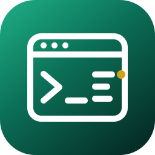
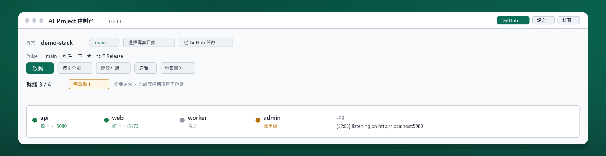
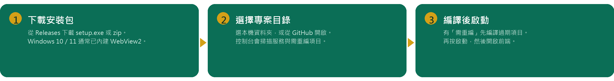

<div align="center">



# AI_Project 控制台

**選一個專案目錄，掃描服務、編譯、一鍵啟動。**

本機桌面程式 · 卡住時把說明交給本機 Agent（預設 [Cursor](https://cursor.com/)）

[](docs/user/whats-new.md)
[](https://github.com/sjvann/AI_Project_Console/releases)
[](https://sjvann.github.io/AI_Project_Console/)
[](docs/legal/copyright.md)

<a href="https://github.com/sjvann/AI_Project_Console/releases"></a>
&nbsp;&nbsp;
<a href="https://sjvann.github.io/AI_Project_Console/"></a>



</div>

> [!TIP]
> **一般使用者請從安裝包開始，不必編譯原始碼。** 完整操作說明在 [使用文件](https://sjvann.github.io/AI_Project_Console/)（倉庫原稿：[docs/](docs/README.md)）。給買家：[產品規格](docs/product/README.md) · [銷售套件](docs/salekit/README.md)（公司營運層標為規劃，尚未出貨）。

## 能做什麼

<table>
<tr>
<td width="50%" valign="top">

**掃描與啟動**<br>
選專案目錄後掃出可啟動服務與需重編項目，一鍵拉起本機堆疊，再開前端。

</td>
<td width="50%" valign="top">

**編譯真相**<br>
原始碼比上次編譯新時標「需重編」。先編譯過期項目，再啟動，少踩過期組件。

</td>
</tr>
<tr>
<td width="50%" valign="top">

**GitHub 節奏**<br>
提交、同步、PR、Release。Pulse 只露出現在該做的那一步；操作台一次看完。

</td>
<td width="50%" valign="top">

**Agent 閉環**<br>
卡住把說明交給本機 Cursor（或其他 Agent）。MCP 讓 Agent 回查堆疊，程式碼不上我們的雲。

</td>
</tr>
</table>

## 三分鐘開始

<div align="center">

</div>

1. 從 [Releases](https://github.com/sjvann/AI_Project_Console/releases) 下載 `*-win-x64-setup.exe`（或 zip 免安裝包）。Windows 10／11 需 [WebView2](https://developer.microsoft.com/microsoft-edge/webview2/)（通常已內建）。
2. 開啟控制台 → **選擇專案目錄…**（或「從 GitHub 開啟…」）。
3. 有「需重編」先 **建置 → 編譯過期項目**，再按 **啟動**，然後 **開啟前端**。

下一步：[安裝與第一次使用](docs/user/getting-started.md) · [畫面導覽](docs/user/interface.md) · [日常操作](docs/user/daily-use.md) · [常見問題](docs/user/troubleshooting.md)

> [!IMPORTANT]
> 關閉控制台**不會**停止已啟動的服務。請用「停止全部」。

## 你想做的事

<table>
<tr>
<td width="33%" valign="top">

**先從這裡開始**<br>
[一般使用者](docs/README.md#一般使用者閱讀順序) — 安裝、開專案、啟動、編譯、看 Log<br>
[90 分鐘導入](docs/team/trial-90min.md) — 帶團隊走一遍

</td>
<td width="33%" valign="top">

**工作區與 GitHub**<br>
[工作區設定](docs/workspace/ai-project-json.md) — 服務掃不到、多倉一起管<br>
[GitHub](docs/user/github.md) — 提交、同步、Release<br>
[卡住時怎麼辦](docs/user/help.md) — 求救、專案問答

</td>
<td width="33%" valign="top">

**買家與維護者**<br>
[產品規格](docs/product/README.md) · [銷售套件](docs/salekit/README.md)<br>
[MCP](docs/agent/mcp.md) — 讓 Agent 回呼控制台<br>
[開發與維護](docs/maintainer/develop.md) — 改原始碼、打包

</td>
</tr>
</table>

現行出貨：**0.6.16**（Windows x64）。[現行版本](docs/user/whats-new.md) · [版權與授權](docs/legal/copyright.md)（公開可見，**保留一切權利**，不是開源授權）。

<details>
<summary><strong>從原始碼執行（維護者）</strong></summary>

需要 [.NET 10 SDK](https://dotnet.microsoft.com/download)。

```powershell
dotnet run --project src/AiProject.Console.App
```

第二個視窗（第一個還在跑時不要再編譯）：

```powershell
dotnet run --no-build --project src/AiProject.Console.App
```

Windows 安裝包與 GitHub Release：[scripts/README.md](scripts/README.md)。方案結構與測試：[開發與維護](docs/maintainer/develop.md)。

</details>

## 授權

Copyright © 2026 sjvann。**保留一切權利。** 公開本倉庫是為了文件與評估，不授權他人把原始碼當產品再發布。安裝包使用範圍與禁止事項見 [LICENSE](LICENSE)；第三方元件見 [NOTICE](NOTICE)。安全回報見 [SECURITY.md](SECURITY.md)。貢獻政策見 [CONTRIBUTING.md](CONTRIBUTING.md)。
