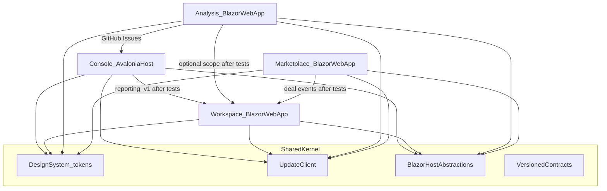
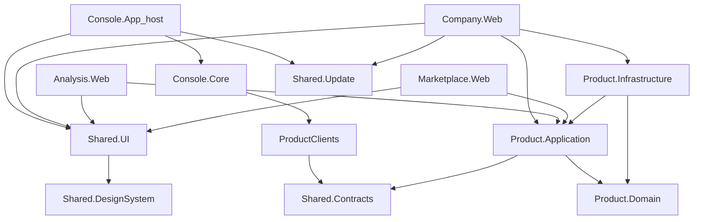
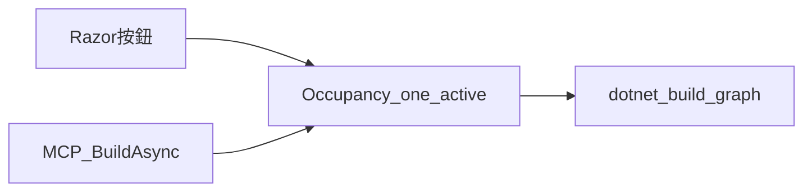
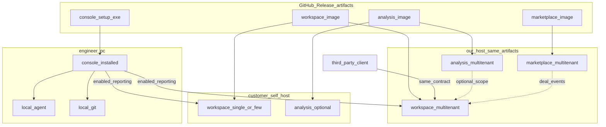

# 技術架構

**規劃。** 控制台出貨行為（0.6.x）為 **現況**；本文件把四套產品寫成可轉 [系統執行計劃書](execution-plan.md) 的一致性契約。產品邊界衝突時以 [總規格・四套產品](spec.md#四套產品) 為準。引導畫面與主題契約見 [UI／UX](ux.md)。公開回報語意見 [reporting.md](reporting.md)。

本輪**只改規格**。不改產品程式、不安裝 Avalonia、不拆倉。

## 1. 怎麼用這份文件

| 欄 | 值 |
|----|-----|
| 讀者 | 工程、產品、下一份執行計畫的作者 |
| 海拔 | 產品家族（initiative）：固定四套產品不能各走各的那些不變量 |
| 範式 | **契約優先的產品家族**（contract-first product family） |
| 狀態 | 規劃。現況宿主仍是 Photino.Blazor；目標宿主是 Avalonia 承載同一套 Blazor UI |
| 本文件保證 | AD 編號穩定、可被執行計畫與 PR 引用 |
| 本文件不保證 | 日曆、人月、Avalonia Hybrid 已通 |

**權威關係**

| 問題 | 看哪裡 |
|------|--------|
| 賣給誰、不做什麼 | [願景](vision.md)、[PRD](prd.md) |
| 產品邊界、權限、主鍵 | [總規格](spec.md) |
| 回報欄位與語意 | [reporting.md](reporting.md) |
| 畫面進場、精靈、色盤 | [ux.md](ux.md) |
| 下一個 PR、階段出口 | [execution-plan.md](execution-plan.md) 第 7、12 節（本文件提供 AD；不取代執行計畫） |
| 這個倉怎麼跑、怎麼打包 | [開發與維護](../maintainer/develop.md)、[發版](../maintainer/release.md) |

**引用規則：** 執行計畫與故事寫 `AD-n`，不要複製本文件長文。改規則時**原地修 Rule、不重編號**；新決策用下一個號碼。`[ADOPTED]` 表示現況或已拍板。`[ASSUMPTION]` 是未另開會的預設，審查時可改。

## 2. 設計範式

四套產品看似獨立、可相依使用。獨立的是**安裝、資料庫、發行通道**；相依的是**版本化 HTTPS 契約**，而且預設關閉，通過契約相容測試後才用設定打開。

共用的是 **NuGet／專案套件**（DesignSystem、Update、Host、Contracts），不是共用行程、不是共用 DbContext。



虛線／標「after tests」的邊不是從屬，是**可選連線**。控制台零個申報目的地時，現況功能必須照常。工作區可先於仲介開帳。原始碼不上雲。

## 3. 不變量（AD）

### AD-1 — 契約優先的產品家族 `[ADOPTED]`

- **Binds:** P1–P4 全家族
- **Prevents:** 把四套做成一個安裝包、一個登入、一個資料庫，或把工作區寫成仲介的下一頁
- **Rule:** 四套各解一個問題；因果是建構順序，不是執行期流水線。交換走契約，不互相內嵌。切割以 [spec.md#四套產品](spec.md#四套產品) 為準。

### AD-2 — 獨立安裝、獨立庫、獨立版號 `[ADOPTED]`

- **Binds:** 每個產品的部署與發行
- **Prevents:** 「裝了控制台就順便有了工作區」；共用 schema 升版把四套綁死
- **Rule:** 每套可單獨安裝與卸載。每套自己的資料庫（P1 本機檔＋本機狀態；P2／P3／P4 各 PostgreSQL）。每套自己的 SemVer。卸下一套不得刪另一套的資料。

### AD-3 — 禁止共用 DbContext／直連對方庫 `[ADOPTED]`

- **Binds:** 所有專案參考與連線字串
- **Prevents:** `Company` `using` `Marketplace` 表；控制台連工作區資料庫
- **Rule:** 產品 A 的程式不得持有產品 B 的連線字串或 EF context。仲介寫入工作區必須走工作區的佈建／成交 API。控制台只打 HTTPS。

### AD-4 — 整合預設關閉，測試通過才啟用 `[ADOPTED]`

- **Binds:** 所有跨產品連線
- **Prevents:** 出廠就假設對方已存在；設定填了 URL 就當整合完成
- **Rule:** 連線登錄裡每一筆對端預設 `disabled`。操作者填 Base URL／憑證／契約版本後，必須跑**契約相容測試**（握手＋一組負向測）且通過，才允許切 `enabled`。測試失敗維持關閉並說人話。CI 對公開契約跑同一套測試包。

### AD-5 — 共用套件，不共用執行個體 `[ADOPTED]`

- **Binds:** `AiProject.Shared.*` 與產品專案
- **Prevents:** 四套跑在同一個 ASP.NET 宿主裡「省機器」；把 Shared 做成必須同時部署的微服務
- **Rule:** DesignSystem、Update、Host 抽象、Contracts DTO 以專案／NuGet 引用。各產品編譯進自己的安裝產物。Shared 不含任何產品的 Domain 或 DbContext。

### AD-6 — 殼可不同，Razor／token／元件語意必須同一套 `[ADOPTED]`

- **Binds:** 所有 UI
- **Prevents:** 控制台一套 CSS 變數、工作區另發明一組；把桌面頁簽搬到瀏覽器當「統一」
- **Rule:** 視覺殼：P1 = Avalonia 視窗；P2／P3／P4 = 瀏覽器。互動 UI：Blazor Razor + 同一套 DesignSystem token。產品特定畫面留在該產品專案，共用的是按鈕、對話、空狀態、徽章、主題精靈，不是業務頁。細節見 [ux.md](ux.md)。

### AD-7 — 技術核心鎖定 `[ADOPTED]`

- **Binds:** 全家族新程式
- **Prevents:** P3 改用 SPA、P4 改用 MVC、P1 改寫成純 Avalonia XAML
- **Rule:** 執行時 **.NET 10**。Web 產品 **Blazor Web App**，Interactive Server 為預設。桌面 **Avalonia 承載同一套 Blazor UI**（見 AD-9、AD-10）。新產品不得另起前端框架。WASM／Auto 不當 MVP 預設。

### AD-8 — 轉譯模式 `[ADOPTED]`

- **Binds:** P2／P3／P4 與 P1 內嵌 Blazor
- **Prevents:** 甘特／薪資表走 WASM 當預設；公開頁硬開 Interactive Server 浪費回路
- **Rule:** 長連線資料網格（甘特、週矩陣、薪資表、分析編輯）用 Interactive Server。登入、只讀薪資條、分析產物預覽、公開行銷頁可用 Static SSR。離線主管平板列 Deferred。

### AD-9 — P1 是 Avalonia 宿主，不是網站、不是 XAML 重寫 `[ADOPTED]`

- **Binds:** 控制台 App 與 Core
- **Prevents:** 把控制台改成網站；把 Razor 重寫成 Avalonia XAML 當「用了 Avalonia」
- **Rule:** 工程師繼續本機視窗（行程、檔案、Agent、MCP）。Avalonia 提供視窗、原生檔案／行程邊界、WebView 承載。現況 Razor 畫面遷入宿主，不重做業務 UI。現況 Photino 僅過渡（AD-10）。

### AD-10 — Avalonia Blazor spike 閘門

- **Binds:** K1 與之後所有 P1 宿主 PR
- **Prevents:** 未驗證就刪 Photino，或讓 Core／Razor 沾上宿主類型
- **Rule:** Avalonia **沒有**官方 Blazor Hybrid（2026-09 現況：`Avalonia.Controls.WebView` 12.x 可嵌網頁且支援 net10.0，Blazor 仍需自製 `WebViewManager`）。K1 必須在 **Windows x64** 用現況主路徑做 spike：掃描、編譯、啟停、GitHub 操作台、工時儀表、設定。通過後才把安裝包切到 Avalonia。失敗則 Photino 留守發行，**宿主介面仍保留**。`AiProject.Console.Core` 與 Razor 元件**不得**引用 `Photino.*` 或 `Avalonia.*`。

### AD-11 — 依賴方向 `[ADOPTED]`

- **Binds:** 全部 csproj
- **Prevents:** Web 專案參考 Console.App；Domain 參考 EF；Razor `new` 倉儲
- **Rule:**



Domain 無 EF／HTTP。Application 開頭授權。規則不進 `.razor`。產品 Application **不得**參考另一產品的 Infrastructure。

### AD-12 — 雙通道部署：我們主機 = 同一產物 `[ADOPTED]`

- **Binds:** P1–P4 發行與營運
- **Prevents:** 「自架後期」造成兩套不相容的部署；我們雲用私有分支、客戶拿到另一個安裝器
- **Rule:** P1 出 Windows 桌面安裝包（現況 Inno Setup `*-win-x64-setup.exe`；目標宿主切換後檔名規則不變）。P2／P3／P4 各出 **Docker 映像 + 主機安裝器／compose**。我們營運多租戶與客戶自架**使用同一發行產物**，差在設定：`Hosting:Mode = SaaS | SelfHosted`、連線字串、憑證、備份責任方。自架不是後期才發明的路徑，是同一通道的一種運營者。P4 仍是門檻產品（AD-30），但產物形態與 P2／P3 相同。

### AD-13 — 一需求公司一個工作區 `[ADOPTED]`

- **Binds:** P2 租戶模型（D-13）
- **Prevents:** 一成交一個工作區；開帳必須先有仲介
- **Rule:** 一公司一租戶、多專案。可先於仲介存在。多租戶 SaaS 與單租戶自架都強制 `tenantId` 查詢邊界。

### AD-14 — PostgreSQL 生產；SQLite 僅開發／測試 `[ADOPTED]`

- **Binds:** P2／P3／P4 資料
- **Prevents:** 生產 SQLite；每套產品選不同引擎
- **Rule:** 試用與生產 PostgreSQL 16+。SQLite 只給開發與自動化測試。遷移必須兩種提供者都能跑，或以 PostgreSQL 為準、測試用 Testcontainers。`[ASSUMPTION]` 第一刀用 EF Core + Npgsql，不引入第二套 ORM。

### AD-15 — 環境與設定表面 `[ADOPTED]`

- **Binds:** 部署、祕密、更新
- **Prevents:** 把生產連線寫進 git；四套各發明一套設定鍵風格
- **Rule:** 設定用 ASP.NET 慣例（`appsettings`、環境變數、使用者祕密）。產品前綴：`Console:`／`Company:`／`Analysis:`／`Marketplace:`。連線登錄鍵統一在 `Connections:`（AD-16）。生產 TLS 終止於反向代理或主機安裝器。備份：SaaS 由我們；自架由客戶，文件必須寫清 dump + 加密金鑰。

### AD-16 — 連線登錄（Connection Registry） `[ADOPTED]`

- **Binds:** 所有跨產品與第三方端點
- **Prevents:** 控制台硬編碼一家公司；工作區假設分析站 URL 永遠存在
- **Rule:** 每一筆連線是：`id`、顯示名、角色（`reporting-destination`／`analysis-scope`／`deal-events`／`update-feed`）、Base URL、契約版本、認證方式、`enabled`、上次測試結果。P1 的「申報目的地」是此登錄的一種角色。UI 引導見 [ux.md](ux.md#引導式開帳與連線)。零連線時該產品核心功能仍可用。

### AD-17 — 契約版本與相容 `[ADOPTED]`

- **Binds:** 公開回報與後續產品間 API
- **Prevents:** 契約變成控制台私有協定；一次破壞性改版逼所有用戶端同日升級
- **Rule:** 每個對外 API 有 OpenAPI 檔，走 SemVer。傳輸標頭宣告版本（回報契約現況語意：`X-Company-Api-Version`）。**至少相容一個控制台大版本。** 破壞性變更開新主版本，舊主版本維持一個重疊窗。權威語意：[reporting.md](reporting.md)。第一刀 JSON，不強制 HR-XML XML／OSLC RDF。

### AD-18 — 原始碼不上雲；上傳白名單 `[ADOPTED]`

- **Binds:** 所有上傳與 Agent 工具
- **Prevents:** path／blob／source 進工作區；MCP 暴露薪資或仲介應收
- **Rule:** 回報僅時段、專案識別、狀態圖、Issue 參照、貢獻類型。契約測試必須拒絕 path／blob／source。MCP 維持控制台本機；公司產品不註冊薪資／費率／毛利／應收工具。

### AD-19 — 每產品自己的 GitHub Release 通道 `[ADOPTED]`

- **Binds:** 發版與自動更新
- **Prevents:** 控制台 latest 誤更新工作區；一個 tag 塞四套產物分不清
- **Rule:** `[ASSUMPTION]` 單一 git 倉、四條 Release 通道，tag：

  | 產品 | tag 前綴 | 資產（至少） |
  |------|-----------|--------------|
  | P1 控制台 | `console-v*` | `*-win-x64-setup.exe`、checksum |
  | P2 工作區 | `workspace-v*` | Docker 映像摘要、compose／主機安裝器、checksum |
  | P3 分析 | `analysis-v*` | 同上 |
  | P4 仲介 | `marketplace-v*` | 同上 |

  過渡期現況控制台仍用倉庫 `releases/latest` 與 `AI_Project_Console-*-win-x64-setup.exe`（見 [發版](../maintainer/release.md)）。切通道時必須讓舊安裝包仍能找到下一版資產。不可覆寫舊 tag。

### AD-20 — 共用 UpdateClient `[ADOPTED]`

- **Binds:** 四套「檢查更新」
- **Prevents:** 每套複製一份 `SelfUpdate` 卻資產命名不一致
- **Rule:** 把現況 [`SelfUpdate`](../../src/AiProject.Console.Core/Update/SelfUpdate.cs) 升成 `AiProject.Shared.Update`：輸入為 `GitHubSlug`、通道、RID、資產規則。桌面：下載 setup → 啟動安裝程式（與現況相同）。Web／自架：檢查映像或安裝器版本，提示管理員更新，**不**在請求路徑上自動重寫正在服務的行程。開發目錄（`bin/Debug`）不套用安裝更新。

### AD-21 — 設計權杖三層 `[ADOPTED]`

- **Binds:** 四套 UI 與主題精靈
- **Prevents:** 硬編碼 `#0b6e56`；每套產品自己的 `--accent` 語意不同
- **Rule:** primitive（色階、字級、間距）→ semantic（`--color-accent`、`--color-danger`、`--color-warning`、`--color-success`、`--color-surface`）→ component（按鈕、徽章、戰情卡）。主題以 JSON 包 + CSS 變數發布。安裝層有預設包；SaaS 租戶可覆寫。現況控制台與 Company.Web 的 accent 抽進 token，不得再散落魔法數字。完整表見 [ux.md](ux.md#企業視覺與色盤)。

### AD-22 — 語意狀態色不可被品牌色蓋掉 `[ADOPTED]`

- **Binds:** 戰情室、工時徽章、超載、逾期
- **Prevents:** 企業把主色設成紅，戰情室紅燈消失
- **Rule:** `--color-success`／`--color-warning`／`--color-danger` 是語意色，主題精靈不可映射到品牌主色槽。品牌可改 accent／surface／中性色。狀態同時有文字，不只靠顏色（WCAG 2.2 AA）。對齊現況工時徽章：8h 黃、10h 紅。

### AD-23 — 四套同一 token，不同預設主題包 `[ADOPTED]`

- **Binds:** 開箱視覺
- **Prevents:** 四套看起來像四家公司，或四套像素級同一個殼
- **Rule:** 共用 token 名稱。預設包：控制台偏工具（密、深可切）、工作區偏營運、分析偏文件閱讀、仲介偏公開品牌。企業可選預設色盤或微調。深色模式與「動效可關」四套都要。

### AD-24 — 引導式第一次啟動 `[ADOPTED]`

- **Binds:** 各產品空狀態與開帳
- **Prevents:** 第一次進空白戰情圖表；連線沒測就當已整合
- **Rule:** 各產品有引導精靈（開帳／主題／連線／更新通道），下一步永遠看得到。流程見 [ux.md](ux.md#引導式開帳與連線)。不得把四套做成同一登入後的分頁。

### AD-25 — 識別按產品，不聯合登入 `[ADOPTED]`

- **Binds:** 認證
- **Prevents:** 一個 SSO 把四套綁成套件；工程師被迫在工作區開完整後台帳
- **Rule:** 工作區管理者：公司帳戶。工程師回報：GitHub（`github:{login}`）或公司核發 API 金鑰。分析站：自己的帳戶（波次 B）。仲介會員：自己的會員（波次 C，門檻後）。控制台繼續 `gh auth`。禁止四套共用登入 cookie。GitHub App／PAT 給工作區讀 Issue、可選寫回 assignee，不是後台使用者 OAuth。

### AD-26 — 授權在伺服器 `[ADOPTED]`

- **Binds:** 所有 API 與 Blazor 端點
- **Prevents:** 只靠隱藏選單
- **Rule:** 角色在 Application／API 強制。越權 403。Blazor 隱藏不是安全邊界。工作區角色以 [spec.md#角色與權限](spec.md#角色與權限) 為準。外包永遠看不到他司與毛利。

### AD-27 — 傳輸與敏感欄 `[ADOPTED]`

- **Binds:** 部署與薪資／費率
- **Prevents:** 明文 HTTP 生產；遺失金鑰後默默改明文
- **Rule:** 生產 TLS。SaaS 憑證由我們管；自架由客戶管。費率與薪資欄加密保存；`Company:EncryptionKey` 遺失則無法讀，不降級明文。畫面遮罩仍要權限才揭開。

### AD-28 — 審計 `[ADOPTED]`

- **Binds:** 人為修正與金鑰
- **Prevents:** 改費率／鎖定／強制超載無原因
- **Rule:** 誰改費率、誰鎖定週期、誰強制超載、誰用 API 金鑰上傳、誰啟用一筆跨產品連線，都要審計。對話框必填原因。軟刪；已有工時不可硬刪。

### AD-29 — 單一倉、四通道 `[ASSUMPTION]`

- **Binds:** git 與 CI
- **Prevents:** 未出貨就拆四個 repo 導致契約套件漂移
- **Rule:** 維持 `AiProject.Console.slnx` 家族倉。契約套件日後可抽獨立 NuGet，不作為 K0 前置。若拆倉，必須先能從本倉產出穩定 Contracts 套件。

### AD-30 — 仲介是門檻產物，不是下一刀 `[ADOPTED]`

- **Binds:** 波次與 repo 看板
- **Prevents:** 先做 Marketplace 骨架
- **Rule:** 僅 [analysis.md](analysis.md) G-01～G-04 通過後才開工 P4 業務 PR。A／B 不得合併仲介功能。架構允許 P4 與 P2 同形部署，不等於現在實作。

### AD-31 — 本機工時是控制台側真相 `[ADOPTED]`

- **Binds:** P1 工時與 P2 上傳
- **Prevents:** 伺服器默默覆蓋已核准列
- **Rule:** `work-hours.json` 是本機真相。上傳是複本，一次一個目的地，非背景偷傳。同一 `localSlotId` 已核准不可改，只能新增更正時段並留審計。

### AD-32 — P1 長工作必須有單一佔用面 `[ADOPTED]`

- **Binds:** 控制台桌面、MCP 堆疊工具、建置／測試／掃描／Git／啟停
- **Prevents:** `bool JobBusy` 擋操作卻幾乎不畫出來；建置選單仍可點、點了才彈「忙碌中」；MCP `--mcp` 另行程編譯同一倉卻不佔桌面鎖，使用者以為當機
- **Rule:** 以一筆 **Occupancy**（`kind`、人話標題、`done/total`、開始時刻、可取消、擋哪些動作）取代全域布林。同時最多一個進行中、一個排隊；排隊要說出來，禁止默默丟掉。被擋的按鈕事前 `disabled` 且 `title` 寫原因。頂欄常駐佔用條（對齊 GitPulse／發行進度，不要只靠灰色 `JobText`）。`IWindowHost.SetTitle` 帶佔用狀態。原生「請等待」對話框不是主訊號。專案問答繼續不佔用（現況）。佔用是 P1 可見行為，**不得**塞進 K0（K0 不改可見流程），也**不**等 K1 才做。

### AD-33 — UI 重繪不得跟編譯器行數線性成長 `[ADOPTED]`

- **Binds:** 控制台建置／測試輸出與 `Notify`／`StateHasChanged`
- **Prevents:** 每一行 `BuildText +=` 整頁重繪把 Photino WebView 卡死，佔用條也畫不出來
- **Rule:** 編譯輸出合併刷新（約 100–200ms 一批）。可見 log 用環形緩衝（建議最後 2 000 行）。佔用期間降低或暫停 `PollLoop` 的 Git／健康／新鮮度全掃。取消必須在重繪風暴下仍收得到。

### AD-34 — 建置委派編譯器圖；同一工作區一個建置域 `[ADOPTED]`

- **Binds:** `BuildRunner`／`StackCommands`、MCP `StackWorkspace.BuildAsync`
- **Prevents:** N 個專案 N 次 `dotnet build` 當預設；專案級平行編譯互搶 `obj/`；MCP 與桌面各編各的
- **Rule:** .NET 倉有 solution／可建圖時，一次交給 `dotnet build`（過期模式仍可把目標交給 MSBuild 圖）。其他語言維持逐目標。徽章與失敗專案仍要對得回單一 csproj。第一刀**不做**專案級平行排程。桌面與 MCP 對同一 `Root` 共用佔用登錄（檔案或 named mutex）；Agent 在編時畫面寫「Agent 正在編譯」。`[ASSUMPTION]` 登錄放工作區 `.ai_project/`，不進 git。

## 4. 選型（種子；代碼存在後以代碼為準）

| 層 | 選擇 | 版本／註記 |
|----|------|------------|
| 執行時 | .NET | **10**（現況 net10.0） |
| Web UI | Blazor Web App，Interactive Server 預設 | ASP.NET Core 10 |
| 桌面宿主（目標） | Avalonia + WebView 承載 Blazor | Avalonia **12.1.x**；`Avalonia.Controls.WebView` **12.1.x**（net10.0）。Hybrid 非官方，受 AD-10 閘門 |
| 桌面宿主（現況／過渡） | Photino.Blazor | **4.0.13**（現況 App） |
| 資料 | PostgreSQL；測試 SQLite | PostgreSQL **16+** |
| API 描述 | OpenAPI | `Microsoft.AspNetCore.OpenApi` 10.x；`Microsoft.OpenApi` 2.x（現況 Company.Web） |
| 桌面安裝 | Inno Setup 6／7；`*-win-x64-setup.exe` | 現況 [scripts/README.md](../../scripts/README.md) |
| Web 安裝 | Docker + compose；可選 Windows／Linux 主機安裝器 | `[ASSUMPTION]` 映像登錄公開或 GHCR，隨 GitHub Release 發 digest |
| 更新 | GitHub Releases API | 共用 UpdateClient（AD-19、AD-20） |
| 識別 | 公司帳戶／GitHub／API 金鑰 | AD-25 |
| 文件站 | DocFX | 現況 GitHub Pages |

WASM 或 Auto 不當 MVP 預設。

## 5. P1 宿主遷移

現況：`AiProject.Console.App` 是 Photino 視窗 + Blazor（[develop.md](../maintainer/develop.md)）。目標：同一 Razor，換成 Avalonia 視窗。

| 階段 | 允許 | 禁止 |
|------|------|------|
| K0 | 抽出 `IWindowHost`／檔案對話／確認框；Core 去 Photino 類型 | 改使用者可見流程（含佔用條；那是軌道 O） |
| K1 spike | 第二個宿主專案 `Console.App.Avalonia` 並行；Windows 等價主路徑 | 刪現況安裝包；Razor 寫 Avalonia API |
| K1 通過後 | 安裝包切 Avalonia；Photino 專案可刪或留 nightly | 未過閘門就改 Release 資產名導致舊版不能更新 |
| K1 失敗 | Photino 繼續出貨；介面與 Shared 保留 | 把失敗當成「改用純 XAML 重寫」 |

**Spike 通過條件（全部真才算過）：**

1. Windows x64 視窗能載入現況 Razor 根元件。
2. 掃描、需重編、啟停、Log、GitHub 操作台、工時儀表、設定可完成一輪。
3. MCP `--mcp` 仍可用（可同一 exe 或旁路專案）。
4. 「檢查更新」仍能解讀 GitHub Release 資產。
5. Core 測試不引用宿主套件。

macOS／Linux 桌面列 Deferred；現況正式資產是 win-x64。

**佔用（軌道 O，與宿主遷移正交）：** Photino 或 Avalonia 都必須滿足 AD-32～AD-34。K1 spike 的主路徑檢查應能看見佔用條；未做 O 不擋 K1 開工，但 K1 通過條件第 2 條在 O 合併後改為「建置中畫面仍可捲動、取消收得到」。



## 6. 獨立安裝與雙通道拓撲



**設定差（同一產物）：**

| 鍵 | SaaS（我們） | 自架 |
|----|--------------|------|
| `Hosting:Mode` | `SaaS` | `SelfHosted` |
| 租戶 | 多 `tenantId` | 通常一租戶；仍有 `tenantId` 欄 |
| TLS 憑證 | 我們 | 客戶 |
| 備份 | 我們 | 客戶（dump + EncryptionKey） |
| 更新 | 我們滾映像 | 管理員接受 UpdateClient 提示 |
| 公開回報 Base URL | 我們公布 | 客戶公布給工程師 |

P4 預設我們營運公開多租戶；自架仲介不是第一刀（法律與 KYC，D-10～D-12）。P2／P3 自架與 SaaS 同級支援。

環境：`Development`（SQLite 或本機 Postgres、可種子）、`Staging`（我們）、`Production`。客戶自架視同 Production 設定面，沒有第三套程式。

## 7. 連線登錄與契約測試

跨產品資料交換（權威欄位仍在規格；這裡只鎖**怎麼連**）：

| 從 | 到 | 契約 | 啟用條件 |
|----|----|------|----------|
| 任何回報用戶端（含 P1） | P2 | 公開回報 v1：`GET /api/v1/me`、`POST /api/v1/timesheets/upload`、`GET /api/v1/me/assignments`、可選 payslip | 握手通過且契約測試綠 |
| P2 | P1 | 握手結果、派工只讀條 | 同一筆申報目的地 `enabled` |
| P3 | GitHub | Issue／指派 | GitHub App／權杖可用 |
| P3 | P2 | 可選範圍／規格摘要 | 雙方登錄測試通過；沒有不擋 P3 |
| P4 | P2 | 成交事件 | 門檻後；佈建 API 測試通過 |
| 各產品 | GitHub Releases | 更新 feed | 通道設定正確 |

**契約測試最低線（與執行計畫第 8 節對齊，架構強制）：**

- 握手失敗人話，不是只 401。
- upload 拒絕 path／blob／source。
- 已核准 `localSlotId` 不可覆蓋。
- 專案識別：Guid／projectCode／repo 至少一種能解析。
- GitHub 權杖與 API 金鑰兩種認證都能走通回報。
- 未 `enabled` 的連線：用戶端不得送、伺服器可拒絕未知來源。

管理端 CRUD 走該產品自己的 Blazor 伺服器，不必讓控制台呼叫。

## 8. GitHub Release 自動更新

現況 P1：啟動後查 `releases/latest`，有新版橫幅；已安裝則下載 `*-win-x64-setup.exe` 開安裝程式（[settings.md](../user/settings.md)、[SelfUpdate.cs](../../src/AiProject.Console.Core/Update/SelfUpdate.cs)）。

家族規則：

1. 每產品 UpdateClient 設定自己的 slug／tag 前綴／資產規則（AD-19）。
2. 檢查可含或不含預發行（現況已有此問句，沿用）。
3. 校驗 checksum（規劃補；現況可先 SHA256 檔列 Deferred 到 K0 出口前必須有）。
4. 簽署：P1 沿用 Azure Artifact Signing（[code-signing.md](../maintainer/code-signing.md)）。Web 映像用 digest pin。
5. 失敗降級：開 GitHub Release 頁，說人話，不靜默。
6. 四套版號獨立；契約相容窗見 AD-17。控制台發版不綁任何一家公司。

## 9. 企業視覺與引導 UX

架構只鎖不變量（AD-21～AD-24）。色盤、精靈步驟、預覽面在 [ux.md](ux.md)。執行計畫不得把「換色」做成每頁硬編碼。

## 10. 識別、安全、營運

沿用第 3 節 AD-25～AD-28。補充營運信封：

- 工作區戰情室逾期五分鐘內反映（PRD-NFR-05）——實作可用推播或短輪詢，不在本文件鎖 SignalR vs 輪詢。`[ASSUMPTION]` Interactive Server 回路足夠 A 波；專用推播列 Deferred。
- 健康檢查：每 Web 產品 `GET /health`。
- 觀測：結構化 log；租戶 id 進 scope。完整 APM 列 Deferred。
- 刪除與保留：軟刪（PRD-NFR-09）。法務保存年限列 Deferred。

## 11. 解決方案種子樹

現有 `AiProject.Console.slnx` 保留。新建以波次為準。

```text
src/
  AiProject.Shared.Contracts/       # 版本化 DTO、錯誤形狀、契約版本標頭
  AiProject.Shared.DesignSystem/    # token CSS／JSON、共用 Razor 碎片
  AiProject.Shared.Update/          # GitHub Release 檢查與套用
  AiProject.Shared.Hosting/         # IWindowHost、Blazor 根註冊；無 Photino／Avalonia 類型
  AiProject.Console.Core/           # 現況：掃描、Git、工時、進件、Agent
  AiProject.Console.App/            # 現況 Photino 宿主；K1 後可改或並存 Avalonia
  AiProject.Console.App.Avalonia/   # K1 新建；閘門通過後成為發行宿主
  AiProject.Console.Mcp/
  AiProject.Console.CompanyClient/  # 公開回報用戶端；目的地清單
  AiProject.Company.Domain|Application|Infrastructure|Contracts|Web/
  AiProject.Analysis.*/             # 波次 B 新建
  AiProject.Marketplace.*/          # 波次 C 新建；禁止被 A／B 參考
tests/
  AiProject.Shared.ContractTests/   # 契約相容套件（K0）
  AiProject.Company.*/
  AiProject.Console.Core.Tests/
```

**誰可參考誰：** 見 AD-11。Company.Web **不得**參考 Console.App。Analysis／Marketplace **不得**參考 Company.Infrastructure。

名稱：P3 品牌待定前，程式碼用 `Analysis`。P4 用 `Marketplace`。

## 12. 能力 → 架構

| 能力 | 住在哪 | 受哪條管 |
|------|--------|----------|
| 本機堆疊／MCP／進件 | Console.Core + App | AD-9、AD-31、AD-32～AD-34 |
| 申報目的地、握手、上傳 | CompanyClient + Company.Web 公開 API | AD-4、AD-16、AD-17、AD-18、AD-31 |
| 人員／派工／薪資／毛利／戰情 | Company.* | AD-13、AD-26、AD-28 |
| 概念→Issue | Analysis.*（B） | AD-1、AD-30 |
| 成交事件 | Marketplace.* → Company 佈建 API（C） | AD-3、AD-4、AD-30 |
| 主題／色盤 | Shared.DesignSystem | AD-21～AD-23 |
| 檢查更新 | Shared.Update | AD-19、AD-20 |
| 自架／SaaS | 同一 Web 產物 + 設定 | AD-12、AD-15 |

## 13. 轉執行計畫的史詩種子

**PR 切分與階段出口以 [execution-plan.md](execution-plan.md) 第 7 節為準。** 插入順序在波次 A 之前加 K0／K1；A 的產品範圍不變。K1 **不擋** A。

| 史詩 | 做什麼 | 依賴 | 演示出口 | 不做 |
|------|--------|------|----------|------|
| **K0 共用核心** | Host 抽象、DesignSystem token 抽出、UpdateClient 抽出、契約測試骨架 | 無 | CI 綠；現況 P1 行為不變；Company.Web 改吃 token 後畫面等價 | 使用者新流程；Avalonia 安裝包；佔用條（軌道 O） |
| **K1 P1 宿主 spike** | Windows Avalonia+Blazor 等價主路徑 | K0 | AD-10 五條通過條件 | 未通過就切正式宿主 |
| **O P1 佔用與建置** | Occupancy 面、MCP 共用佔用、輸出節流、solution 級建置 | 不擋 A；不進 K0；不等 K1 | 建置中按鈕停用有原因、可取消、畫面可捲動；Agent 編譯看得見 | 專案級平行編譯框架；把控制台改網站 |
| **A 工作區可安裝化** | 既有 Company.* 租戶化、公開契約、獨立 `workspace-v*` 通道、連線登錄、控制台多名目的地 | K0；K1／O 不擋 A | KPI-01～08；自架 compose 能起同一映像；契約測試綠 | Marketplace；Analysis |
| **B 分析站** | 新建 Analysis.*，只依 Contracts／DesignSystem／Update | A 已發布 | KPI-SA\* | 塞進仲介或控制台 |
| **C 仲介** | 新建 Marketplace.*，成交走 API | B 且 G-01～G-04 | KPI-M\* | 未過門檻的業務 PR |

波次 A 內部階段（A0–A8）以執行計畫第 7 節為準；A 的 Definition of Done **額外**包含：連線登錄＋契約測試（AD-4，A2-6）、工作區獨立 Release 產物（AD-12、AD-19，A8）、主題 token 不再硬編碼（AD-21，K0-2，最晚 A8）。

第一個**產品**程式 PR 是工作區 `tenantId` 與越權測試（A0／A1）。第一個**家族**程式 PR 是 K0-1 Host 抽象，不改可見行為。第一個 **P1 體感** PR 是 O1 佔用條（AD-32），可與 K0／A 並行。不要先做仲介骨架、戰情室當首頁大改、或未過 K1 就切 Avalonia 安裝包。不要把佔用／建置加速塞進 K0（會破壞「行為不變」）。

## 14. Deferred

| 項目 | 為什麼可以等 |
|------|----------------|
| 官方 Avalonia Blazor Hybrid | 無官方套件；K1 自製或留守 Photino |
| P1 macOS／Linux 正式安裝包 | 現況資產是 win-x64 |
| 離線主管平板（WASM／Auto） | 非預設 |
| 契約套件獨立 NuGet／拆倉 | AD-29 |
| P4 客戶自架仲介 | KYC／法律；第一刀我們營運 |
| 完整 APM、法務保存年限 | 不擋獨立安裝 |
| checksum 檔作為更新硬條件 | K0 出口前補；現況可先有檔 |
| SignalR 專用推播 | A 波 Interactive Server 足夠則不動 |
| 完整 ReqIF／OSLC RDF 伺服器 | 規格已列非目標 |
| 把 UpdateClient 換成 Velopack／WinGet 為唯一通道 | 現況 GitHub Release 已服務已安裝使用者 |
| 專案級平行 `dotnet build` | AD-34：先交給 MSBuild 圖；平行互搶 `obj/` |
| 四套產品共用忙碌條元件 | Rule of Three；P2／P3 長工作另議 |

## 15. 開放問題

1. P3 品牌名稱 — **B 前**（不擋 AD）。
2. 公開契約 OpenAPI 檔倉庫路徑 — **A 上傳前**（建議 `docs/contracts/reporting-v1.yaml`，`[ASSUMPTION]`）。
3. Web 映像是否公開 GHCR 或只附 Release 附件 — **A 可安裝化前**。
4. K1 失敗時 Photino 留守多久 — 以「官方 Hybrid 出現或自製穩定」為再評估點，不擋波次 A。
5. D-10／D-11／D-12 — **C 前**。
