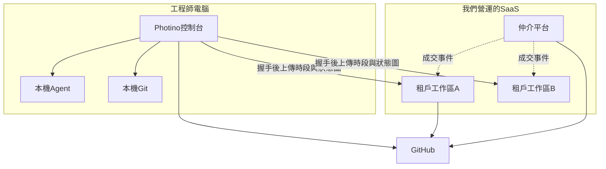

# 技術架構

公司工作區與仲介平台為 **規劃**。控制台技術為 **現況**，見 [開發與維護](../maintainer/develop.md)。三套機制獨立部署、獨立資料庫，只靠契約交換資料。見 [總規格・三層產品](spec.md#三層產品)。

## 選型

| 層 | 選擇 | 為什麼 |
|----|------|--------|
| 執行時 | .NET 10 | 與控制台同一 SDK 與團隊技能 |
| UI | **Blazor Web App**，Interactive Server 為預設 | 仲介刊登、工作區甘特與薪資表是長連線資料網格 |
| 可選 | 特定公開頁用 Static Server Render | 登入、刊登瀏覽、只讀薪資條 |
| 桌面 | 維持 Photino.Blazor | 本機行程、檔案、Agent；不把控制台改成 Web |
| 資料 | PostgreSQL；開發與測試可用 SQLite | 多租戶、權限、審計 |
| 識別 | 仲介：會員帳戶。工作區管理者：公司帳戶。工程師：控制台 GitHub | `github:{login}` 給上傳與派工寫回 |
| 部署 | **仲介與工作區預設由我們營運**（多租戶 SaaS）。工作區自架改後期 | 媒合、認證、合同、抽成必須在我們主機；原始碼仍不上雲 |

WASM 或 Auto 不當 MVP 預設。若日後要離線主管平板，再評估。

## 邏輯佈署

虛線是產品間交換，不是從屬。控制台是獨立安裝包，可同時設定多家**申報目的地**（各租戶工作區的接收 API）。仲介是公開多租戶。工作區預設也是我們主機上的租戶（一需求公司一工作區，見執行計劃 D-13），**可先於仲介開帳**。原始碼不上仲介雲。切割以 [總規格](spec.md#三層產品) 為準。

控制台繼續直連 GitHub（現況）。各工作區用 GitHub App 或 PAT 讀該案的 Issue／成員，寫回 assignee（可關）。

## 與 AiProject.Console.Core 的關係

- **現況** Core：掃描、建置、GitHub、工時聚合、進件、文件。
- **規劃：** 「工作區用戶端」套件（時段 DTO、狀態圖 DTO、握手、上傳）。控制台對每個申報目的地呼叫該租戶的 HTTPS 接收 API，**不**把仲介或工作區資料庫連線寫進桌面。
- 工時檔 `work-hours.json` 仍是本機真相來源；上傳是複本，且每次只送到使用者選的那一個目的地。衝突（本機與該接收端時段 ID 重疊）以本機為準並留伺服器審計——上線採「同一時段 ID 不可改已核准列，只能新增更正時段」。

建議接收 API 形狀（實作時再定 OpenAPI，此處約束語意；各租戶工作區同一契約）：

- `GET /api/v1/me` — **握手**：用控制台 GitHub 權杖確認此人在該公司名冊；通過才允許後續上傳。未建檔／未邀請回人話（待歸戶），不是只 401
- `POST /api/v1/timesheets/upload` — 時段＋狀態圖；冪等鍵用本機時段 ID
- `GET /api/v1/me/assignments` — 我的派工，供控制台顯示「這家公司認為你這週在哪些專案」
- `GET /api/v1/me/payslip` — 只讀（該公司的薪資條）
- 管理端 CRUD 走該公司 Blazor 伺服器，不必做成公開 REST，也**不必**讓控制台呼叫

MCP 維持控制台本機（現況）。公司平台**不**把薪資工具暴露給 Agent。

## 安全

- 傳輸 TLS。我們營運環境的憑證由我們管；後期自架由客戶管。
- 角色在伺服器強制；Blazor 元件隱藏不是安全邊界。
- 費率與薪資欄加密保存（至少資料庫權限隔離；欄位加密列 V1.1 可接受）。
- 審計表：誰看過薪資條可列後續；MVP 至少記誰改了費率、誰鎖定週期、誰強制超載。
- 控制台不把原始碼傳到公司平台。上傳內容僅時段、專案識別、狀態圖、Issue 編號。

## 解決方案結構（建議，實作階段再建）

現有 `AiProject.Console.slnx` 與 `AiProject.Company.*` 保留。仲介為新專案（名稱實作時定，例如 `AiProject.Marketplace.*`）。分階段開工清單見 [系統執行計劃書](execution-plan.md)。摘要：

- `src/AiProject.Marketplace.*` — 會員、認證、刊登、成交、合同、應收（下一實作才建）
- `src/AiProject.Company.Domain` — 工作區聚合、政策介面（已存在；改租戶）
- `src/AiProject.Company.Application` — 工作區用例與授權
- `src/AiProject.Company.Infrastructure` — EF Core、GitHub、加密
- `src/AiProject.Company.Contracts` — 接收契約（握手／上傳／派工）OpenAPI DTO
- `src/AiProject.Company.Web` — 工作區 Blazor 與接收 API
- `src/AiProject.Console.CompanyClient` — 控制台 HTTPS 用戶端

本輪只改規格。第一個實作 PR 做仲介骨架與租戶切分，不要先畫戰情室。

## 營運

- 仲介：我們營運的公開多租戶。工作區：預設同一套主機上的**另一個宿主**的租戶（一需求公司一工作區）。自架工作區改後期。
- 備份由我們（SaaS）或後期自架客戶負責。
- 版本與控制台獨立發版；接收 API 要相容至少一個控制台大版本。
- 控制台發版不綁任何一家公司；工作區公布自己的接收 Base URL（或由仲介成交事件寫入控制台可發現的目的地）。
