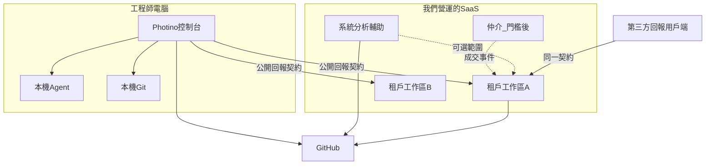

# 技術架構

公司工作區、系統分析輔助、仲介平台為 **規劃**。控制台技術為 **現況**，見 [開發與維護](../maintainer/develop.md)。四套產品獨立部署、獨立資料庫，只靠契約交換資料。見 [總規格・四套產品](spec.md#四套產品)。

## 選型

| 層 | 選擇 | 為什麼 |
|----|------|--------|
| 執行時 | .NET 10 | 與控制台同一 SDK 與團隊技能 |
| UI | **Blazor Web App**，Interactive Server 為預設 | 工作區甘特與薪資表是長連線資料網格；仲介／分析站同棧 |
| 可選 | 特定公開頁用 Static Server Render | 登入、只讀薪資條、分析產物預覽 |
| 桌面 | 維持 Photino.Blazor | 本機行程、檔案、Agent；不把控制台改成 Web |
| 資料 | PostgreSQL；開發與測試可用 SQLite | 多租戶、權限、審計 |
| 識別 | 工作區管理者：公司帳戶。工程師：GitHub 或 API 金鑰。仲介會員（門檻後）。分析站帳戶（B） | `github:{login}` 給上傳與派工寫回 |
| 部署 | **工作區預設由我們營運**（多租戶）。分析站與仲介（門檻後）同。工作區自架改後期 | 原始碼仍不上雲 |

WASM 或 Auto 不當 MVP 預設。若日後要離線主管平板，再評估。

## 邏輯佈署

虛線是產品間交換，不是從屬。控制台是獨立安裝包，可同時設定多家**申報目的地**。任何符合 [公開回報契約](reporting.md) 的用戶端都可送。工作區預設我們主機租戶（一需求公司一工作區，見 D-13），**可先於仲介開帳**。原始碼不上雲。切割以 [總規格](spec.md#四套產品) 為準。

控制台繼續直連 GitHub（現況）。各工作區用 GitHub App 或 PAT 讀該案的 Issue／成員，寫回 assignee（可關）。系統分析輔助寫 Issue／指派到 GitHub。

## 與 AiProject.Console.Core 的關係

- **現況** Core：掃描、建置、GitHub、工時聚合、進件、文件。
- **規劃：** 「工作區用戶端」套件（時段 DTO、狀態圖 DTO、握手、上傳）。控制台對每個申報目的地呼叫該租戶的 HTTPS **公開回報契約**，**不**把工作區或仲介資料庫連線寫進桌面。
- 工時檔 `work-hours.json` 仍是本機真相來源；上傳是複本，且每次只送到使用者選的那一個目的地。衝突以本機為準並留伺服器審計——「同一時段 ID 不可改已核准列，只能新增更正時段」。

公開回報契約語意（權威：[reporting.md](reporting.md)；實作時再定 OpenAPI）：

- `GET /api/v1/me` — **握手**（GitHub 或 API 金鑰）
- `POST /api/v1/timesheets/upload` — 時段＋狀態圖＋ Issue 參照；專案可用 Guid／專案碼／repo
- `GET /api/v1/me/assignments` — 我的派工
- `GET /api/v1/me/payslip` — 只讀薪資條
- 管理端 CRUD 走該公司 Blazor 伺服器，不必讓控制台呼叫

MCP 維持控制台本機（現況）。公司平台**不**把薪資工具暴露給 Agent。

## 安全

- 傳輸 TLS。我們營運環境的憑證由我們管；後期自架由客戶管。
- 角色在伺服器強制；Blazor 元件隱藏不是安全邊界。
- 費率與薪資欄加密保存（至少資料庫權限隔離；欄位加密列 V1.1 可接受）。
- 審計表：誰改了費率、誰鎖定週期、誰強制超載、誰用 API 金鑰上傳。
- 上傳內容僅時段、專案識別、狀態圖、Issue 參照；禁止 path／blob／source。

## 解決方案結構（建議，實作階段再建）

現有 `AiProject.Console.slnx` 與 `AiProject.Company.*` 保留。分階段見 [系統執行計劃書](execution-plan.md)。摘要：

- `src/AiProject.Company.*` — **下一實作**：租戶、公開契約、六大模組缺口
- `src/AiProject.Console.CompanyClient` — 多名目的地、握手、上傳
- `src/AiProject.Analysis.*`（名稱待定）— 波次 B 新建
- `src/AiProject.Marketplace.*` — **門檻後**再建（會員、成交、合同、應收）

本輪只改規格。第一個實作 PR 做工作區租戶與公開契約，**不要**先做仲介骨架或戰情室當首頁。

## 營運

- 工作區：預設我們營運租戶。分析站：我們營運。仲介：門檻後、我們營運多租戶。
- 備份由我們（SaaS）或後期自架客戶負責。
- 版本與控制台獨立發版；公開回報契約要相容至少一個控制台大版本。
- 控制台發版不綁任何一家公司；工作區公布自己的接收 Base URL。
