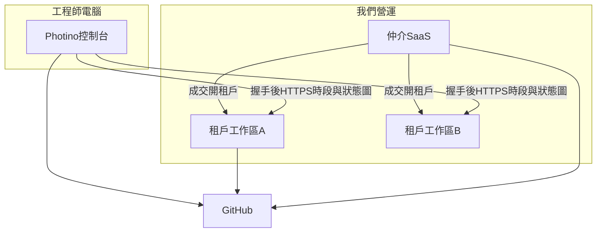
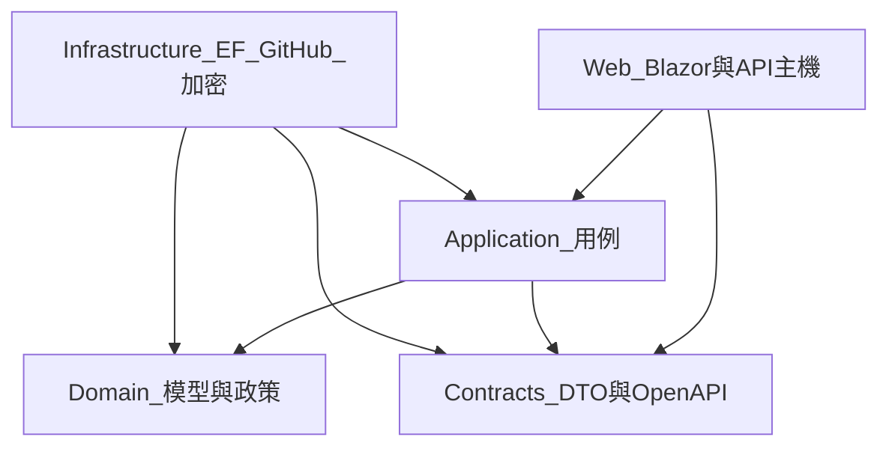

# 系統執行計劃書

給工程、產品、採購對齊用。權威需求仍是 [PRD](prd.md) 與 [總規格](spec.md)；**衝突時以總規格的三層產品為準**。本文件把需求展開成可施工的階段。目標是 **我們營運的仲介 SaaS 能成交並開工作區**，不是先讓一家 SI 自架跑完薪資月。

| 欄 | 值 |
|----|-----|
| 狀態 | **規劃**。仲介尚未實作。工作區 Company.* 已有程式，定位改租戶 |
| 適用產品 | 仲介 SaaS（下一實作）＋成交後工作區＋控制台上傳 |
| 前提 | 控制台約 0.6.x 已出貨 |
| 交付判準 | 一組通過認證的需求組織與工程師走完發布 → 成交 → 開工作區 → 控制台第一筆工時 |
| 本文件不保證 | 日曆交貨日、人月估點、營收 |

銷售簡報必須標「規劃」。把本計劃書講成已安裝，等於對買家說謊。

## 1. 對 PRD 的執行立場

[PRD](prd.md) 分波次 A（仲介）與波次 B（工作區）。本計劃書：

| PRD 說法 | 本計劃書做法 |
|----------|----------------|
| 波次 A 是下一驗收 | **先做仲介**；不與工作區十階段綁成同一上線版本 |
| 波次 B 沿用 Company.* | 租戶化與開帳；缺的再補。不刪現碼重寫 |
| 仲介第一刀必須裁切 | 不做押金／金流託管／自動媒合／戰情室 |
| 開放問題 | **開工前關閉** D-10～D-13 |

**仍不做**（產品邊界）：控制台改成網站、取代 Jira／Cursor、汎用 ERP／報稅／勞健保、勞基法加班引擎、勞務派遣、自動媒合、原始碼上傳、在仲介層重做薪資／戰情室。見 [願景](vision.md)、[仲介](marketplace.md)。

公開 SaaS 多租戶與需求方自助發布是仲介**預設**，不再列為不做。

波次 A 成功標準：KPI-M01～M06。波次 B 沿用 KPI-01～06。

## 2. 目標系統長什麼樣

三層，見 [總規格](spec.md#三層產品)：

- 仲介（我們營運）：會員、認證、精靈發案、應徵／邀請、合同、仲介應收
- 工作區（成交後租戶）：名冊、專案、派工、工時確認、薪資匯出、戰情室
- 控制台（現況）：做工與申報；可對多家工作區



技術形態見 [架構](architecture.md)：仲介與工作區 .NET 10 Blazor Web App；控制台 Photino.Blazor。

## 3. 開工前關閉的決策

| # | 問題 | 決策 | 理由 |
|---|------|------|------|
| D-01 | GitHub App vs PAT | **預設 GitHub App**；PAT 僅備援與本機開發 | 讀 Issue、寫回 assignee 需要可撤銷權限 |
| D-02 | 資料庫 | **生產與試用一律 PostgreSQL**；SQLite 只給測試與單機開發 | 多租戶與審計不能靠每人一份檔 |
| D-03 | 控制台「公司派工」條 | 波次 B 交付 `GET /api/v1/me/assignments` | 波次 A 只需握手＋上傳 |
| D-04 | 已請款／已收款 | 工作區資料模型分兩步；一鍵「已認列」可同時寫兩步 | 波次 B；仲介應收是另一本帳 |
| D-05 | 欄位加密 | 工作區上線即做月薪／費率加密 | 租戶人事費率 |
| D-06 | 誰看過薪資 | 工作區上線即做讀取審計 | 波次 B |
| D-07 | 匯率 | 工作區人工匯率表 | 波次 B |
| D-08 | API 宿主 | 工作區接收 API 與 Blazor 同一宿主；仲介另宿主或同站不同模組 | DTO 給控制台，不把 EF 洩到桌面 |
| D-09 | 多租戶 | **仲介與工作區由我們營運**。控制台多名目的地指向不同租戶 | 翻轉舊「單一公司自架、不做公開多租戶」 |
| D-10 | 法律定位 | **專案承攬仲介，不是人力派遣**。合同當事人：需求公司 ↔ 工程師；平台是仲介與抽成方 | 文案、合同範本、不代發薪。未關本項不得寫成交程式 |
| D-11 | 合同當事人 | 同 D-10；平台不成為工程師雇主 | 與 D-10 一併關 |
| D-12 | KYC 與押金 | **第一刀不做真金流託管與押金凍結**。工程師：身分＋GitHub；組織：統編＋負責人。eKYC／押金列下一步 | 牌照與金流；不假裝第一刀有託管 |
| D-13 | 租戶切分 | **一需求公司一個工作區、多專案** | 較能沿用現有 `CompanyDbContext`；一成交一庫會炸開 |

D-10～D-13 未關閉前，不得合併仲介成交相關 PR。

## 4. 架構原則（SOLID 與 DI）

公司工作區與仲介**禁止**把規則寫進 Razor、靜態工具類或「一個 God Service」。所有可變行為靠介面注入。仲介與工作區可分專案，原則相同。

### 4.1 分層與依賴方向



- **Domain** 不引用 EF、HTTP、Blazor。只含實體、值物件、領域事件、政策介面。
- **Application** 編排用例：授權 → 載入聚合 → 呼叫領域 → 發事件 → 回傳 DTO。
- **Infrastructure** 實作倉儲、GitHub、時鐘、加密、審計寫入。
- **Web** 只做呈現、端點、組合根（Composition Root）。
- **Contracts** 是控制台與**任意一個租戶工作區**的穩定接收契約；版本化，相容至少一個控制台大版本。仲介刊登／成交另有自己的契約，不跟接收 API 混成一個 God DTO。

### 4.2 SOLID 落點

| 原則 | 做法 |
|------|------|
| S 單一職責 | 一個用例一個 handler（建立人員、確認時段、鎖定週期各不相混） |
| O 開放封閉 | 計薪、收入認列、健康規則、GitHub 寫回皆為策略介面；新規則加類別不改呼叫端 |
| L 里氏替換 | `IGitHubDirectory` 的 App／PAT／GHE 實作必須通過同一組契約測試 |
| I 介面隔離 | 讀模型用 `I*Query`，寫入用 `I*Repository`；控制台用戶端只看 Contracts |
| D 依賴反轉 | Application 只依賴 `IClock`、`ICurrentUser`、`IAuthorizationGate`、`IAuditLog`、各倉儲與策略 |

### 4.3 組合根與生命週期

在 `AiProject.Company.Web` 的 `Program.cs` 只呼叫擴充方法，不手寫數十行 `AddScoped`。

```csharp
builder.Services.AddCompanyPlatform(builder.Configuration);
```

建議註冊（實作時落在 Infrastructure／Application 擴充）：

| 生命週期 | 類型 | 例子 |
|----------|------|------|
| Singleton | 無狀態策略、選項 | `IPayrollCalculator` 各實作、`IMarginThresholds`、`IGitHubAppAuthenticator` |
| Scoped | 每請求 | `DbContext`、`IUnitOfWork`、`ICurrentUser`、各 Repository／Query、`IAuthorizationGate` |
| Transient | 短命編排 | Command handler（若不用 MediatR 亦可 Scoped） |

禁止：Service Locator、靜態 `HttpContext`、Razor 直接 `new` 倉儲、控制台連公司資料庫。

### 4.4 必須存在的抽象（開工即建）

| 介面 | 職責 |
|------|------|
| `IClock` | 可測時鐘；戰情室「今天線」、週期鎖定以此外為準 |
| `ICurrentUser` | `personId`、角色、外包商、授權專案 |
| `IAuthorizationGate` | 伺服器強制；隱藏選單不是安全邊界 |
| `IAuditLog` | 誰、何時、對何物、為什麼、前後摘要 |
| `IFieldEncryptor` | 月薪／費率加解密；金鑰來自設定／DPAPI／機房 KMS |
| `IGitHubDirectory` | org 成員、Issue、寫回 assignee |
| `ITimesheetIdempotency` | 本機時段 ID 冪等；已核准不可覆蓋 |
| `IPayrollCalculator` | 月薪／時計／專案獎金策略 |
| `IRevenueRecognizer` | 里程碑／直線攤提／T&M |
| `IAvailabilityCalculator` | 剩餘可派小時、超載；戰情室與派工同一口徑 |
| `IProjectHealthPolicy` | 綠黃紅；門檻來自公司設定 |
| `IUnitOfWork` | 交易邊界；鎖定週期與匯出同一交易 |

授權檢查發生在 Application 層，不在元件 `@if`。Blazor 元件只問「目前使用者能否看到這塊 UI」，真正拒絕在 handler／endpoint。

## 5. 解決方案結構

保留現有 `AiProject.Console.slnx` 與已存在的 `AiProject.Company.*`。**下一實作新增仲介專案**（名稱實作時定）：

| 專案 | 職責 |
|------|------|
| `src/AiProject.Marketplace.*` | 會員、認證、刊登、成交、合同、應收（波次 A 才建） |
| `src/AiProject.Company.Domain` | 工作區聚合、值物件、領域事件、政策介面（已存在；改租戶） |
| `src/AiProject.Company.Application` | 工作區用例、授權、驗證、DTO 對應 |
| `src/AiProject.Company.Infrastructure` | EF Core（PostgreSQL）、GitHub、加密、檔案匯出 |
| `src/AiProject.Company.Contracts` | 接收契約（握手／上傳／派工／薪資條） |
| `src/AiProject.Company.Web` | 工作區 Blazor ＋ 接收 API |
| `src/AiProject.Console.CompanyClient` | 控制台 HTTPS 用戶端 |
| 既有 `tests/AiProject.Company.*` | 工作區測試沿用 |

控制台 `AiProject.Console.App` 只依賴 `CompanyClient`＋`Contracts`，**不**依賴 Domain／EF。仲介不把工作區 EF 洩到刊登頁。

聚合建議（工作區，一聚合一個一致性邊界）：

- `CompanySettings`（時區、貨幣、毛利門檻、寫回開關、匯率表）
- `Person`／`Vendor`
- `Client`／`Contract`／`Project`（階段、里程碑、倉連結）
- `Assignment`
- `Timesheet`（時段＋狀態圖；核准狀態機）
- `PayrollPeriod`
- `BudgetSnapshot` 可為專案上的實體或由工時／認列投影；寫入認列走 `Project` 或獨立 `Recognition` 聚合
- `WarRoomReadModel` 為查詢端投影，不是寫入聚合

仲介另有：`Member`／`Organization`、`Listing`、`Deal`、`ContractPack`、`CommissionReceivable`。不要塞進工作區 `CompanySettings`。

軟刪：已有工時、派工或成交的人員／專案不可硬刪（PRD-NFR-09）。

## 6. 需求展開

每條含：行為、領域物件、介面、畫面或 API、驗收。模組欄位細節以各規格篇為準，此處不重複表單。

### 6.0 仲介第一刀（PRD-MKT）

規格：[仲介平台](marketplace.md)

| ID | 展開 | 主要類型 | 驗收 |
|----|------|----------|------|
| PRD-MKT-01 | 免費註冊需求組織或工程師檔 | `Member`、`Organization` | 未付費可加入；未認證不能成交 |
| PRD-MKT-02 | 工程師身分＋GitHub 認證 | `TalentKyc` | 通過可應徵 |
| PRD-MKT-03 | 組織統編＋負責人認證 | `OrgKyc` | 通過可發布 |
| PRD-MKT-04 | 網頁精靈刊登；不寫 Git | `Listing`、精靈欄位 | 不要求控制台 |
| PRD-MKT-05 | 已認證者應徵 | `Application` | 未認證不可成交 |
| PRD-MKT-06 | 邀請；雙方接受寫成交 | `Deal` | 可分次多人 |
| PRD-MKT-07 | 合同套件＋確認紀錄 | `ContractPack` | 電子簽可第三方 |
| PRD-MKT-08 | 成交寫仲介應收 | `CommissionReceivable` | 不做扣款 |
| PRD-MKT-09 | 開租戶工作區；工程師入名冊 | 工作區 `Person` | 控制台可指向接收 API |
| PRD-MKT-10 | 建或掛 GitHub 倉；Issue 溝通 | `RepoLink` | 不另做站內聊天主路徑 |
| PRD-MKT-11 | 握手＋上傳第一筆 | `GET /api/v1/me`、upload | 不含原始碼 |

### 6.1 工作區基盤（PRD-PLT / NFR；波次 B）

| ID | 展開後的系統行為 | 主要類型 | 驗收 |
|----|------------------|----------|------|
| PRD-PLT-01 | 後台只用公司帳戶。GitHub 邀請給線上招募的外部工程師與控制台上傳對人；未建檔上傳進待歸戶 | `Invitation`、`IAuthorizationGate`、公司帳戶 Cookie | 後台無 GitHub OAuth；未邀請上傳 202 待歸戶；邀請後可對人 |
| PRD-PLT-02 | 登入後依角色進預設首頁，不是空白選單 | `IHomeRouteResolver` | 對齊 [UX 落地表](ux.md) 與 PRD 第 5 節 |
| PRD-PLT-03 | `owner` 設公司名、時區（預設 `Asia/Taipei`）、貨幣（TWD）、毛利門檻、寫回 assignee | `CompanySettings`、`IMarginThresholds` | 存檔後全公司讀同一份；戰情室與預算同門檻 |
| PRD-PLT-04 | 預設我們主機上一個租戶（D-13 一組織一工作區）；自架後期 | 租戶鍵＋連線／schema | 文件說明 SaaS；自架不擋仲介 |
| PRD-PLT-05 | 改費率、鎖定週期、強制超載必填原因並審計 | `IAuditLog`、`SensitiveChange` | 能查出誰、何時、為什麼 |
| PRD-PLT-06 | 工程師看不到同事月薪與對客戶費率；API 同樣拒絕 | `IAuthorizationGate`、遮罩元件 | 直打 URL／API 403；畫面遮罩 |
| PRD-NFR-01 | TLS；SaaS 憑證我們管；後期自架客戶管 | 部署手冊 | 試用機 HTTPS |
| PRD-NFR-02 | 角色伺服器強制 | 每個 handler 開頭授權 | 隱藏選單不能當唯一防線 |
| PRD-NFR-03 | 費率／月薪加密＋遮罩；讀取寫入審計 | `IFieldEncryptor`、`IAuditLog` | DB 內非明文；「誰看過」可查 |
| PRD-NFR-04 | 上傳不含原始碼；MCP 不暴露薪資工具 | Contracts 白名單欄位 | 契約測試禁止 path／blob |
| PRD-NFR-05 | 逾期狀態五分鐘內反映 | 領域事件 → 讀模型；或請求時即時算健康 | 改目標日到昨天，五分鐘內紅 |
| PRD-NFR-06 | 編輯 ≥1200px；手機只保證戰情室、核准、我的工時 | CSS／版面 | 平板可讀 KPI |
| PRD-NFR-07 | 狀態不只靠顏色；WCAG 2.2 AA 目標 | 文案＋圖示 | 紅燈同時有「逾期」 |
| PRD-NFR-08 | 上傳 API 相容一個控制台大版本 | Contracts 版本標頭 | 舊用戶端仍能上傳 |
| PRD-NFR-09 | 軟刪；有工時／派工不可硬刪 | 聚合不變量 | API 回人話錯誤 |
| PRD-NFR-10 | 繁中、錯誤說人話 | `DomainError` → 對應文案 | 「這位外包不在合約名單裡」而非只 403 |

### 6.2 人員與外包（PRD-PPL）

規格：[人員與外包](modules/people.md)

| ID | 展開 | 主要類型 | 驗收 |
|----|------|----------|------|
| PRD-PPL-01 | 建立正職／個人外包／承攬派駐；必填顯示名、類型、狀態 | `Person`、`EmploymentKind` | 三種可建 |
| PRD-PPL-02 | `github:{login}` 對 `personId`；同一帳號不能綁兩個在職 | `PersonGitHubBinding` | 第二次綁定失敗並說明 |
| PRD-PPL-03 | `vendor_admin` 僅己方人員與己方專案工時 | 資源範圍授權 | 抽測看不到他司、費率、毛利、戰情室 |
| PRD-PPL-04 | 停用後不能新派工；歷史工時可查 | `Person.Status` | 派工寫入拒絕；查詢仍可 |
| PRD-PPL-05 | 技能、週上限、不可派區間給派工讀 | `IAvailabilityCalculator` | 剩餘小時、超載與戰情室一致 |
| PRD-PPL-06 | 未綁 GitHub 可建檔；上傳進待歸戶；未綁不能自動對 PR | `UnmatchedUploadQueue` | 畫面說找人資，不噴 UUID |

外包商主檔、費率覆寫、窗口人員、有效期間一併在本階段交付（模組規格，不是可選）。

### 6.3 專案與客戶（PRD-PRJ）

規格：[專案與客戶](modules/projects-clients.md)

| ID | 展開 | 主要類型 | 驗收 |
|----|------|----------|------|
| PRD-PRJ-01 | 客戶 → 合約 → 專案 → GitHub 倉 | `Client`、`Contract`、`Project`、`RepoLink` | 資料鏈可建可查 |
| PRD-PRJ-02 | 階段／里程碑甘特；今天線；逾期紅；一層「完成才開始」 | `Phase`、`Milestone`、`GanttQuery` | 逾期條變紅 |
| PRD-PRJ-03 | 專案首頁分析師／工程師來自派工，不另養名單 | `IAssignmentQuery` | 與週矩陣同一資料 |
| PRD-PRJ-04 | 結案不能新派工；歷史甘特／工時可查 | `Project.Status` | 寫入拒絕 |
| PRD-PRJ-05 | 連結工作區，只讀進件彙總；不搬 `intake.json` | `IWorkspaceIntakeSummary` | 顯示已發出／待驗收筆數 |
| PRD-PRJ-06 | 同一份客戶主檔生命週期；逾期跟進；潛在不派工、不佔進行中 | `ClientLifecycle`、`ClientActivity` | 列表可篩潛在；黃／紅跟進 |
| PRD-PRJ-07 | 客戶首頁一次成立合約＋專案；標成交；活動紀錄 | `ProjectCommands.EstablishAsync` | 單一交易；可加第二條 |
| PRD-PRJ-08 | 需求分析目錄（Pages／骨架／進件）＋專案紀錄；需求未就緒黃燈 | `IProjectDocsCatalog`、`ProjectJournalEntry` | 未掛倉說明句；不搬 Markdown 全文 |

合約計價（固定／T&M／混合）、可派外包商名單、內部／外部客戶一併交付。

### 6.4 派工（PRD-DSP）

規格：[派工](modules/dispatch.md)

| ID | 展開 | 主要類型 | 驗收 |
|----|------|----------|------|
| PRD-DSP-01 | 週矩陣派人到專案一週；可拖放；可選寫回 Issue assignee | `Assignment`、`IGitHubDirectory` | 寫入派工單；矩陣可見 |
| PRD-DSP-02 | 寫回失敗標「待同步」，不假裝已派到 GitHub | `AssignmentSyncState` | UI 明示待同步 |
| PRD-DSP-03 | 外包派到未授權專案拒絕，人話原因 | `IContractStaffingPolicy` | 說明「不在合約名單」 |
| PRD-DSP-04 | 超載警告；`delivery` 可強制並留審計 | `IAvailabilityCalculator` | 強制必填原因 |
| PRD-DSP-05 | 取消派工不刪已上傳工時 | 時段聚合獨立 | 薪資／預算仍見時段 |
| PRD-DSP-06 | 建議名單依技能與剩餘小時；**不是**自動指派 | `IAssignmentSuggester` | 列表可選，不自動寫入 |

未派 Issue 側欄、外包商摺疊列、角色（分析師／工程師／Lead／PM）一併交付。

### 6.5 控制台上傳（PRD-CON）

規格：[薪資](modules/payroll.md)、[架構](architecture.md)

| ID | 展開 | 主要類型 | 驗收 |
|----|------|----------|------|
| PRD-CON-01 | 控制台專案 × 日期執行狀態圖，不是公司甘特縮小版 | 控制台頁＋本機存檔 | 可塗色、可存 |
| PRD-CON-02 | 選一個申報目的地後明確「送到〔這家公司〕」；失敗可重試；`work-hours.json` 仍在 | `CompanyClient` | 非背景偷傳；一次一個目的地 |
| PRD-CON-03 | `POST /api/v1/timesheets/upload` 本機時段 ID 冪等；已核准不可覆蓋，只能新增更正時段 | `ITimesheetIdempotency` | 重送不複製；核准列拒絕覆蓋 |
| PRD-CON-04 | 上傳僅時段、專案識別、狀態圖、Issue 編號 | Contracts 白名單 | 契約測試 |
| PRD-CON-05 | `GET /api/v1/me/assignments`；控制台只讀條＋Web「我的工時」；資料來自目前目的地 | 同一 Query | 兩邊資料一致；不混別家公司 |
| PRD-CON-06 | 控制台可新增多個申報目的地（顯示名＋Base URL） | 設定＋`CompanyClient` 按目的地建 HttpClient | 零個目的地時其餘功能可用；刪目的地不刪本機工時 |
| PRD-CON-07 | `GET /api/v1/me` 握手：名冊有此 GitHub 才允許上傳 | 邀請／綁定／待歸戶 | 未通過說人話；不鎖死控制台 |

另交付 `GET /api/v1/me/payslip`（架構已列）。衝突以本機為準並留伺服器審計。

### 6.6 薪資（PRD-PAY）

規格：[薪資](modules/payroll.md)

| ID | 展開 | 主要類型 | 驗收 |
|----|------|----------|------|
| PRD-PAY-01 | 上傳後 Web「待 PM 確認」；可見退回原因；繪圖入口指控制台 | 時段狀態機 | 工程師看得到狀態 |
| PRD-PAY-02 | PM 確認歸屬與狀態圖，不核定薪水金額 | `ConfirmTimesheet` 用例 | PM 不能改金額 |
| PRD-PAY-03 | 正職月薪：無獎金時實發＝月薪；分攤只影響成本 | `MonthlySalaryCalculator` | 分攤明細可查 |
| PRD-PAY-04 | 時計：實發＝核准小時 × 費率；未核准不進；超上限待核准加班 | `HourlyCalculator` | 數字對得上 |
| PRD-PAY-05 | 專案獎金在里程碑或 PM「可發」前不進實發 | `ProjectBonusCalculator` | 可發前實發不含該列 |
| PRD-PAY-06 | 鎖定後 CSV；不能改歷史，只能開更正週期 | `PayrollPeriod` | 欄位固定；鎖定後寫入失敗 |
| PRD-PAY-07 | 外包窗口代送己方工時，仍要我方 PM 確認 | 授權範圍 | 他司不可代送 |

計薪策略用 `IPayrollCalculator` 可並存（月薪＋獎金）。不做勞基法費率引擎。

### 6.7 預算費用（PRD-BDG）

規格：[預算費用](modules/budget.md)

| ID | 展開 | 主要類型 | 驗收 |
|----|------|----------|------|
| PRD-BDG-01 | 固定價格用里程碑認列；人事實際來自核准工時／薪資分攤 | `IRevenueRecognizer`、成本投影 | 能指出收入來源與分攤列 |
| PRD-BDG-02 | T&M 對客戶費率與對內成本分開；工程師不可見對客戶費率 | 欄位授權＋加密 | API 拒絕 |
| PRD-BDG-03 | 月報 CSV 欄位固定 | `IBudgetExport` | 文件化欄位 |
| PRD-BDG-04 | 正職可標「不參與專案分攤」 | `Person.CostAllocation` | 成本不塞隨機專案 |
| PRD-BDG-05 | 毛利門檻與戰情室同一組；收入 0 顯示「—」 | `IMarginThresholds` | 不當 100% |

其他費用一筆列、計劃 vs 實際並排、原幣＋公司幣（D-07）一併交付。

### 6.8 戰情室（PRD-WAR）

規格：[戰情室](modules/war-room.md)

| ID | 展開 | 主要類型 | 驗收 |
|----|------|----------|------|
| PRD-WAR-01 | `exec` 登入即戰情室 | `IHomeRouteResolver` | 不必找選單 |
| PRD-WAR-02 | 目標日改昨天，卡片變紅，五分鐘內 | `IProjectHealthPolicy`＋讀模型 | 準即時 |
| PRD-WAR-03 | `vendor_*`／`engineer` 看不到；直連被拒 | 授權 | 選單無、API 403 |
| PRD-WAR-04 | 內部無收入專案可不列入毛利 KPI | 專案旗標 | 避免全紅 |
| PRD-WAR-05 | 紅燈鑽取：專案首頁／週矩陣／損益卡 | 深層連結 | `delivery` 可跳去改派工 |
| PRD-WAR-06 | 行動裝置可讀 KPI、例外、只讀專案頁 | 響應式 | 不保證改甘特 |

KPI：進行中、紅燈、待案人力、本月預估毛利。例外：未派 Issue、工時未傳、毛利破門檻、超載。規則出廠值可調。

## 7. 分階段執行計畫

原則：**每一階段結束都是可部署的增量**。波次 A（仲介）先於波次 B（工作區租戶化）。工作區內戰情室仍放最後。


人力假設可縮放。下列是順序與相對比重，不是合約日。

### 波次 A — 仲介第一刀（下一實作）

對應：PRD-MKT-01～11、KPI-M01～M06。D-10～D-13 必須已關閉。

#### 階段 A0 — 仲介組合根與多租戶骨架

| 工作包 | 內容 |
|--------|------|
| MKT-00 | 建立 `AiProject.Marketplace.*`（或同等）專案、DI、PostgreSQL、CI、`/health` |
| MKT-01 | 租戶／會員資料模型與審計基底；與 Company 庫隔離或 schema 隔離 |
| MKT-02 | 公開站骨架：註冊／登入；繁中人話錯誤 |

**出口：** 空站可部署到我們的環境。尚無成交。

#### 階段 A1 — 會員與認證

| 工作包 | 內容 |
|--------|------|
| MKT-10 | 需求組織／工程師個人兩種主體；角色標籤分析／設計／開發／測試 |
| MKT-11 | 工程師：身分＋GitHub 驗證 |
| MKT-12 | 組織：統編＋負責人；未認證不能發布／應徵 |

**出口：** KPI-M01。不做押金與 eKYC（D-12）。

#### 階段 A2 — 需求精靈與刊登

| 工作包 | 內容 |
|--------|------|
| MKT-20 | 網頁精靈：範圍、非範圍、角色人數、資格、期間、預算區間 |
| MKT-21 | 刊登公開瀏覽（僅已認證可應徵）；欄位對齊進件概念但不寫 Git |

**出口：** KPI-M02。

#### 階段 A3 — 應徵、邀請、合同、應收

| 工作包 | 內容 |
|--------|------|
| MKT-30 | 應徵與邀請；雙方接受寫 `dealId` |
| MKT-31 | 合同套件範本（保密＋承攬範圍）＋雙方確認紀錄；電子簽可接第三方 |
| MKT-32 | 成交寫入仲介應收；費率可設定；不做扣款 |

**出口：** KPI-M03。文案符合 D-10（不是派遣）。

#### 階段 A4 — 開工作區與控制台第一筆工時

| 工作包 | 內容 |
|--------|------|
| MKT-40 | 成交後為該組織開／掛租戶工作區（D-13） |
| MKT-41 | 成交工程師入名冊並綁 GitHub |
| MKT-42 | 建或掛 GitHub 倉；Issue 為溝通面 |
| MKT-43 | 控制台目的地、`GET /api/v1/me` 握手、上傳第一筆；不含原始碼 |

**出口：** KPI-M04～M05。波次 A 可發布。

### 波次 B — 成交後工作區（程式已存在；改租戶與開帳）

以下原「階段 0～9」改隸波次 B，**不與 A 同一上線版本硬綁**。Company.* 已有人員／專案／派工／工時／薪資／戰情時，本波以租戶隔離、開帳劇本、缺口補齊為主，不是從零畫戰情室。

原則：戰情室仍放最後。依賴與 [PRD 波次 B](prd.md) 一致。

#### 階段 0 — 組合根、資料庫、品質門（租戶化）

**目的：** 後面所有模組有家可住，而不是先堆畫面。

| 工作包 | 內容 |
|--------|------|
| SOL-01 | 建立第 5 節專案、DI 擴充、`AddCompanyPlatform` |
| SOL-02 | EF Core＋PostgreSQL；開發容器或 docker-compose；測試用 Testcontainers |
| SOL-03 | `IClock`、`ICurrentUser` 測試替身、`IAuditLog`、`IFieldEncryptor`、軟刪基底 |
| SOL-04 | 錯誤模型（人話代碼）、OpenAPI 雛型、CI（restore／build／test） |
| SOL-05 | 自架骨架：反向代理範例、設定檔、健康檢查 `/health` |

**出口：** 空站可部署到內網、HTTPS、DB migrate、CI 綠。尚無業務畫面。

### 階段 1 — 身分、邀請、公司設定、角色落地

對應：PRD-PLT-01～04、KPI-06、NFR-01／02／10。

| 工作包 | 內容 |
|--------|------|
| ID-01 | 公司帳戶 Cookie 登入後台；GitHub App／org token 只給目錄與寫回 assignee |
| ID-02 | GitHub 邀請（線上招募外部工程師）、角色指派、未邀請控制台上傳進待歸戶 |
| ID-03 | 公司設定（時區、貨幣、毛利門檻、寫回開關） |
| ID-04 | `IHomeRouteResolver` 與全域導覽權限 |
| ID-05 | 授權中介：直打頁面／API 403 |

**出口：** `owner` 用公司帳戶完成首次設定；各管理者角色登入進對的空狀態首頁（「建立第一個客戶」而不是空白圖）。工程師不登後台。

### 階段 2 — 人員、外包商、可用度、待歸戶

對應：PRD-PPL-01～06、PLT-05／06（費率遮罩起點）。

| 工作包 | 內容 |
|--------|------|
| PPL-01 | 人員名冊／卡片；三種雇用類型；軟刪與停用 |
| PPL-02 | GitHub 綁定唯一性；未綁建檔 |
| PPL-03 | 外包商、窗口、`vendor_admin` 資料隔離 |
| PPL-04 | 技能、週上限、不可派日期區間 |
| PPL-05 | `IAvailabilityCalculator` 單一口徑 |
| PPL-06 | 待歸戶佇列 |

**出口：** 人資可建正職＋兩種外包；外包窗口抽測隔離通過；停用不可新派（先用 API／領域測試擋，UI 在階段 5 接上）。

### 階段 3 — 客戶、合約、專案、甘特、進件只讀

對應：PRD-PRJ-01～08。

| 工作包 | 內容 |
|--------|------|
| PRJ-01 | 客戶／合約／專案 CRUD；結案規則 |
| PRJ-02 | 階段預設六段、里程碑、一層依賴 |
| PRJ-03 | 甘特查詢（計劃／實際、今天線、逾期） |
| PRJ-04 | 從已授權 repo 挑選掛倉（少填表） |
| PRJ-05 | 工作區進件彙總只讀 |
| PRJ-06 | 專案首頁殼（派工／損益槽位先放空狀態） |
| PRJ-07 | 客戶生命週期、跟進、活動列；清單分頁籤 |
| PRJ-08 | `EstablishAsync`：合約＋專案＋標成交 |
| PRJ-09 | 專案紀錄時間線；需求分析目錄與黃燈 |

**出口：** PM 能走完潛在→議約→成立專案→倉→甘特／需求分析空狀態；結案專案領域層拒絕新派工；潛在不進戰情室進行中。

### 階段 4 — 上傳 API、狀態圖、控制台用戶端

對應：PRD-CON-01～05、KPI-04、NFR-04／08。

| 工作包 | 內容 |
|--------|------|
| CON-01 | Contracts：me 握手／upload／assignments／payslip |
| CON-02 | 冪等、已核准不可覆蓋、更正時段、審計 |
| CON-03 | 控制台狀態圖頁＋申報目的地清單＋「送到〔這家公司〕」＋重試 |
| CON-04 | `CompanyClient` 依目前目的地注入 Base URL，失敗可重試 |
| CON-05 | 控制台只讀「這家公司的派工」條 |
| CON-06 | 契約相容測試（舊欄位仍可解） |
| CON-07 | `GET /api/v1/me`：名冊確認；未邀請進待歸戶 |

**出口：** 工程師從控制台上傳成功；Web 能顯示待確認（確認 UI 在階段 6）；本機檔仍在。

### 階段 5 — 派工全貌、拖放、GitHub 寫回、建議

對應：PRD-DSP-01～06、PPL-05、PRJ-03／04。

| 工作包 | 內容 |
|--------|------|
| DSP-01 | 派工單寫入、週矩陣、外包摺疊 |
| DSP-02 | 拖放＋鍵盤；超載紅底與文字 |
| DSP-03 | 合約授權檢查、人話錯誤 |
| DSP-04 | 強制超載＋審計 |
| DSP-05 | GitHub 寫回與「待同步」重試 |
| DSP-06 | 建議名單（非自動指派） |
| DSP-07 | 未派 Issue 側欄 |
| DSP-08 | 取消派工保留工時 |

**出口：** 交付主管可把人派進一週；外包未授權被拒；寫回失敗不假裝成功。

### 階段 6 — 薪資週期、確認、鎖定、匯出

對應：PRD-PAY-01～07、KPI-01。

| 工作包 | 內容 |
|--------|------|
| PAY-01 | 時段狀態機：待確認／退回／已核准 |
| PAY-02 | PM 確認畫面（狀態圖＋歸屬） |
| PAY-03 | 三種 `IPayrollCalculator` |
| PAY-04 | 待核准加班列（人資填金額，非法規引擎） |
| PAY-05 | 週期鎖定、更正週期、CSV |
| PAY-06 | 我的工時／薪資條；讀取審計 |
| PAY-07 | `vendor_admin` 代送 |

**出口：** 正職＋至少一種外包跑完：上傳 → PM 確認 → 人資鎖定 → CSV。

### 階段 7 — 預算、認列、毛利、月報

對應：PRD-BDG-01～05、KPI-05。

| 工作包 | 內容 |
|--------|------|
| BDG-01 | 里程碑／直線／T&M 認列策略；已請款／已收款／一鍵已認列 |
| BDG-02 | 正職分攤、外包成本、不參與分攤標記 |
| BDG-03 | 其他費用列；計劃 vs 實際 |
| BDG-04 | 匯率表；原幣＋公司幣 |
| BDG-05 | 損益卡、月報 CSV、門檻與「—」 |
| BDG-06 | 對客戶費率授權 |

**出口：** 固定價格能解釋收入來源與人事分攤；T&M 費率隔離；工程師 API 看不到對客戶費率。

### 階段 8 — 戰情室與鑽取

對應：PRD-WAR-01～06、KPI-02／03、NFR-05／06／07。

| 工作包 | 內容 |
|--------|------|
| WAR-01 | 讀模型或即時健康計算；五分鐘內反映 |
| WAR-02 | KPI、專案卡、例外清單、只看紅黃 |
| WAR-03 | 鑽取連結；`exec` 只讀、`delivery` 可跳派工 |
| WAR-04 | 角色落地與拒絕 |
| WAR-05 | 無收入專案排除毛利 KPI |
| WAR-06 | 行動裝置只讀版面 |

**出口：** `exec` 30 秒內看到例外並鑽到專案；外包／工程師直連被拒。

### 階段 9 — 上線包（軟體公司可接手營運）

對應：NFR 全體、KPI-06、發布準則。

| 工作包 | 內容 |
|--------|------|
| OPS-01 | 安裝手冊：Windows Server／Linux＋反向代理、憑證、備份還原演練 |
| OPS-02 | GitHub App 權限清單、輪替、PAT 備援 |
| OPS-03 | 金鑰保管（加密欄位）、設定檢查清單 |
| OPS-04 | 種子資料：出廠健康規則、CSV 欄位說明、採購 FAQ（非 HRIS／非報稅） |
| OPS-05 | 效能：200 人、約 50 並行專案的派工矩陣與戰情室讀取 |
| OPS-06 | 安全迴歸：每個角色直打越權 URL／API |
| OPS-07 | 控制台相容：對目前大版本上傳／派工條 |
| OPS-08 | 導入劇本：一家公司一個月營運（對齊 KPI-01～04） |

**出口：** 該租戶可備份、可發薪匯出、可開戰情室；文件與程式行為一致。自架改後期，本階段預設我們營運。

## 8. 跨階段品質與測試

波次 A 合併前必須綠：會員認證負向、未認證不能成交、合同紀錄、應收、開租戶、上傳不含 path／blob。

波次 B 每一階段合併前必須綠：

| 層 | 必測 |
|----|------|
| 領域 | 計薪、分攤、毛利「—」、超載、冪等、軟刪、結案／停用不可派 |
| 應用 | 每個寫入用例的授權（含 `vendor_admin` 負向） |
| API | 上傳契約、越權 403、人話錯誤 |
| UI | 角色落地、遮罩、紅燈文字、≥1200px 矩陣 |
| 控制台 | 送到選定工作區、重試、本機檔仍在 |

MCP／Agent **不得**註冊薪資、費率、毛利、仲介應收工具。

## 9. 與控制台現況的分工

不要在仲介或工作區重做：掃描、編譯、啟停、Log、進件表、本機工時真相、Agent。仲介精靈不取代控制台進件。工作區只讀進件彙總、只收時段複本。

控制台本階段只加：執行狀態圖、**多名申報目的地**、握手、送到選定工作區、該目的地派工只讀條、CompanyClient DI。未設定目的地時其餘功能與現況相同。

需求公司發案用仲介網站。公司頂多要求「參與者須用控制台申報」。

## 10. 發布與驗收對照

**波次 A：** PRD-MKT-01～11、KPI-M01～M06、階段 A0～A4。

**波次 B：** 原七條工作區準則改為租戶上可營運（人員、專案、派工、上傳確認、薪資 CSV、毛利、戰情室）。不要求與 A 同日。

試用成功：KPI-M01～M05 用真實需求窗口與一位工程師走通。

## 11. 風險（執行層）

| 風險 | 緩解 |
|------|------|
| 被當成派遣 | D-10 合同與文案；不代發薪（階段 A3） |
| 把規劃賣成現況 | 仲介與工作區維持「規劃」標籤；演示只跑控制台 |
| 仲介與工作區做成 God 站 | 契約分層；仲介不重做薪資 |
| 本機與伺服器時段衝突 | 已核准不可覆蓋；更正時段＋審計 |
| 戰情室假資料 | 禁止波次 B 戰情室提前當仲介首頁 |
| God class／Razor 藏規則 | PR 檢查：業務 if 不進 `.razor` |
| 加密金鑰遺失 | 無金鑰則薪資欄不可讀 |

## 12. 下一步（實作啟動清單）

開工第一個 PR 只做階段 A0：仲介專案骨架、會員／租戶資料模型、PostgreSQL migrate、健康檢查、CI。不要先畫戰情室，也不要先做金流。

產品走讀：波次 A 對 [仲介](marketplace.md) 與 PRD-MKT-*；波次 B 對第 6 節工作區 ID。工程拆 sprint：A0～A4 然後 B。欄位與畫面以模組篇、[仲介](marketplace.md) 與 [UX](ux.md) 為準。
