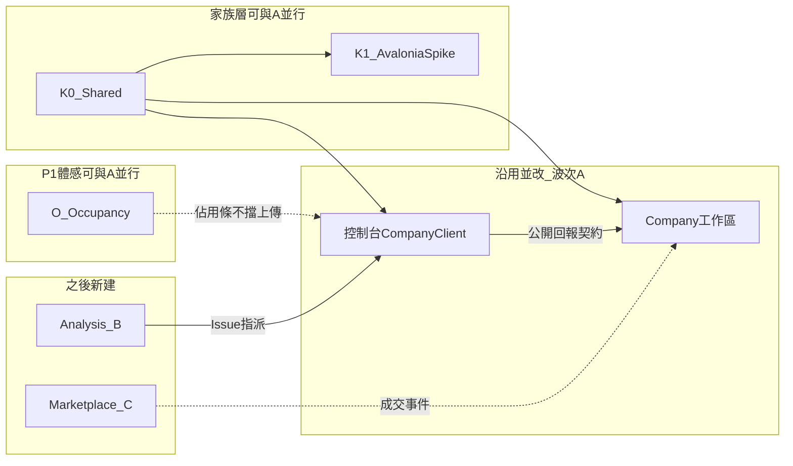
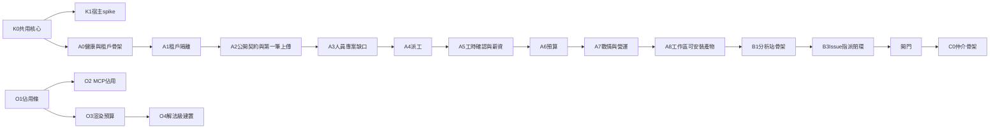

# 系統執行計劃書

依 [PRD](prd.md) 編號落地。衝突時以 [總規格・四套產品](spec.md#四套產品) 為準。技術不變量以 [技術架構](architecture.md) 的 `AD-n` 為準。本文件回答：**下一個可合併的 PR 做什麼、每個階段結束誰能演示什麼、哪段是新建、哪段是沿用現碼。**

家族層 **K0／K1**、產品層 **A0–A8**、控制台體感 **O1–O4** 可並行；K1 與 O **都不擋**波次 A。K0／K1／O 的不變量見架構第 13 節（AD-32～AD-34 管 O）；**PR 切分以本文件第 7 節為準**。

| 欄 | 值 |
|----|-----|
| 狀態 | **波次 A 已發布／合進 main**。波次 B：B1／B2 已落地，**B3 Issue 指派**進行中。仲介仍門檻後。 |
| 下一上線 | 波次 B 關門：KPI-SA\*（含 Issue 指派閉環） |
| 可並行 | **K1** Avalonia spike（不擋 B）。**O** 已大致完成 |
| 之後才做 | 波次 C：仲介（**僅 G-01～G-04 通過後**） |
| 本文件不保證 | 日曆交貨日、人月、營收 |

銷售必須標「規劃」。把本計劃講成已安裝，等於對買家說謊。

## 1. 落地原則（對 PRD 與 AD）

| 來源 | 落地怎麼做 |
|------|------------|
| 波次 A 是下一驗收 | **只把公司端＋公開契約做成可發布產品**。仲介不進 A 的 Definition of Done |
| 波次 A 沿用 Company.* | **盤點 → 加 `tenantId` → 公開契約 → 對 PRD 缺口補丁**。禁止再開一套人員／甘特／薪資 |
| 控制台 CON-01～07 與 RPT | **放進 A**，否則「回報閉環」是假的 |
| 控制台 CON-08／NFR-13 | **軌道 O**，不進 A 的 DoD |
| AD-4／AD-16 | A2 連線登錄：測試通過才 `enabled` |
| AD-12／AD-19 | A 關門要有工作區獨立發行產物（Docker／compose）；我們主機與自架同一產物 |
| AD-21 | 主題 token 由 K0 抽出；A 關門不得再硬編碼 `#0b6e56`（K0 未完則 A 不得宣稱視覺契約完成，但不擋第一筆上傳演示） |
| K0 | 抽出 Shared；**不改**使用者可見流程（佔用條禁止混進 K0） |
| K1 | Windows spike；**未過閘門不得**切正式安裝包宿主（AD-10） |
| O | 佔用可見＋輸出節流＋solution 建置；**不擋** A；**不等** K1 |
| 波次 B | 新建 Analysis 專案；不塞進仲介、不塞進控制台當雲端進件 |
| 波次 C | **G-01～G-04 關閉前禁止**建 Marketplace 業務 PR |
| 不做 | 與 PRD 第 3 節相同：控制台改網站、派遣、自動媒合、金流託管、仲介當下一刀、把工作區綁死在「必須先成交」 |

每一階段出口必須是**可部署增量**：CI 綠、授權負向測過、有人話錯誤。不要「先畫面再補 API」。

## 2. 現況資產（不要重做）

| 已有 | 路徑／能力 | 怎麼用 |
|------|------------|--------|
| 控制台 0.6.x | 堆疊、GitHub、進件、本機工時 | 做工與 `intake.json`；A 加目的地＋握手＋上傳 |
| Photino.Blazor 4.0.13 | `Console.App` 宿主 | K0 抽出介面後暫留；K1 通過才替換 |
| `SelfUpdate` | GitHub Release 檢查／套用 setup.exe | K0 升成 `Shared.Update`；P1 行為等價 |
| `--accent: #0b6e56` | Console 與 Company.Web CSS | K0 抽進 DesignSystem token |
| `CompanyPlatformClient` | `POST .../timesheets/upload`、assignments、payslip | 補 `GET /api/v1/me`；目的地改清單 |
| Company.* Web | 人員、客戶、專案、派工、薪資、預算、戰情、待歸戶、上傳 API | **租戶化**；公開契約擴專案識別；專案貢獻檢視 |
| `JobBusy`／建置輸出／逐專案 `dotnet build` | 全域鎖幾乎不畫；一行一重繪；N 次 build | **O 改**：Occupancy 條、合併刷新、solution 圖；不要重寫掃描／MCP 協定 |

**A 不建：** Marketplace。**B 才建：** Analysis。**C 才建：** Marketplace。**K0 新建：** Shared.*（抽出，不是新產品）。

K1 不連到 Co：宿主 spike **不擋**工作區上線。O 不連到 Co：佔用條 **不擋** 回報閉環。

## 3. 開工前決策（擋哪一階段）

| # | 決策 | 最晚關閉 | 落地含義 |
|---|------|----------|----------|
| D-13 | **一需求公司一個工作區、多專案**。可先於仲介存在 | **A 租戶化前** | 開帳不依成交 |
| D-08 | 工作區獨立 ASP.NET 宿主；日後仲介／分析另宿主，不共用 DbContext | A0 | Company 不 `using` 未來 Marketplace |
| D-02 | 生產／試用 PostgreSQL；SQLite 僅測 | A0 | |
| D-01 | 工作區 GitHub App；PAT 備援 | A 派工寫回前 | |
| D-09 | 工作區獨立產物（SaaS 與自架同一通道）；控制台多名目的地；公開契約；連線測試通過才啟用 | A 上傳前 | AD-4、AD-12、AD-16 |
| D-RPT | 公開契約 OpenAPI 版本與專案識別規則 | A 上傳前 | 見 [reporting.md](reporting.md) |
| D-K0 | Shared 套件邊界：Host／DesignSystem／Update／Contracts 不含 Domain | **K0 合併前** | AD-5、AD-11 |
| D-K1 | Avalonia spike 五條通過才切 P1 安裝包宿主 | **切正式宿主前** | AD-10。失敗則 Photino 留守 |
| D-O | Occupancy 單一進行中＋一個排隊；MCP 與桌面同一建置域；輸出合併刷新 | **O1 合併前** | AD-32～AD-34。**已關**（使用者回饋：建置時以為當機） |
| D-03～D-07 | 派工條、認列兩步、加密、讀取審計、匯率 | A 內可分期 | 不擋「第一筆上傳」演示，但擋 A 完整營運關門 |
| D-10／D-11／D-12 | 仲介法律、KYC、押金 | **C 前** | 不擋 A／B／K |
| G-01～G-04 | 系統分析開門條件 | **C 前** | 見 [analysis.md](analysis.md)；見證表 [analysis-gate-checklist.md](analysis-gate-checklist.md) |

## 4. 架構（實作約束）

工作區：Domain 無 EF／HTTP；Application 開頭授權；規則不進 `.razor`。依賴方向見 AD-11。

**家族層（K0）要落地的抽象：**

| 介面／能力 | 職責 | AD |
|------------|------|-----|
| `IWindowHost` | 視窗、確認、檔案對話；Core／Razor 不引用宿主套件 | AD-9、AD-10 |
| DesignSystem token | primitive → semantic → component；兩套 CSS 改吃變數 | AD-21～AD-23 |
| UpdateClient | slug／通道／RID／資產規則；P1 行為等價 | AD-19、AD-20 |
| 契約測試骨架 | 可對 OpenAPI／白名單跑負向測 | AD-4、AD-17、AD-18 |
| checksum 檔 | 打包產出 SHA256；UpdateClient 能校 | AD-20；K0 出口前必有 |

**軌道 O（P1 佔用／建置）要落地的抽象：**

| 介面／能力 | 職責 | AD |
|------------|------|-----|
| Occupancy | 單一進行中＋一個排隊；kind／標題／進度／取消／擋哪些動作 | AD-32 |
| 佔用條 | 頂欄常駐；按鈕事前停用＋原因；視窗標題帶狀態 | AD-32、[ux.md](ux.md#控制台佔用條) |
| 工作區佔用鎖 | 桌面與 MCP 對同一 `Root` 互斥建置 | AD-32、AD-34 |
| 輸出合併刷新 | 建置 log 批次 Notify；環形緩衝 | AD-33 |
| 建置圖 | .NET 有 sln 則一次 `dotnet build`；徽章仍對回專案 | AD-34 |

**波次 A 要補的工作區／契約抽象：**

| 介面／能力 | 職責 | 對應 PRD |
|------------|------|----------|
| `GET /api/v1/me` | 握手 | CON-07、RPT |
| 上傳白名單 | 禁 path／blob／source | CON-04、NFR-04 |
| 專案解析 | Guid／projectCode／repo → projectId | RPT-01 |
| API 金鑰 | 第三方用戶端 | PLT-07、RPT-02 |
| 專案貢獻彙總 | 依專案看工時／Issue／類型 | RPT-03 |
| `tenantId` | 全查詢硬邊界 | PLT-04、NFR-11 |
| 連線登錄 | 目的地預設關閉；測試通過才啟用 | CON-06、AD-4、AD-16 |
| `Hosting:Mode` | SaaS／SelfHosted 同一產物 | PLT-04、AD-12 |
| `workspace-v*` 產物 | Docker／compose／checksum | AD-12、AD-19 |

禁止：控制台連任一資料庫；Razor `new` 倉儲；Core／Razor 引用 `Photino.*` 或 `Avalonia.*`。日後仲介不得直接寫 Company 表（必須走佈建 API）。

## 5. 專案切分

| 專案 | 動作 | 職責 |
|------|------|------|
| `AiProject.Shared.Hosting` | **K0 新建** | `IWindowHost`、Blazor 根註冊抽象 |
| `AiProject.Shared.DesignSystem` | **K0 新建** | token CSS／JSON、共用碎片 |
| `AiProject.Shared.Update` | **K0 抽出** | 從 `SelfUpdate` 升成共用客戶端 |
| `AiProject.Shared.Contracts` | **K0 新建／抽出** | 版本化 DTO、錯誤形狀、契約版本標頭 |
| `tests/AiProject.Shared.ContractTests` | **K0 新建** | 契約相容套件 |
| `AiProject.Console.App.Avalonia` | **K1 新建** | spike 宿主；通過後才成發行宿主 |
| `AiProject.Company.*` | **改（下一產品實作）** | 租戶、公開契約、模組缺口、貢獻檢視、獨立 Release 產物 |
| `AiProject.Console.CompanyClient`／App | **改** | 多名目的地、握手、狀態圖上傳；改吃 Host／Update；**O：** 佔用條（勿與 K0 抽出同一 PR） |
| `tests/AiProject.Company.*` | **改** | tenant、契約、越權 |
| `src/AiProject.Analysis.*` | **B 新建** | 概念→需求→規格→Issue |
| `src/AiProject.Marketplace.*` | **C 新建** | 會員、認證、刊登、成交、合同、應收 |

## 6. PRD／AD 對階段（追蹤表）

### 6.0 家族層（可與 A 並行）

| 來源 | 階段 | 落地做法 |
|------|------|----------|
| AD-5、AD-9、AD-11 | K0-1 | Host 抽象；Core 去宿主類型 |
| AD-21～AD-23 | K0-2 | token 抽出；Console＋Company.Web 畫面等價 |
| AD-19、AD-20 | K0-3 | UpdateClient；checksum；P1 更新路徑等價 |
| AD-4、AD-17、AD-18 | K0-4 | 契約測試骨架（白名單／版本標頭可先測假伺服器） |
| AD-10 | K1 | Avalonia+Blazor 五條通過條件；未過不切安裝包 |
| AD-32～AD-34、PRD-CON-08、NFR-13 | O1～O4 | 佔用條、MCP 鎖、輸出節流、solution 建置；不進 A 的 DoD |

### 6.1 波次 A（下一發布必須全綠）

| PRD | 階段 | 落地做法 |
|-----|------|----------|
| PRD-PLT-04、NFR-03／11 | A1 | 全部查詢加 `tenantId`；越權 403 |
| PRD-PLT-01～03、05、06 | A1 | 登入／設定／遮罩；租戶測試 |
| PRD-PLT-07、RPT-01～02 | A2 | API 金鑰；專案碼／repo 解析；OpenAPI 草稿 |
| PRD-CON-01～07 | A2 | 控制台目的地清單、狀態圖、握手、上傳；連線測試通過才啟用（AD-4） |
| PRD-RPT-03 | A2 | 專案貢獻檢視 |
| PRD-PPL-\*、PRD-PRJ-\* | A3 | 對現有頁缺口清單，缺才補 |
| PRD-DSP-\* | A4 | 派工、寫回 GitHub 待同步 |
| PRD-PAY-\*、CON-05 | A5 | PM 確認、鎖定、CSV |
| PRD-BDG-\* | A6 | 預算／毛利 |
| PRD-WAR-\* | A7 | 戰情室最後驗 |
| PRD-NFR-01、PLT-04 | A8 | 工作區 Docker／compose；`Hosting:Mode`；`workspace-v*` 資產 |
| KPI-01～08 | A2／A5／A7 | 對應出口 |

A **不**實作：PRD-MKT-\*、PRD-SA-\*、押金、電子發票、把 P1 安裝包切到 Avalonia（那是 K1 通過後的另一次發布）。

### 6.2 波次 B（A 發布後）

| PRD | 階段 | 落地做法 |
|-----|------|----------|
| PRD-SA-01～06 | B1～B3 | Analysis 專案；產物；GitHub Issue；指派 |
| KPI-SA01～04 | B3 | 閉環演示 |
| G-01～G-04 | B3 出口 | 記錄是否達 N 次 |

### 6.3 波次 C（門檻後）

僅 G 通過後啟用。原仲介 A0～A5 工作包整體延後至此：會員認證、刊登、成交合同應收、成交事件寫入工作區。發案呼叫 P3 產物，不重做分析引擎。對應 PRD-MKT-01～15、KPI-M01～M06。

## 7. 分階段（每一段都能演示）

K1 與 O 都不畫進 A 的箭頭：**不擋** A 發布。K0 應在 A8 前完成（token／Update 被工作區產物引用）；若 A2 演示時 K0 未完，token 與 checksum 列 A8 關門清單，不得用「以後再說」略過。O 可與 K0 同週開工，但**禁止**與 K0-2／K0-3 同一 PR 改 `ConsoleSession` 的 Update／token 抽出。

### 家族層 — 可與 A0 同週開工

#### 階段 K0 — 共用核心（不改可見行為）

**對應：** AD-5、AD-9、AD-11、AD-19～AD-23。**D-K0 已關。**

| 工作包 | 做什麼 | 演示 |
|--------|--------|------|
| K0-1 | 新增 `Shared.Hosting`；`IWindowHost`；App 適配 Photino；Core／Razor **零** `Photino.*` 引用 | `dotnet test` 綠；現況主路徑手動一輪不變 |
| K0-2 | `Shared.DesignSystem`：松綠預設 token；Console `app.css` 與 Company `app.css` 改吃 semantic 變數；禁止新硬編碼 accent | 並排截圖／目視等價；深色仍可切 |
| K0-3 | `SelfUpdate` → `Shared.Update`；打包產出 checksum；P1「檢查更新」仍吃現況 `releases/latest` 與 `*-win-x64-setup.exe` | 已安裝路徑能找到資產；開發目錄不套用安裝更新 |
| K0-4 | `Shared.Contracts`＋`ContractTests`：版本標頭、upload 白名單負向測（可對假伺服器）；尚未有的 `GET /api/v1/me` 用契約草稿 skip 或待 A2 接上 | CI 有契約專案；禁 path／blob 的測先綠 |

**出口：** CI 綠；使用者看不出功能差異；Shared 不含任何產品 Domain／DbContext。

**不做：** Avalonia 安裝包、主題精靈 UI、連線登錄畫面、新使用者流程、佔用條（那是 O）。

#### 階段 K1 — P1 宿主 spike（不擋 A）

**對應：** AD-10。**依賴 K0-1。** **D-K1 在切正式宿主前關閉。**

| 工作包 | 做什麼 |
|--------|--------|
| K1-1 | 新建 `Console.App.Avalonia`；WebView 承載現況 Razor 根元件；不刪 Photino 發行專案 |
| K1-2 | Windows x64 走完：掃描、需重編、啟停、Log、GitHub 操作台、工時儀表、設定 |
| K1-3 | MCP `--mcp` 仍可用；「檢查更新」仍能解讀 Release 資產；Core 測試不引用 Avalonia |
| K1-4 | 記錄閘門：五條全真 → 另開「切正式宿主」PR（改 pack 腳本，**不**改舊 tag 資產名規則）。任一假 → Photino 留守，介面保留 |

**演示：** spike exe 完成主路徑一輪；書面勾選 AD-10 五條。

**失敗則：** 波次 A 照常；P1 繼續 Photino。禁止改寫成純 Avalonia XAML。

#### 階段 O — P1 佔用與建置（不擋 A，不等 K1）

**對應：** AD-32～AD-34、PRD-CON-08、PRD-NFR-13。**D-O 已關。** **禁止塞進 K0**（K0 出口是「使用者看不出功能差異」）。

| 工作包 | 做什麼 | 演示 |
|--------|--------|------|
| O1 | `JobBusy` → Occupancy；頂欄佔用條；建置選單與列上「編譯」事前停用並寫原因；視窗標題帶狀態；可取消 | 建置中點「建置」不再像當機；停用按鈕 `title` 看得到「建置中 3/12 · Foo」 |
| O2 | 桌面與 MCP 對同一工作區 Root 共用佔用鎖；Agent 編譯時條上寫「Agent 正在編譯」 | MCP `build` 進行中，桌面編譯按鈕停用且原因正確 |
| O3 | 建置輸出 100–200ms 合併刷新；log 環形緩衝；佔用期間降頻 PollLoop | 大解法建置時仍可切頁、捲動、按取消 |
| O4 | .NET 有 `.sln`／可建圖則一次 `dotnet build`；失敗仍對回專案徽章 | 過期編譯比逐專案 foreach 明顯較短；徽章與現況語意一致 |

**出口：** 使用者能說出系統正在做什麼；建置中 UI 仍活著。**不進**波次 A 關門清單。

**不做：** 專案級平行編譯、Avalonia、把佔用條抽進 DesignSystem、改 CON 上傳流程。

### 波次 A — 下一發布

#### 階段 A0 — 健康檢查與租戶欄位起點

**演示：** Company `/health` 200；CI 綠；`tenantId` 欄位遷移可跑（可先單租戶預設值）。

**不做：** 仲介、分析站、戰情室當首頁大改、Avalonia。

#### 階段 A1 — 租戶隔離

**對應：** PLT、NFR-11。**D-13 已關。**

兩個租戶並行；A 的窗口打 B 的 URL／API 403。

#### 階段 A2 — 公開契約與第一筆上傳（本波最硬的整合）

**對應：** CON-\*、RPT-\*、KPI-04／07／08。**D-09、D-RPT 已關。**

| 工作包 | 做什麼 |
|--------|--------|
| A2-1 | `GET /api/v1/me`；upload 白名單；契約測試禁 path／blob（接上 K0-4） |
| A2-2 | 專案識別：Guid／projectCode／repos；Issue 帶 repo |
| A2-3 | API 金鑰；第三方 curl 上傳成功 |
| A2-4 | 控制台：目的地清單、狀態圖、「送到〔這家〕」、重試 |
| A2-5 | 專案貢獻彙總頁 |
| A2-6 | 連線登錄：預設 `disabled`；「測試連線」通過才允許送出；失敗說人話（[ux.md](ux.md#引導式開帳與連線)） |

**演示：** 工程師控制台與一支 curl 腳本都能上傳；專案頁看得到貢獻；payload 無原始碼；未測目的地不能送。

**失敗則 A 不能宣稱「回報閉環完成」。**

#### 階段 A3～A7 — 模組缺口到營運關門

A3 人員／專案 → A4 派工 → A5 工時確認與薪資 CSV → A6 預算 → A7 戰情室與越權總驗。

**A7 演示：** KPI-01～08 產品側為真（上傳閉環＋戰情）。可安裝產物放 A8。

#### 階段 A8 — 工作區可安裝產物

**對應：** AD-12、AD-15、AD-19、PRD-NFR-01、PLT-04。**K0-2／K0-3 應已合併**（token、Update）；否則本階段一併收尾，不得略過。

| 工作包 | 做什麼 |
|--------|--------|
| A8-1 | Dockerfile＋compose；`Hosting:Mode=SaaS|SelfHosted`；文件對齊 [deploy-company.md](deploy-company.md) |
| A8-2 | 發行資產：映像 digest、compose、checksum；tag 前綴 `workspace-v*`（過渡期可先附在現況 Release，但檔名必須能被 UpdateClient 規則區分） |
| A8-3 | 自架走完：起庫、種 owner、開帳精靈能跑（主題可先只吃 K0 預設盤，完整精靈可列 A8-4） |
| A8-4 | 設定頁：主題包選盤（五色＋對比檢查最低限度）或明確「精靈下一切」；不得再散落 `#0b6e56` |

**演示：** 同一 compose 在本機自架起來；控制台對該 Base URL 測試連線並上傳一筆。

**出口（波次 A）：** KPI-01～08 全真 **且** A8 產物可起。K1 通過與否**不**進本出口。

### 波次 B — 系統分析輔助

B1 空站可部署（吃 Shared DesignSystem／Update／Contracts）→ B2 需求／規格產物 → B3 Issue＋指派＋控制台開工。出口：KPI-SA\* 與 G-01～G-04 紀錄。

#### 階段 B1 — 分析站空站骨架

**對應：** PRD-SA-01（開案入口）、PRD-SA-06（假設可見）、AD-8／AD-11（獨立宿主；不碰 Company.Infrastructure）。

| 工作包 | 做什麼 | 演示 |
|--------|--------|------|
| B1-1 | 新建 `Analysis.Domain`／`Application`／`Web`；記憶體 `IAnalysisCaseStore`；開案必有可見假設 | `dotnet test` 綠；首頁可開案並進詳情 |
| B1-2 | `/health`；吃 DesignSystem token 與 Update 產品身份；**零** Company.Infrastructure 引用 | `GET /health` 回 `product=analysis` |
| B1-3 | `deploy/analysis` Dockerfile＋compose；文件 [deploy-analysis.md](deploy-analysis.md)／[analysis.md](analysis.md) | compose 起站；瀏覽開案 |

**不做：** 需求／規格 Markdown 匯出（B2）、GitHub Issue／指派（B3）、持久化 DB、仲介、控制台雲端進件。

#### 階段 B2 — 需求／規格產物

**對應：** PRD-SA-02／03／06、KPI-SA01／SA02。

| 工作包 | 做什麼 | 演示 |
|--------|--------|------|
| B2-1 | 規則模板產出需求文件（範圍／非範圍／驗收／REQ-ID）；假設／待決寫進產物 | 案詳情按「產出需求」；Markdown／JSON 可下載 |
| B2-2 | 依需求產出規格摘要（SPEC-ID 追溯 REQ-ID） | 「產出規格」；產物含追溯 |
| B2-3 | `GET /api/cases/{id}/requirements|spec.(md|json)` | curl／瀏覽器可取 |

**不做：** 外部 LLM 呼叫、ReqIF 伺服器、GitHub Issue（B3）、持久化 DB。

#### 階段 B3 — Issue 指派閉環

**對應：** PRD-SA-04／05、KPI-SA03／SA04。

| 工作包 | 做什麼 | 演示 |
|--------|--------|------|
| B3-1 | 依需求＋規格組 Issue 包（feature／test／acceptance／debug；含 checklist、追溯、假設） | 案詳情「組 Issue 包」 |
| B3-2 | 發布至 GitHub（`Analysis:GitHub`）；無 Token 或 `DryRun=true` 走 dry-run URL | 「發布 Issue」；列表有連結 |
| B3-3 | 功能／追蹤類可帶 assignee；工程師經 GitHub／控制台既有任務面可見 | 指派 login 後發布 |

**不做：** 控制台新 UI、仲介、持久化 DB、自動媒合。

### 波次 C — 仲介（門檻後）

C0 起比照舊「仲介骨架」計劃：會員、認證、刊登、成交、合同、應收、成交事件寫入。**未過 Gate 禁止合併 C 業務 PR。** 只依 Contracts／DesignSystem／Update，不碰 Company.Infrastructure。

## 8. 每階段測試最低線

| 波次 | 合併前必綠 |
|------|------------|
| K0 | Core／Razor 無 Photino／Avalonia 引用；token 無新魔法 accent；開發目錄不觸發安裝更新；契約測試專案存在 |
| K1 | AD-10 五條書面＋手動主路徑；失敗不得改 pack 宿主 |
| O | 佔用中建置按鈕停用且 title 有原因；MCP 建置時桌面看得見；大輸出下 UI 仍可取消；有 sln 時非 N 次獨立 restore+build 當唯一路徑 |
| A | 租戶越權 403；upload 契約無 path／blob；握手失敗人話；已核准不可覆蓋；金鑰與 GitHub 兩種認證可上傳；未測連線不能送 |
| A8 | compose 起得來；`/health` 200；自架與文件中的 `Hosting:Mode` 一致 |
| B | 產物有假設標註；Issue 可指派；控制台看得見 |
| C | 未認證不能寫；他司不能讀；成交有 Deal＋應收；文案無派遣 |

MCP／Agent **不得**註冊薪資、費率、毛利、仲介應收工具（NFR-04）。

## 9. 控制台本波（A）只准加這些

- 執行狀態圖（CON-01）
- 申報目的地清單（CON-06）＋測試連線才啟用（AD-4）
- 握手 `GET /api/v1/me`（CON-07）
- 「送到〔這家公司〕」＋重試（CON-02～04）
- 該目的地派工只讀條（CON-05）

零目的地時，掃描／進件／工時儀表與現況相同。需求上游分析走 P3（B），不塞進控制台當唯一發案站。

K0 對控制台只准**抽出與改吃套件**，不准借機做上述以外的功能（含不准做佔用條）。K1 只准 spike 專案，不准當 A 的 DoD。

### 9.1 控制台軌道 O 只准加這些

- Occupancy 面與頂欄佔用條（CON-08、AD-32）
- MCP／桌面同一建置域（AD-32、AD-34）
- 建置輸出合併刷新與 log 上限（AD-33）
- solution／圖一次建置（AD-34）
- 可取消目前長工作

不准借 O 做申報目的地、Avalonia、或把 `JobBusy` 拆成通用 job 編排框架。

## 10. 發布對照

| 發布 | 必須為真 |
|------|----------|
| K0（家族增量，可先於 A 合併） | 第 8 節 K0 列；現況 P1 行為不變 |
| O（P1 體感增量，可與 A 並行） | 第 8 節 O 列；不進 A 關門 |
| 波次 A | KPI-01～08、PLT／PPL／PRJ／DSP／PAY／BDG／WAR／CON-01～07／RPT、NFR-01／02／04／11、A8 產物、連線測試 |
| K1 通過後的 P1 宿主切換 | AD-10 五條；資產檔名規則仍讓舊安裝包找得到下一版 |
| 波次 B | KPI-SA01～04、PRD-SA-01～06 |
| 波次 C | G-01～G-04 已關；KPI-M01～M06、PRD-MKT-\*、NFR-12、D-10～D-12 已關 |

**不進任一發布：** 自動媒合、派遣、金流託管、電子發票、勞基法引擎、控制台改網站、原始碼上雲、未過門檻的仲介、未過 K1 就把安裝包改成 Avalonia。

## 11. 執行風險

| 風險 | 落地緩解 |
|------|----------|
| 又把仲介當第一個 PR | 本文件第 12 節寫死；CI／看板禁止 Marketplace 進 A／K |
| 重寫 Company | PR 說明必須寫「對現有頁的 diff」 |
| 契約變私有 | A2 必過 curl 第三方上傳 |
| 戰情室拖死回報閉環 | A2 先過上傳；戰情放 A7 |
| 先做 Avalonia 再抽 Host | K0-1 必須先於 K1；Core 沾宿主類型直接退回 |
| 用 K1 擋住工作區 | 看板：K1 與 A 分開；A 的 DoD 不含宿主切換 |
| 把佔用條塞進 K0 | 看板：O 與 K0 分開；K0 出口仍是「行為不變」 |
| O 與 K0-3 同時改 `ConsoleSession` | 檔案邊界：F 只改吃 Update；O 只改 JobBusy→Occupancy。K0-3 先合併，O rebase |
| 自架又做成第二套安裝器 | A8 與我們主機同一 Dockerfile |

## 12. 下一個 PR

**軌道 P（產品）— 進行中：B3 Issue 指派（B1／B2 已落地）。**

1. 合併 Issue 包＋dry-run／真實 GitHub 發布＋assignee。
2. 演示：開案 → 需求 → 規格 → 發布 Issue（可 dry-run）→ 工程師在 GitHub／控制台任務面看到。
3. 累積 G-01～G-04 證據後才開仲介（填 [analysis-gate-checklist.md](analysis-gate-checklist.md)）。

**不要：**

- 建 Marketplace 專案骨架，直到 G-01～G-04 關閉。
- Analysis 參考 `Company.Infrastructure`。
- 把分析站塞進控制台當唯一發案站。
- 把 P1 正式安裝包切到 Avalonia。

產品走讀用第 6 節追蹤表對 [PRD](prd.md)。工程拆 sprint 用第 7 節。契約以 [reporting.md](reporting.md)、[analysis.md](analysis.md)、[UX](ux.md)、[架構 AD](architecture.md) 為準。
