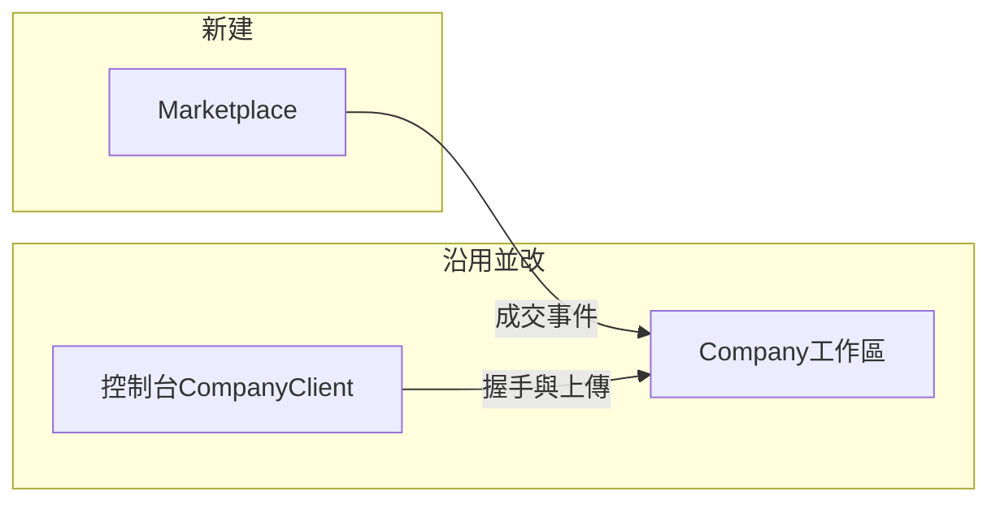

# 系統執行計劃書

依 [PRD](prd.md) 編號落地。衝突時以 [總規格・三層產品](spec.md#三層產品) 為準。本文件回答：**下一個可合併的 PR 做什麼、每個階段結束誰能演示什麼、哪段是新建、哪段是沿用現碼。**

| 欄 | 值 |
|----|-----|
| 狀態 | **規劃**。仲介尚未建專案。Company.* 工作區畫面與上傳 API **已存在**，缺租戶切分與 `GET /api/v1/me` |
| 下一上線 | 波次 A：仲介成交閉環＋控制台第一筆工時（KPI-M01～M06） |
| 之後才做 | 波次 B：把現有工作區租戶化並對齊 PRD-PPL／PRJ／DSP／PAY／BDG／WAR |
| 本文件不保證 | 日曆交貨日、人月、營收 |

銷售必須標「規劃」。把本計劃講成已安裝，等於對買家說謊。

## 1. 落地原則（對 PRD）

| PRD | 落地怎麼做 |
|-----|------------|
| 波次 A 是下一驗收 | **只把 A 做成可發布產品**。B 的戰情室／毛利不進 A 的 Definition of Done |
| 波次 B 沿用 Company.* | **盤點 → 加 `tenantId` → 對 PRD 缺口補丁**。禁止再開一套人員／甘特／薪資。工作區是獨立機制，不是仲介子模組 |
| MKT 與 CON 重疊（握手、上傳、多名目的地） | **放進 A4**，否則「成交事件寫入後能開工」是假的 |
| 開工前決策 D-10～D-13 | **A3 合併前必須關閉**。A0～A2 可先做會員與精靈，但合同／成交 PR 不得在未關時合併 |
| 不做 | 與 PRD 第 3 節相同：控制台改網站、派遣、自動媒合、金流託管、仲介層重做薪資、把工作區綁死在「必須先成交」 |

每一階段出口必須是**可部署增量**：CI 綠、授權負向測過、有人話錯誤。不要「先畫面再補 API」。

## 2. 現況資產（不要重做）

落地時把下列當給定，不是階段 0 的產出。

| 已有 | 路徑／能力 | A 怎麼用 |
|------|------------|----------|
| 控制台 0.6.x | 堆疊、GitHub、進件、本機工時 | 做工與 `intake.json`；A4 只加目的地＋握手＋上傳 |
| `CompanyPlatformClient` | `POST .../timesheets/upload`、assignments、payslip | A4 補 `GET /api/v1/me`；目的地從單一 `companyBaseUrl` 改成清單 |
| Company.* Web | 人員、客戶、專案、派工、薪資、預算、戰情、待歸戶、上傳 API | A4 **開租戶並寫入名冊／專案**；B 再租戶隔離與缺口 |
| 上傳 API | 已有 upload；**沒有**握手 `GET /api/v1/me` | A4 必做 |

**沒有、必須新建：** `AiProject.Marketplace.*`（會員、認證、精靈、刊登、應徵、成交、合同、應收）。

## 3. 開工前決策（擋哪一階段）

| # | 決策 | 最晚關閉 | 落地含義 |
|---|------|----------|----------|
| D-10／D-11 | 承攬仲介；合同當事人公司 ↔ 工程師；平台抽成、不雇人、不代發薪 | **A3 前** | 合同範本與 UI 文案寫死；未關不得合併成交 |
| D-12 | 第一刀不做押金／eKYC／金流託管。工程師＝身分＋GitHub；組織＝統編＋負責人 | **A1 前** | A1 只做這兩種認證 |
| D-13 | **一需求公司一個工作區、多專案**。工作區可先於仲介存在；第二次成交掛回同一租戶 | **A4 前** | 第二次成交不新建庫；無租戶才建 |
| D-08 | 仲介與工作區 **兩個 ASP.NET 宿主**（或同機不同 path）；內部用佈建 API，不共用 DbContext | A0 | 仲介不 `using` Company.Infrastructure |
| D-02 | 生產／試用 PostgreSQL；SQLite 僅測 | A0 | Marketplace 與 Company 可同叢集不同 database 或 schema |
| D-01 | 工作區 GitHub App；PAT 備援 | A4 | 建倉／掛倉／Issue 用 App |
| D-09 | 我們營運多租戶；控制台多名目的地 | A4 | 翻轉自架預設 |
| D-03～D-07 | 派工條、認列兩步、加密、讀取審計、匯率 | **波次 B** | 不擋 A 發布 |

D-10～D-13 未關：可合併 A0～A2；**不可**合併 A3／A4。

## 4. 架構（實作約束）

仲介與工作區皆：Domain 無 EF／HTTP；Application 開頭授權；規則不進 `.razor`。

**波次 A 開工即要的仲介抽象（不要等 B 的計薪介面）：**

| 介面 | 職責 | 對應 PRD |
|------|------|----------|
| `IClock` | 可測時鐘 | 刊登期間、成交日 |
| `ICurrentMember` | 會員、組織、talent／demand 身分 | MKT-13／14 |
| `IAuthorizationGate` | 伺服器強制 | KPI-M06、NFR-02／11 |
| `IAuditLog` | 認證狀態、成交、確認合同 | MKT-02、NFR-12 |
| `ITalentGithubVerifier` | 驗證 GitHub 帳號屬於此人 | MKT-02 |
| `IListingWizard` | 精靈欄位驗證（不寫 Git） | MKT-04 |
| `IDealCloser` | 雙方接受 → Deal＋應收＋發佈「開租戶」 | MKT-06～09 |
| `ICommissionPolicy` | 至少一種分擔規則 | MKT-08 |
| `IWorkspaceProvisioner` | 對 Company 內部 API：開／掛租戶、寫 Person、寫 Project | MKT-09／15 |
| `IContractPackRenderer` | 保密＋承攬範圍範本＋確認紀錄 | MKT-07 |

工作區側 A4 要補：`GET /api/v1/me`、依 `tenantId` 寫入、白名單上傳欄位（NFR-04）。`IPayrollCalculator` 等留在 B。

禁止：控制台連任一資料庫；Razor `new` 倉儲；仲介 DbContext 直接寫 Company 表（必須走 `IWorkspaceProvisioner`）。工作區查詢不得 `using` Marketplace。

## 5. 專案切分

同一 `AiProject.Console.slnx`（或加 Marketplace 仍一次還原）。

| 專案 | 動作 | 職責 |
|------|------|------|
| `src/AiProject.Marketplace.Domain` | **新建** | Member、Organization、Listing、Application、Deal、ContractPack、CommissionReceivable |
| `src/AiProject.Marketplace.Application` | **新建** | 註冊、認證、精靈、應徵、成交 |
| `src/AiProject.Marketplace.Infrastructure` | **新建** | EF、GitHub 驗證、郵件可後補 |
| `src/AiProject.Marketplace.Web` | **新建** | 仲介網站＋會員 API |
| `src/AiProject.Marketplace.Contracts` | **新建** | 僅仲介 DTO，不與 timesheet DTO 混 |
| `AiProject.Company.*` | **改** | 加租戶；佈建端點；`GET /api/v1/me` |
| `AiProject.Console.CompanyClient`／App | **改** | 多名目的地、握手、狀態圖上傳 |
| `tests/AiProject.Marketplace.*` | **新建** | 認證負向、成交、租戶隔離 |
| 既有 `tests/AiProject.Company.*` | **改** | 補 tenant 範圍測試 |

組合根：`AddMarketplace(...)`、既有 `AddCompanyPlatform(...)` 分開呼叫。

## 6. PRD 對階段（追蹤表）

施工只認這一張。欄位細節仍看 [仲介](marketplace.md) 與模組篇。

### 6.1 波次 A（下一發布必須全綠）

| PRD | 階段 | 落地做法 |
|-----|------|----------|
| PRD-MKT-01 | A1 | 免費註冊兩種主體；無付款碼 |
| PRD-MKT-02 | A1 | 身分欄＋GitHub OAuth／驗證 token；失敗人話；寫審計 |
| PRD-MKT-03 | A1 | 統編＋負責人；通過才有發布權 |
| PRD-MKT-12 | A1 | talent 角色多選：分析／設計／開發／測試 |
| PRD-MKT-13 | A1 | 匿名可讀公開刊登摘要；寫入一律拒 |
| PRD-MKT-14 | A1 | 同一 login 連 org 窗口＋talent；claim 分開 |
| PRD-MKT-04 | A2 | 仲介站精靈，必填欄一次做完；存 Listing 不寫 Git |
| PRD-MKT-05 | A2／A3 | A2 瀏覽＋篩角色標籤；A3 應徵 |
| PRD-MKT-06 | A3 | 邀請＋雙方接受 → `dealId`；可多人分次；禁止自動配對 |
| PRD-MKT-07 | A3 | 範本＋「我確認」紀錄；電子簽可 stub 第三方 |
| PRD-MKT-08 | A3 | 成交當下算應收；一種規則即可（例如需求方應付 X%） |
| PRD-NFR-12 | A1 文案／A3 範本 | 介面寫承攬仲介；不出現派遣、代發薪 |
| PRD-MKT-09 | A4 | `IWorkspaceProvisioner`：無租戶則建，有則掛；Person 專案外包＋GitHub。這是資料交換，不是仲介擁有工作區 |
| PRD-MKT-10 | A4 | 建或掛 repo；Issue 連結給雙方；不做站內聊天 |
| PRD-MKT-11 | A4 | 控制台握手＋upload 一筆真實時段 |
| PRD-MKT-15 | A4 | 從 Listing 投影 Client＋Project，窗口打開工作區看得到 |
| PRD-CON-01～04、06、07 | A4 | 狀態圖、目的地清單、冪等、白名單、握手 |
| PRD-NFR-01／02／04／08／09／10／11 | A0 起逐步；A5 總驗 | 見階段 A5 |
| KPI-M01～M06 | A1／A2／A3／A4／A5 | 對應階段出口 |

A **不**實作：PRD-PAY／BDG／WAR、PRD-CON-05、押金、電子發票。

### 6.2 波次 B（A 發布後；現碼對表）

| PRD | 階段 | 落地做法 |
|-----|------|----------|
| PRD-PLT-04、NFR-03／11 | B1 | 現有 Company 全部查詢加 `tenantId`；越權 403 |
| PRD-PLT-01～03、05、06 | B1 | 現有登入／設定／遮罩；補租戶範圍測試 |
| PRD-PPL-* | B2 | 對現有 People／Vendors 頁做缺口清單，缺才補 |
| PRD-PRJ-* | B2 | 對現有 Projects／Clients／甘特；確認 A4 投影的專案可繼續編 |
| PRD-DSP-* | B3 | 現有 Dispatch 頁；寫回 GitHub 待同步 |
| PRD-CON-05、PAY-* | B4 | 派工條、PM 確認、鎖定 CSV |
| PRD-BDG-* | B5 | 現有 Budget 頁對 KPI-05 |
| PRD-WAR-* | B6 | 現有 WarRoom 最後驗；禁止提前當仲介首頁 |
| D-05／D-06／D-07 | B1 或 B5 | 加密、讀取審計、匯率 |
| KPI-01～06 | B6 | 租戶上跑完一個薪資週期 |

## 7. 分階段（每一段都能演示）

人力可縮放。以下「建議工期」是相對比重，不是合約日。

### 波次 A — 下一發布

#### 階段 A0 — 空站可部署到我們的環境

**演示：** `/health` 200；migrate 成功；CI 綠。尚無業務。

| 工作包 | 做什麼 |
|--------|--------|
| A0-1 | 建 Marketplace 四層專案、`AddMarketplace`、CI restore／build／test |
| A0-2 | PostgreSQL（docker-compose）；Marketplace 獨立 connection string |
| A0-3 | `IClock`、`ICurrentMember` 測試替身、`IAuditLog`、人話 `DomainError` |
| A0-4 | 登入／註冊殼（SSR）；NFR-10 繁中 |

**不做：** 成交、金流、戰情室、接到 Company 庫。

#### 階段 A1 — 免費加入，認證擋得住

**對應：** MKT-01～03、12～14、KPI-M01、NFR-02／12。**D-12 已關。**

| 工作包 | 做什麼 |
|--------|--------|
| A1-1 | Organization 與 Talent 註冊；同一 Member 可兼（MKT-14） |
| A1-2 | Talent：身分欄＋GitHub 驗證；未過不能應徵 |
| A1-3 | Org：統編＋負責人；未過不能發布 |
| A1-4 | 角色標籤多選（MKT-12） |
| A1-5 | 匿名只讀公開說明（MKT-13）；寫入 403 人話 |

**演示：** 未認證點「應徵／發布」被拒並說人話；認證後按鈕才亮。不做押金。

#### 階段 A2 — 非軟體業窗口能發案

**對應：** MKT-04、MKT-05（瀏覽／篩選）、KPI-M02。

| 工作包 | 做什麼 |
|--------|--------|
| A2-1 | 精靈一步或分步：一句話與問題、範圍／非範圍、四類角色人數、資格、期間、預算或面議 |
| A2-2 | 存 `Listing`；**禁止**寫 `intake.json` 或任何 Git |
| A2-3 | 公開列表＋依角色標籤篩選（不是自動媒合） |

**演示：** 產品窗口（不會 Git）15 分鐘內刊登一則；工程師依「測試」篩到它。

#### 階段 A3 — 雙方能成交，帳與合同留得住

**對應：** MKT-05 應徵、06～08、KPI-M03、NFR-09／12。**D-10／D-11 已關。**

| 工作包 | 做什麼 |
|--------|--------|
| A3-1 | 應徵；公司邀請；雙方接受 → `dealId`（可分次多人） |
| A3-2 | 合同套件：保密＋承攬範圍；「雙方於平台確認」；電子簽介面可先假實作 |
| A3-3 | `ICommissionPolicy` 一種規則寫 `CommissionReceivable`；無扣款 |
| A3-4 | 軟刪：已成交 Listing／Deal 不可硬刪 |

**演示：** 一則刊登 → 應徵 → 雙方確認 → 看得到合同紀錄與一筆應收。文案無「派遣」。

**不做：** 發成交事件到工作區（下一階段）。A3 結束仲介帳已成立，工作區可以還沒收到事件——但 A 不能停在這裡發布。

#### 階段 A4 — 成交事件寫入後真的能開工（本波最硬的整合）

**對應：** MKT-09～11、15、CON-01～04／06／07、KPI-M04／M05。**D-13、D-01、D-09 已關。**

這階段才改 Company 與控制台。目標不是做完薪資，也不是讓仲介吞掉工作區，是**成交事件落到對的租戶、第一筆工時進得去**。工作區產品本身在波次 B 繼續獨立演進。

| 工作包 | 做什麼 |
|--------|--------|
| A4-1 | Company 加 `tenantId`（可先單欄、查詢強制）。佈建 API 僅內網／服務憑證，供 `IWorkspaceProvisioner`。Company 仍是獨立宿主 |
| A4-2 | 成交：無租戶則建；有則掛。寫 Person（專案外包＋GitHub）、從 Listing 建 Client＋Project（MKT-15） |
| A4-3 | 建或掛 GitHub 倉；把 Issue URL 給雙方（MKT-10） |
| A4-4 | `GET /api/v1/me` 握手；upload 白名單；契約測試禁 path／blob |
| A4-5 | 控制台：目的地清單（顯示名＋Base URL）、狀態圖、「送到〔這家〕」、重試；零目的地時現況功能仍可用 |

**演示：** 成交後窗口在工作區看到該專案與該工程師；工程師控制台握手成功並上傳一筆；本機 `work-hours.json` 仍在；payload 無原始碼。

**失敗則 A 不能發布。** 不要用「先手動建租戶」當仲介演示路徑——手動開帳只允許：開發，或工作區**不經仲介**的獨立使用。

#### 階段 A5 — 越權與租戶隔離（A 的品質門）

**對應：** KPI-M06、NFR-02／04／08／11。

| 工作包 | 做什麼 |
|--------|--------|
| A5-1 | 矩陣：訪客／未認證 talent／他司 demand_admin 直打刊登寫入、成交、應收、工作區佈建 |
| A5-2 | 公司 A 看不到公司 B 的後台、名冊、合同、應收 |
| A5-3 | 控制台對 B 的 URL 帶 A 的 GitHub，應被拒或待歸戶，不得寫進 B 名冊外的專案 |

**出口（波次 A 可發布）：** KPI-M01～M06 全真；PRD-MKT-01～15 與 A 組 CON 全真；D-10～D-13 已關。

試用劇本：一位真實需求窗口＋一位工程師走完 PRD 第 10 節波次 A。

### 波次 B — 現有工作區對 PRD 補齊（A 發布後）

**不要**再執行舊的「階段 0 建立 Company 專案」。Company Web 頁面已在。B 的第一件事是隔離，第二件事是對表打勾。工作區必須能在沒有任何仲介成交的租戶上跑完人員／專案／派工。

#### 階段 B1 — 租戶化現碼

**對應：** PLT-01～06、NFR-01／03／11、D-05 加密起點。

把 A4 的「能寫 tenantId」做成**所有** Company 查詢／畫面的硬邊界。補越權測試。自架文件改後期附錄，預設我們營運。

**出口：** 兩個租戶並行；A 的窗口打 B 的專案 URL／API 403。

#### 階段 B2 — 人員與專案缺口

**對應：** PPL-01～06、PRJ-01～08。

對現有 People／Vendors／Clients／Projects／甘特逐條打勾。缺的才開 PR（例如生命週期黃燈、進件只讀彙總）。A4 投影的專案必須能繼續當 PRJ 主檔編，不要第二份「仲介專案」表。

#### 階段 B3 — 派工

**對應：** DSP-01～06。現有 Dispatch 頁：拖放、待同步、超載審計、取消派工保留工時。

#### 階段 B4 — 工時確認與薪資

**對應：** CON-05、PAY-01～07、KPI-01／04。A 已能上傳；本階段做 PM 確認、鎖定、CSV。仲介仍不代發薪。

#### 階段 B5 — 預算

**對應：** BDG-01～05、KPI-05、D-07 匯率。現有 Budget 頁對表。

#### 階段 B6 — 戰情室與營運關門

**對應：** WAR-01～06、KPI-02／03／06、其餘 NFR。`exec` 登入即戰情；工程師／vendor 直連拒。備份還原、金鑰、控制台大版本相容。

**出口（波次 B）：** 某一租戶跑完上傳 → 確認 → 鎖定 → CSV，且戰情室看得到例外。不要求與 A 同日發版。

## 8. 每階段測試最低線

| 波次 | 合併前必綠 |
|------|------------|
| A | 未認證不能寫；他司不能讀；成交有 Deal＋應收＋確認紀錄；upload 契約無 path／blob；握手失敗人話 |
| B | 租戶越權 403；計薪／毛利「—」；已核准不可覆蓋；vendor 看不到戰情 |

MCP／Agent **不得**註冊薪資、費率、毛利、仲介應收工具（NFR-04）。

## 9. 控制台本波只准加這些

- 執行狀態圖（CON-01）
- 申報目的地清單（CON-06）
- 握手 `GET /api/v1/me`（CON-07）
- 「送到〔這家公司〕」＋重試（CON-02～04）
- （B 才做）該目的地派工只讀條（CON-05）

零目的地時，掃描／進件／工時儀表與現況相同。需求公司發案只走仲介網站。

## 10. 發布對照

| 發布 | 必須為真 |
|------|----------|
| 波次 A | PRD-MKT-01～15、PRD-CON-01～04／06／07、KPI-M01～M06、NFR-02／04／11／12、D-10～D-13 已關 |
| 波次 B | PRD-PLT／PPL／PRJ／DSP／PAY／BDG／WAR 與 KPI-01～06 在租戶上可營運 |

**不進任一發布：** 自動媒合、派遣、金流託管、電子發票、勞基法引擎、控制台改網站、原始碼上雲。

## 11. 執行風險

| 風險 | 落地緩解 |
|------|----------|
| A4 卡在租戶與 GitHub App | A0 就定 D-08 兩宿主；A4 第一個 PR 只做佈建 API＋假 GitHub，第二個才接真 App |
| 重寫 Company | B 的 PR 說明必須寫「對現有頁的 diff」，禁止新專案複製 People |
| 被當成派遣 | A3 範本審查；CI 可掃「派遣」「雇主」禁用詞（文案測） |
| 戰情室當仲介首頁 | A 的 Marketplace.Web 路由不得連 WarRoom；工作區是另一個宿主 |
| 單一 companyBaseUrl 遺漏 | A4 控制台設定改清單；舊鍵遷移為一筆目的地 |

## 12. 下一個 PR（不要選戰情室）

1. 關閉 D-12 文字（本文件已建議：第一刀無押金）——產品在 issue 打勾即可開工 A0。
2. **第一個程式 PR = 階段 A0：** Marketplace 專案骨架、`AddMarketplace`、PostgreSQL migrate、`/health`、CI。
3. 並行：列出 Company `DbContext` 實體清單，標哪些 A4 佈建要寫（Person、Client、Project、RepoLink）。不要在 A0 就大遷移。

產品走讀用第 6 節追蹤表對 [PRD](prd.md)。工程拆 sprint 用第 7 節。畫面欄位以 [仲介](marketplace.md)、模組篇、[UX](ux.md) 為準。
