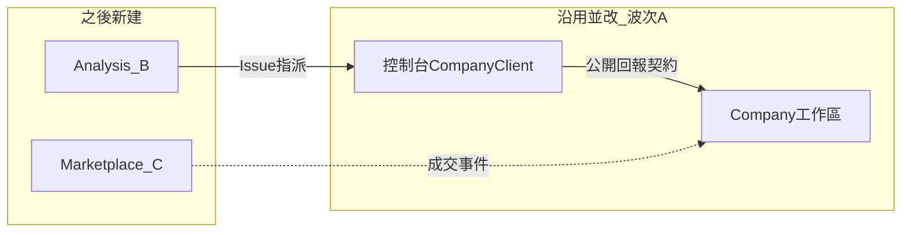

# 系統執行計劃書

依 [PRD](prd.md) 編號落地。衝突時以 [總規格・四套產品](spec.md#四套產品) 為準。本文件回答：**下一個可合併的 PR 做什麼、每個階段結束誰能演示什麼、哪段是新建、哪段是沿用現碼。**

| 欄 | 值 |
|----|-----|
| 狀態 | **規劃**。Company.* 工作區畫面與上傳 API **已存在**，缺租戶切分、`GET /api/v1/me`、公開契約文件化。仲介與系統分析**尚未**建專案 |
| 下一上線 | 波次 A：公司工作區可營運＋公開回報契約＋控制台第一筆上傳（KPI-01～08） |
| 之後才做 | 波次 B：系統分析輔助（KPI-SA\*）。波次 C：仲介（**僅 G-01～G-04 通過後**） |
| 本文件不保證 | 日曆交貨日、人月、營收 |

銷售必須標「規劃」。把本計劃講成已安裝，等於對買家說謊。

## 1. 落地原則（對 PRD）

| PRD | 落地怎麼做 |
|-----|------------|
| 波次 A 是下一驗收 | **只把公司端＋公開契約做成可發布產品**。仲介不進 A 的 Definition of Done |
| 波次 A 沿用 Company.* | **盤點 → 加 `tenantId` → 公開契約 → 對 PRD 缺口補丁**。禁止再開一套人員／甘特／薪資 |
| 控制台 CON 與 RPT | **放進 A**，否則「回報閉環」是假的 |
| 波次 B | 新建 Analysis 專案；不塞進仲介、不塞進控制台當雲端進件 |
| 波次 C | **G-01～G-04 關閉前禁止**建 Marketplace 業務 PR |
| 不做 | 與 PRD 第 3 節相同：控制台改網站、派遣、自動媒合、金流託管、仲介當下一刀、把工作區綁死在「必須先成交」 |

每一階段出口必須是**可部署增量**：CI 綠、授權負向測過、有人話錯誤。不要「先畫面再補 API」。

## 2. 現況資產（不要重做）

| 已有 | 路徑／能力 | A 怎麼用 |
|------|------------|----------|
| 控制台 0.6.x | 堆疊、GitHub、進件、本機工時 | 做工與 `intake.json`；A 加目的地＋握手＋上傳 |
| `CompanyPlatformClient` | `POST .../timesheets/upload`、assignments、payslip | 補 `GET /api/v1/me`；目的地改清單 |
| Company.* Web | 人員、客戶、專案、派工、薪資、預算、戰情、待歸戶、上傳 API | **租戶化**；公開契約擴專案識別；專案貢獻檢視 |
| 上傳 API | 已有 upload；**沒有**握手 `GET /api/v1/me` | A 必做 |

**A 不建：** Marketplace。**B 才建：** Analysis。**C 才建：** Marketplace。

## 3. 開工前決策（擋哪一階段）

| # | 決策 | 最晚關閉 | 落地含義 |
|---|------|----------|----------|
| D-13 | **一需求公司一個工作區、多專案**。可先於仲介存在 | **A 租戶化前** | 開帳不依成交 |
| D-08 | 工作區獨立 ASP.NET 宿主；日後仲介／分析另宿主，不共用 DbContext | A0 | Company 不 `using` 未來 Marketplace |
| D-02 | 生產／試用 PostgreSQL；SQLite 僅測 | A0 | |
| D-01 | 工作區 GitHub App；PAT 備援 | A 派工寫回前 | |
| D-09 | 我們營運多租戶；控制台多名目的地；公開契約 | A 上傳前 | |
| D-RPT | 公開契約 OpenAPI 版本與專案識別規則 | A 上傳前 | 見 [reporting.md](reporting.md) |
| D-03～D-07 | 派工條、認列兩步、加密、讀取審計、匯率 | A 內可分期 | 不擋「第一筆上傳」演示，但擋 A 完整營運關門 |
| D-10／D-11／D-12 | 仲介法律、KYC、押金 | **C 前** | 不擋 A／B |
| G-01～G-04 | 系統分析開門條件 | **C 前** | 見 [analysis.md](analysis.md) |

## 4. 架構（實作約束）

工作區：Domain 無 EF／HTTP；Application 開頭授權；規則不進 `.razor`。

**波次 A 要補的工作區／契約抽象：**

| 介面／能力 | 職責 | 對應 PRD |
|------------|------|----------|
| `GET /api/v1/me` | 握手 | CON-07、RPT |
| 上傳白名單 | 禁 path／blob／source | CON-04、NFR-04 |
| 專案解析 | Guid／projectCode／repo → projectId | RPT-01 |
| API 金鑰 | 第三方用戶端 | PLT-07、RPT-02 |
| 專案貢獻彙總 | 依專案看工時／Issue／類型 | RPT-03 |
| `tenantId` | 全查詢硬邊界 | PLT-04、NFR-11 |

禁止：控制台連任一資料庫；Razor `new` 倉儲。日後仲介不得直接寫 Company 表（必須走佈建 API）。

## 5. 專案切分

| 專案 | 動作 | 職責 |
|------|------|------|
| `AiProject.Company.*` | **改（下一實作）** | 租戶、公開契約、模組缺口、貢獻檢視 |
| `AiProject.Console.CompanyClient`／App | **改** | 多名目的地、握手、狀態圖上傳 |
| `tests/AiProject.Company.*` | **改** | tenant、契約、越權 |
| `src/AiProject.Analysis.*` | **B 新建** | 概念→需求→規格→Issue |
| `src/AiProject.Marketplace.*` | **C 新建** | 會員、認證、刊登、成交、合同、應收 |

## 6. PRD 對階段（追蹤表）

### 6.1 波次 A（下一發布必須全綠）

| PRD | 階段 | 落地做法 |
|-----|------|----------|
| PRD-PLT-04、NFR-03／11 | A1 | 全部查詢加 `tenantId`；越權 403 |
| PRD-PLT-01～03、05、06 | A1 | 登入／設定／遮罩；租戶測試 |
| PRD-PLT-07、RPT-01～02 | A2 | API 金鑰；專案碼／repo 解析；OpenAPI 草稿 |
| PRD-CON-01～07 | A2 | 控制台目的地清單、狀態圖、握手、上傳 |
| PRD-RPT-03 | A2 | 專案貢獻檢視 |
| PRD-PPL-\*、PRD-PRJ-\* | A3 | 對現有頁缺口清單，缺才補 |
| PRD-DSP-\* | A4 | 派工、寫回 GitHub 待同步 |
| PRD-PAY-\*、CON-05 | A5 | PM 確認、鎖定、CSV |
| PRD-BDG-\* | A6 | 預算／毛利 |
| PRD-WAR-\* | A7 | 戰情室最後驗 |
| KPI-01～08 | A2／A5／A7 | 對應出口 |

A **不**實作：PRD-MKT-\*、PRD-SA-\*、押金、電子發票。

### 6.2 波次 B（A 發布後）

| PRD | 階段 | 落地做法 |
|-----|------|----------|
| PRD-SA-01～06 | B1～B3 | Analysis 專案；產物；GitHub Issue；指派 |
| KPI-SA01～04 | B3 | 閉環演示 |
| G-01～G-04 | B3 出口 | 記錄是否達 N 次 |

### 6.3 波次 C（門檻後）

僅 G 通過後啟用。原仲介 A0～A5 工作包整體延後至此：會員認證、刊登、成交合同應收、成交事件寫入工作區。發案呼叫 P3 產物，不重做分析引擎。對應 PRD-MKT-01～15、KPI-M01～M06。

## 7. 分階段（每一段都能演示）

### 波次 A — 下一發布

#### 階段 A0 — 健康檢查與租戶欄位起點

**演示：** Company `/health` 200；CI 綠；`tenantId` 欄位遷移可跑（可先單租戶預設值）。

**不做：** 仲介、分析站、戰情室當首頁大改。

#### 階段 A1 — 租戶隔離

**對應：** PLT、NFR-11。**D-13 已關。**

兩個租戶並行；A 的窗口打 B 的 URL／API 403。

#### 階段 A2 — 公開契約與第一筆上傳（本波最硬的整合）

**對應：** CON-\*、RPT-\*、KPI-04／07／08。**D-09、D-RPT 已關。**

| 工作包 | 做什麼 |
|--------|--------|
| A2-1 | `GET /api/v1/me`；upload 白名單；契約測試禁 path／blob |
| A2-2 | 專案識別：Guid／projectCode／repos；Issue 帶 repo |
| A2-3 | API 金鑰；第三方 curl 上傳成功 |
| A2-4 | 控制台：目的地清單、狀態圖、「送到〔這家〕」、重試 |
| A2-5 | 專案貢獻彙總頁 |

**演示：** 工程師控制台與一支 curl 腳本都能上傳；專案頁看得到貢獻；payload 無原始碼。

**失敗則 A 不能宣稱「回報閉環完成」。**

#### 階段 A3～A7 — 模組缺口到營運關門

A3 人員／專案 → A4 派工 → A5 工時確認與薪資 CSV → A6 預算 → A7 戰情室與越權總驗。

**出口（波次 A）：** KPI-01～08 全真。

### 波次 B — 系統分析輔助

B1 空站可部署 → B2 需求／規格產物 → B3 Issue＋指派＋控制台開工。出口：KPI-SA\* 與 G-01～G-04 紀錄。

### 波次 C — 仲介（門檻後）

C0 起比照舊「仲介骨架」計劃：會員、認證、刊登、成交、合同、應收、成交事件寫入。**未過 Gate 禁止合併 C 業務 PR。**

## 8. 每階段測試最低線

| 波次 | 合併前必綠 |
|------|------------|
| A | 租戶越權 403；upload 契約無 path／blob；握手失敗人話；已核准不可覆蓋；金鑰與 GitHub 兩種認證可上傳 |
| B | 產物有假設標註；Issue 可指派；控制台看得見 |
| C | 未認證不能寫；他司不能讀；成交有 Deal＋應收；文案無派遣 |

MCP／Agent **不得**註冊薪資、費率、毛利、仲介應收工具（NFR-04）。

## 9. 控制台本波（A）只准加這些

- 執行狀態圖（CON-01）
- 申報目的地清單（CON-06）
- 握手 `GET /api/v1/me`（CON-07）
- 「送到〔這家公司〕」＋重試（CON-02～04）
- 該目的地派工只讀條（CON-05）

零目的地時，掃描／進件／工時儀表與現況相同。需求上游分析走 P3（B），不塞進控制台當唯一發案站。

## 10. 發布對照

| 發布 | 必須為真 |
|------|----------|
| 波次 A | KPI-01～08、PLT／PPL／PRJ／DSP／PAY／BDG／WAR／CON／RPT、NFR-02／04／11 |
| 波次 B | KPI-SA01～04、PRD-SA-01～06 |
| 波次 C | G-01～G-04 已關；KPI-M01～M06、PRD-MKT-\*、NFR-12、D-10～D-12 已關 |

**不進任一發布：** 自動媒合、派遣、金流託管、電子發票、勞基法引擎、控制台改網站、原始碼上雲、未過門檻的仲介。

## 11. 執行風險

| 風險 | 落地緩解 |
|------|----------|
| 又把仲介當第一個 PR | 本文件第 12 節寫死；CI／看板禁止 Marketplace 進 A |
| 重寫 Company | PR 說明必須寫「對現有頁的 diff」 |
| 契約變私有 | A2 必過 curl 第三方上傳 |
| 戰情室拖死回報閉環 | A2 先過上傳；戰情放 A7 |

## 12. 下一個 PR（不要選仲介或戰情室）

1. 關閉 D-13／D-RPT 文字——產品在 issue 打勾即可開工 A0。
2. **第一個程式 PR = 階段 A0／A1：** Company `tenantId`、查詢邊界、越權測試、`/health`。
3. 並行：依 [reporting.md](reporting.md) 起草 OpenAPI；列出 upload DTO 要擴的專案識別欄位。
4. **不要**建 Marketplace 專案骨架，直到 G-01～G-04 關閉。

產品走讀用第 6 節追蹤表對 [PRD](prd.md)。工程拆 sprint 用第 7 節。契約以 [reporting.md](reporting.md)、模組篇、[UX](ux.md) 為準。
