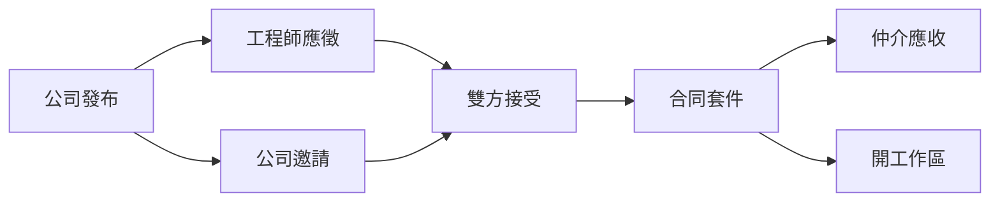

# 仲介平台

**規劃**。下一實作。**不能**講成已出貨。衝突時以 [總規格・三層產品](spec.md#三層產品) 為準。

仲介是我們營運的公開 SaaS。需求公司發布專案；工程師找案；達成協議後抽仲介費。加入免費，認證要強。成交時**交換資料**給 [公司工作區](modules/projects-clients.md)（現有 Company.* 改租戶，不重做）；工作區可先獨立存在，不是仲介畫面的下一頁。做工與工時走 [控制台](../user/getting-started.md)。

## 要解決的問題

有軟體需求的公司不一定養得起正職團隊，也不一定會寫 PRD。獨立工程師找得到案子，成交後卻回到試算表、私人 Git、口頭保密。仲介只補：**可驗證的雙方、寫得清楚的需求、合同與抽成**。管人／派工／毛利是工作區的問題；本機做工是控制台的問題。不要在仲介裡重做那兩套。

## 會員

加入**不收費**。兩種主體：

| 主體 | 誰 | 能做（通過認證後） |
|------|-----|-------------------|
| 需求組織 | 任何有軟體需求的公司或單位，不限軟體業 | 用網頁精靈發布專案、邀請或接受應徵、簽署合同；若使用工作區，成交後可從仲介進入該租戶 |
| 工程師個人 | 系統分析、系統設計、程式開發、系統測試（可複選） | 瀏覽／應徵、接受邀請、簽署合同、用控制台做工與申報 |

同一自然人可同時是某組織的窗口，與自己的工程師檔。未認證只能瀏覽公開說明，不能發布、不能應徵、不能成交。

## 認證（第一刀 vs 下一步）

第一刀要「強烈」但**不做真金流託管**：

| 邊 | 第一刀 | 同一計畫的下一步（不假裝第一刀就有） |
|----|--------|--------------------------------------|
| 工程師 | 身分資料＋已驗證 GitHub 帳號 | 第三方 eKYC、押金 |
| 需求組織 | 統編（或同等登記號）＋負責人／窗口身分 | 第三方企業認證、押金 |

未通過認證的發布／應徵被拒絕，畫面說人話。認證狀態寫審計。押金與金流託管涉及法規與金流牌照，列執行計劃開工前決策，**不**在第一刀實作。

## 需求精靈（網頁，不是控制台）

需求方不一定會裝桌面控制台。發布必須在仲介網站完成。精靈引導寫出：

- 專案一句話與要解決的問題
- 範圍／非範圍
- 需要的角色與人數（分析／設計／開發／測試）
- 資格（技能、年資、產業、語言、是否需到場）
- 預估期間、預算或時計區間（可標「面議」）
- 溝通與倉：成交後掛 GitHub；沒有倉則成交時建立或由工程師後補

欄位結構對齊控制台進件（問題、驗收條件、角色），**不寫進 Git**。成交且已有工作區／倉之後，工程師才用控制台需求工作台把進件落到 `docs/product/intake.json`。

## 媒合與成交

不是自動配對。流程：

雙方接受 = 成交。成交產出合同套件（保密＋承攬／專案範圍）範本，雙方確認並留紀錄。電子簽接第三方，不自研簽章。平台算出應付仲介費並開立應收；請款自動化與金流下一刀。

合同當事人是**需求公司 ↔ 工程師**。平台是仲介與抽成方，不是派遣雇主。法律定位見執行計劃 D-10，開工前關閉。

## 成交後的資料交換

仲介在雙方接受之後**結束自己的主流程**（合同套件、仲介應收）。接著發成交事件，不把工作區當自己的子站：

1. 若該需求組織**尚無**工作區租戶，則建立一個（建議：一需求公司一個工作區、多專案；見 D-13）。若**已有**，則掛回同一租戶。
2. 把成交工程師寫進該工作區名冊（綁 GitHub），控制台申報目的地可指向該工作區接收 API。
3. 為該案建立或掛上 GitHub 倉。**Issue 是唯一任務溝通面**；不另做站內聊天當主路徑。
4. 需求公司在**工作區**做管理面（專案彙整、工時確認、預算／戰情）。工程師繼續用控制台。

工作區不重做進件表、編譯、Agent。那些是控制台現況。沒有工作區的需求公司仍可在仲介完成成交與合同；只是沒有管理面可寫入。

## 抽成

成交時按當時費率算出仲介費，寫入應收（需求方、供給方如何分擔在費率表設定，第一刀至少一種規則可跑）。不做：自動扣款、託管工程款、電子發票引擎（列後續）。

## 與另外兩套機制的邊界

| 仲介做 | 工作區做 | 控制台做 |
|--------|----------|----------|
| 會員、認證、發布、應徵、合同、抽成應收 | 名冊、專案、派工、工時確認、薪資／毛利、戰情室 | 本機堆疊、進件落到 Git、工時真相、Agent |
| 網頁精靈（成交前） | 只讀進件彙總（有倉才有） | 需求工作台（承接後） |
| 不碰原始碼 | 不碰原始碼 | 原始碼只在工程師電腦與 GitHub |
| 發成交事件 | 收成交事件；也可自己建人與專案 | 可從成交事件拿到目的地；也可手動加 |

禁止：仲介層複製一套薪資／戰情室；控制台連仲介或工作區資料庫；把控制台改成網站好讓需求公司發案；把工作區生命週期綁死在「必須先仲介成交」。

## 非目標（仲介第一刀）

- 自動媒合、履歷社群、公開評價灌水
- 勞務派遣牌照、代發薪給工程師（工作區可匯出，不是仲介發薪）
- 託管原始碼、站內 IDE
- 真金流託管、押金凍結、電子發票
- 行動 App

## 驗收（第一刀）

一組通過認證的需求組織與工程師：發布 → 應徵或邀請 → 雙方接受 → 合同紀錄產生 → 成交事件寫入工作區且名冊有該工程師 → 控制台握手並申報第一筆工時。原始碼未上傳到仲介雲。編號驗收以 [PRD](prd.md) PRD-MKT-01～15 為準。工作區本身的人員／薪資／戰情不在本篇驗收。
