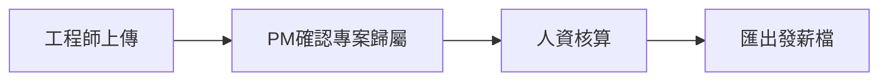

# 薪資

**規劃**（公司工作區 P2；**下一實作**：彙總、規則、核准、匯出）。工程師繪製執行狀態與本機計時為 **現況** 控制台能力；本模組消費 [公開回報契約](../reporting.md) 的上傳結果（不限控制台）。仲介抽成應收不在本模組。

## 要解決的問題

工程師已經能在控制台看到各專案工時。公司要把這些時段，加上「這週實際做了哪個專案到哪裡」，按**月薪、時計、按專案**三種規則發錢。人資不要再收 30 封信附的試算表。

## 工程師側（現況控制台＋規劃上傳）

1. **現況：** 開啟專案即計時；儀表板可看週／月與各專案時數；可匯出 CSV。工時儀表板「公司」分頁只讀顯示選定目的地的握手身分、派工、最近上傳結果與可選薪資條。
2. **規劃：** 在控制台畫**執行狀態圖**（哪段日期投入哪個專案、完成度或階段備註），與時段一併送到**選定的公司接收 API**。可設定多家目的地；一次只送一家。
3. 上傳前先握手，確認該公司名冊有此工程師。上傳是明確動作（按「送到〔這家公司〕」），不是背景偷傳。失敗要能重試。本機仍保留 `work-hours.json`。公司端收到後依專案彙整，進入 PM 確認。控制台不顯示費率表或毛利。

狀態圖不是另一套工時。它用來：解釋時段（為什麼這週 12 小時在 A）、給 PM 看執行、給按專案計薪當佐證。時數仍以時段為準。

## 計薪規則（每人或每外包商可設）

| 模式 | 誰用 | 計算 |
|------|------|------|
| 按月 | 多數正職 | 月薪固定；專案分攤只影響**成本**不影響實發，除非另加專案獎金 |
| 按時計 | 外包、部分正職加班列 | 核准工時 × 費率；可設每日／每週上限，超出列「待核准加班」不自動發 |
| 按專案 | 專案獎金或包工 | 專案達成里程碑或 PM 標記「可發」後，發固定額或完工比例 |

同一人可「月薪＋專案獎金」並列。MVP **不做**勞基法加班費率自動計算（平日／休息日／國定）；超出上限進待核准，由人資決定金額。這點必須對買家講清楚。

## 核准流

- PM 確認的是「時段掛對專案、狀態圖合理」，不是核定薪水。
- 人資才能改金額、退回、鎖定週期。
- 鎖定後只能開下一個更正週期，不能默默改歷史。

外包窗口可代送己方工時，仍要我方 PM 確認。

## 工程師 Web

只讀：本週／本月已上傳時數、核准狀態、自己的薪資條（實發相關列）。看不到同事、看不到費率表全貌（時計者可見「我的費率」）。

## 匯出

鎖定週期後匯出 CSV（人員、所得類別、金額、專案分攤備註）。格式文件化，方便接既有發薪或外包請款。不內建扣繳、勞健保、銀行檔。

**CSV 表頭（固定，權威實作 `PayrollCsv.Header`）：**

| 欄位 | 語意 |
|------|------|
| `personId` | 人員 Guid |
| `displayName` | 顯示名 |
| `kind` | 所得類別 enum：`Monthly` 月薪／`Hourly` 時計／`ProjectBonus` 專案獎金／`OvertimePending` 待核准加班 |
| `amount` | 實發金額（`payable=false` 時仍可能有列，以 `payable` 為準） |
| `costAmount` | 成本分攤金額（月薪分攤列常用） |
| `projectId` | 專案 Guid（可空） |
| `hours` | 核准小時 |
| `payable` | 是否計入實發 |
| `note` | 備註（含專案分攤說明） |

## 關鍵畫面

- **公開回報：** 接收匣（Base URL、待 PM 確認、待歸戶、API 金鑰）。控制台送來後第一眼看這裡。
- **我的工時（Web）：** 狀態、退回原因、補傳入口說明（實際繪圖仍在控制台）。
- **薪資週期：** 人資看每人三模式列、例外、一鍵鎖定；待 PM 確認與公開回報同一批資料。
- **控制台狀態圖編輯器：** 簡單的專案 × 日期色塊，不要做成完整甘特。

## 驗收條件（MVP）

- 正職月薪週期能產出分攤到專案的成本，且實發與月薪一致（無獎金時）。
- 時計外包的實發 = 核准小時 × 費率；未核准不進實發。
- 按專案獎金在里程碑「可發」前不出現在實發。
- 工程師能從控制台上傳成功，並在 Web 看到「待 PM 確認」。
