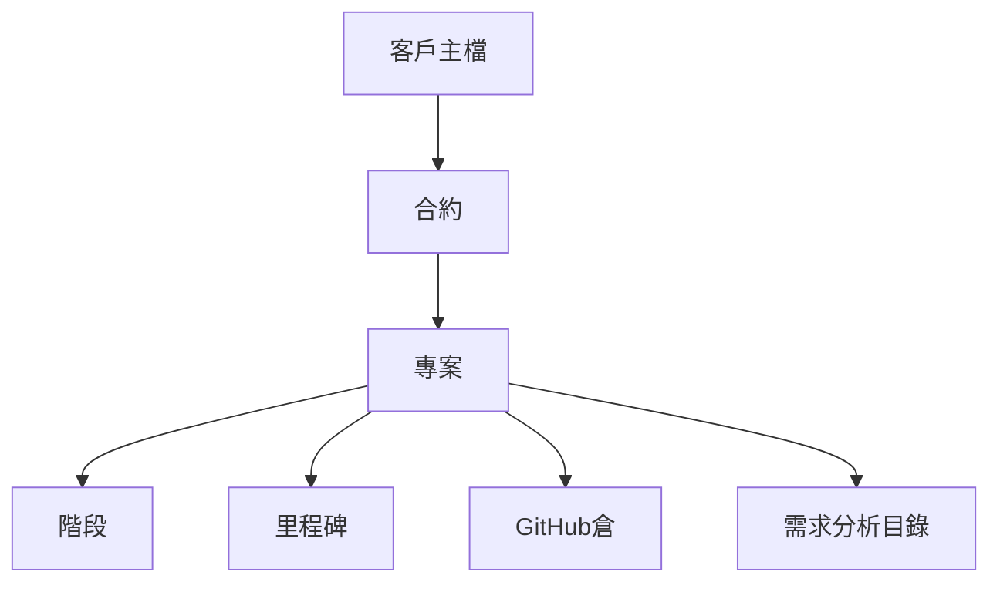

# 專案與客戶

**規劃**（公司工作區 P2；**下一實作**）：客戶生命週期、成立專案、甘特、階段投入、需求分析目錄、**專案貢獻彙總**（來自 [公開回報契約](../reporting.md)）。**現況**已有：控制台工作區／倉、需求工作台開 GitHub Issue 與驗收。不要在工作區重做進件表或 DocFX 編輯器。上游「概念 → Issue」見 [系統分析輔助](../analysis.md)。本模組可獨立建客戶與專案；仲介成交（門檻後）時可投影一條，**不必先走仲介**。

## 要解決的問題

軟體公司的「專案」在 Git 裡是倉，在業務裡是客戶合約的一個交付。經營層問「進行中有哪些、排到何時、哪個階段、哪幾位分析師與工程師」時，需要客戶 → 合約 → 專案 → 階段這條鏈，而不是只有 repo 清單。同一份客戶主檔也要能追潛在與議約，成交後才開合約。

## 資料鏈

- **客戶：** 同一份主檔。生命週期：潛在 → 需求訪談 → 提案議約 → 合約客戶 → 休眠。另有窗口、電話／Email、來源、下次跟進、負責 PM。活動列（來電／面談／需求／提案／狀態變更／成立專案）只寫人話摘要；金額走審計。
- **合約：** 期間、總額或框架、計價（固定價格／T&M／混合）、可派的外包商。
- **專案：** 名稱、所屬合約、狀態（立案／進行／暫停／驗收／結案）、開始與目標結束日、工作區路徑或 repo 列表、專案紀錄時間線。
- **階段：** 預設需求 → 設計 → 實作 → 驗證 → 驗收 → 維運。新專案預設停在需求。歷史階段保留進入與離開日期。
- **里程碑：** 日期、交付物、可選請款點（給預算模組）。
- **需求分析目錄：** 只讀引用控制台：GitHub Pages、`docs/product` 骨架、進件彙總。不把 Markdown 全文搬進公司庫。

分析師與工程師的「參預」來自派工單，不是再維護一份名單。專案頁讀派工模組。

潛在／訪談中的客戶不能成立專案、不能派工、其專案不列入戰情室「進行中」。只有議約或已成交能「成立專案」（單一交易：合約＋專案＋客戶標成交＋活動）。既有「先建合約再加專案」留給同一客戶第二條。

外包窗口看不到他司客戶與合約額。

## 甘特圖

- 列：專案下的階段與里程碑；可展開到派工人員。
- 條：計劃起迄（實線）與實際起迄（若已有進入／離開日期）。
- 依賴：里程碑之間可標「完成才開始」（MVP 只做一層，不做關鍵路徑演算）。
- 今天線。逾期未完成的條變紅。

行動裝置：**不**保證可編輯甘特；只保證只讀時間條。編輯以桌面瀏覽器為準。

## 與現況進件的關係

需求工作台的進件仍寫在各倉 `docs/product/intake.json`。公司平台專案可「連結工作區」，只讀該倉進件狀態彙總（幾筆已發出、幾筆待驗收），不把進件搬到公司資料庫當主檔。真相仍在 Git。規格樹是否存在（README／vision／prd／spec）與 GitHub Pages 連結同理：平台當目錄與健康燈。階段「需求」未離開且 Pages／骨架未就緒 → 既有專案健康黃燈。

## 關鍵畫面

- **客戶列表：** 分頁籤潛在／議約／合約／休眠；下次跟進排序；逾期黃／紅。
- **客戶首頁：** 上狀態機；中活動時間線；下成立專案與既有合約。
- **專案組合：** 進行中列表：客戶、生命週期來源、階段、目標日、狀態。
- **專案首頁：** 需求分析目錄、專案紀錄、時程、甘特、派工、進件彙總、預算摘要（權限內）。

## 驗收條件（MVP）

- 能從客戶建立合約與專案，並掛上既有 GitHub repo。
- 列表能只看潛在；逾期跟進看得到。
- 潛在客戶不能派工、不佔戰情室進行中。
- `pm` 從客戶「成立專案」後有合約＋專案＋活動紀錄。
- 甘特能顯示階段與里程碑；逾期變紅。
- 專案首頁看到 Pages／進件彙總／規格是否存在；未掛倉是說明句不是 500。
- 專案首頁看到目前派工的分析師／工程師，資料與派工模組一致。
- 結案後不能新派工；歷史甘特與工時仍可查。
- 外包窗口仍看不到他司客戶。
