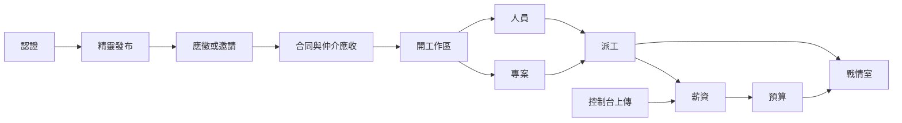

# 產品需求文件（PRD）

**下一驗收是仲介平台第一刀。** 成交後工作區沿用已實作的 Company.*，不在本 PRD 當下一上線版本重開。模組細節以各規格篇為準；**衝突時以 [總規格](spec.md) 的三層產品為準**。本文件給工程、設計、採購對齊範圍與驗收，**不是**銷售投影片。

## 1. 文件資訊

| 欄 | 值 |
|----|----|
| 狀態 | **規劃／尚未出貨**（仲介與工作區）。控制台為現況 |
| 適用版本 | 仲介 SaaS 第一刀；成交後開租戶工作區；控制台需配合「執行狀態圖＋上傳」 |
| 前提 | 控制台約 0.6.x 已出貨；Company.* 工作區能力已有程式，定位改為成交後租戶 |
| 讀者 | 工程、設計、產品、採購（會後走讀） |
| 權威來源 | [願景](vision.md)、[仲介](marketplace.md)、[角色](personas.md)、[總規格](spec.md)、[路線圖](roadmap.md)、[系統執行計劃書](execution-plan.md) |
| 本 PRD 不保證 | 交貨日、營收、客戶實測數字 |

銷售與簡報必須沿用「現況／規劃」標籤。把本 PRD 講成安裝包已有，等於對買家說謊。

本 PRD 分兩波：

| 波次 | 驗收什麼 | 何時做 |
|------|----------|--------|
| **A 仲介第一刀** | 會員、認證、精靈發布、應徵／邀請、合同紀錄、仲介應收、開工作區、控制台第一筆工時 | **下一實作** |
| **B 成交後工作區** | 人員、派工、甘特、薪資、毛利、戰情室 | 成交後使用；程式沿用，改租戶與開帳。不與 A 同一上線版本「一次做完」 |

## 2. 問題與機會

目標是**軟體工程仲介**：需求方不限軟體公司；供給方是分析／設計／開發／測試。見 [願景](vision.md)、[仲介](marketplace.md)。

斷層是：

- 需求公司不會寫 PRD、找不到通過認證的人、成交後沒有管理面
- 工程師找得到案，開工後又回到試算表與口頭保密
- 控制台已補執行層；Company.* 已有管理面，但過去當成「SI 自架」，沒有成交入口

要完成的工作：網頁精靈發案；認證後應徵／邀請；合同與仲介應收；開工作區；Issue 溝通；控制台申報。

## 3. 目標與非目標

### 本 PRD 波次 A 要交付

一組通過認證的需求組織與工程師，走完：**發布 → 應徵或邀請 → 雙方同意 → 合同產生 → 開工作區 → 控制台申報第一筆工時**。

技術形態（見 [架構](architecture.md)）：仲介與工作區是我們營運的 .NET 10 **Blazor Web App**（多租戶）；控制台維持 Photino.Blazor，**不改成網站**。需求精靈在仲介網站，不在控制台。

### 非目標（兩波驗收都不含）

| 不做 | 原因 |
|------|------|
| 把控制台改成網站 | 工程師必須碰到本機行程與檔案；需求公司用仲介網頁精靈即可 |
| 取代 Jira／Azure Boards | 任務面以 GitHub 為準 |
| 取代 Cursor／Copilot | Agent 是操作者 |
| 汎用 ERP、總帳、報稅、勞健保 | 工作區匯出給既有財務 |
| 勞基法加班費率引擎、假勤／特休 | 先做不可派區間與待核准加班 |
| 勞務派遣、自動媒合、履歷社群 | 專案承攬仲介，不是人力銀行 |
| 押金凍結、金流託管、電子發票 | 第一刀只記仲介應收；見執行計劃 D-12 |
| 把控制台做成某家公司的前後台 | 見 [三層產品](spec.md#三層產品) |
| 在仲介層重做薪資／毛利／戰情室 | 那是波次 B 工作區 |
| 把原始碼傳到本產品雲 | 控制台本機；上傳僅時段與狀態圖 |

舊非目標「公開 SaaS 多租戶、客戶自助入口」已翻轉：那是仲介預設。自架工作區改後期。

## 4. 成功指標

以下是**產品意圖、可驗收**，不是合約保證。

### 波次 A（仲介；下一上線）

| ID | 指標 | 怎麼驗 |
|----|------|--------|
| KPI-M01 | 免費加入＋認證門檻 | 未認證不能發布／應徵；工程師 GitHub、組織統編通過後可以 |
| KPI-M02 | 精靈發案 | 非軟體業窗口能填完範圍、角色、資格、預算區間並刊登 |
| KPI-M03 | 成交閉環 | 應徵或邀請 → 雙方接受 → 合同套件紀錄存在 → 仲介應收列產生 |
| KPI-M04 | 開工作區 | 成交後該組織有租戶；成交工程師在名冊且綁 GitHub |
| KPI-M05 | 工時第一筆 | 控制台對該工作區握手並上傳成功；原始碼未上傳 |
| KPI-M06 | 權限在伺服器 | 無權直打仲介／工作區 URL／API 被拒 |

### 波次 B（工作區；成交後，沿用程式）

| ID | 指標 | 怎麼驗 |
|----|------|--------|
| KPI-01 | 一條真實專案跑完一個薪資週期 | 上傳 → PM 確認 → 人資鎖定 → CSV |
| KPI-02 | 經營層 30 秒內看到例外 | `exec` 登入落地戰情室 |
| KPI-03 | 外包資料隔離 | `vendor_admin` 抽測隔離 |
| KPI-04 | 工時閉環 | 「送到〔這家公司〕」後 Web「待 PM 確認」 |
| KPI-05 | 毛利可解釋 | 能指出收入來源與人事分攤 |
| KPI-06 | 權限在伺服器 | 隱藏選單不是唯一防線 |

## 5. 使用者與進場

細節見 [角色](personas.md)、[仲介](marketplace.md)。工作區權限見 [總規格](spec.md#角色與權限)。

| 角色 | 預設落地 | 主要工作 |
|------|----------|----------|
| `demand_admin` | 仲介：我的刊登 | 精靈發案、邀請／接受、看合同與應收 |
| `talent` | 仲介：找專案 | 應徵、簽合同；做工在控制台 |
| 工作區 `owner`／`exec`／`pm`／`hr`／`finance` | 成交後工作區 | 沿用第 7.2 節以降；工程師幾乎不到瀏覽器 |

## 6. 範圍與依賴

**建議實作順序：** 仲介會員／認證 → 精靈發布 → 成交／合同／應收 → 開租戶工作區 → 控制台握手上傳。工作區內模組（派工、薪資、戰情）沿用現碼，租戶化後再補缺口，**不要**與仲介第一刀綁成同一發布。

## 7. 功能需求

### 7.1 仲介第一刀（P0 進下一上線）

規格：[仲介平台](marketplace.md)

| ID | P | 角色 | 故事 | 驗收 |
|----|---|------|------|------|
| PRD-MKT-01 | P0 | 全員 | 我能免費註冊需求組織或工程師檔 | 未付費可加入；未認證不能成交 |
| PRD-MKT-02 | P0 | `talent` | 我用身分＋GitHub 完成認證 | 通過後可應徵；失敗說人話 |
| PRD-MKT-03 | P0 | `demand_admin` | 我用統編＋負責人完成組織認證 | 通過後可發布 |
| PRD-MKT-04 | P0 | `demand_admin` | 我用網頁精靈發布專案（範圍、角色、資格、預算） | 不寫進 Git；不要求安裝控制台 |
| PRD-MKT-05 | P0 | `talent` | 我能瀏覽並應徵已認證刊登 | 未認證刊登不對未認證者成交 |
| PRD-MKT-06 | P0 | `demand_admin` | 我能邀請工程師；雙方接受即成交 | 單筆 `dealId`；可分次成交多人 |
| PRD-MKT-07 | P0 | 雙方 | 成交後看到合同套件（保密＋範圍）並留下確認紀錄 | 電子簽可先第三方；無簽章則「雙方於平台確認」仍算第一刀 |
| PRD-MKT-08 | P0 | 系統 | 成交時寫入仲介應收 | 費率可設定；不做自動扣款 |
| PRD-MKT-09 | P0 | 系統 | 成交後開該組織租戶工作區，成交工程師入名冊 | 控制台目的地可指向該接收 API |
| PRD-MKT-10 | P0 | 系統 | 為該案建立或掛上 GitHub 倉；Issue 為溝通面 | 不另做站內聊天當主路徑 |
| PRD-MKT-11 | P0 | `engineer`／`talent` | 控制台握手並上傳第一筆工時 | 沿用 PRD-CON-*；不含原始碼 |

押金、eKYC、金流託管：**不是** PRD-MKT-* 第一刀。見執行計劃 D-12。

### 7.2 成交後工作區（沿用；不擋仲介第一刀發布）

以下條目原為公司平台 PRD，改標**波次 B**。程式已存在則租戶化與開帳，不重寫產品意圖。規格仍見各模組篇。

#### 7.2.1 平台基盤

| ID | P | 角色 | 故事 | 驗收 |
|----|---|------|------|------|
| PRD-PLT-01 | B | 全員 | 管理者用公司帳戶登入工作區；工程師用控制台 GitHub | 未邀請上傳進待歸戶；邀請後能對上傳 |
| PRD-PLT-02 | B | 各角色 | 登入後進我的預設首頁 | 對齊工作區落地表 |
| PRD-PLT-03 | B | `owner` | 我能設公司名、時區、貨幣、毛利門檻、是否寫回 GitHub | 存檔後該租戶生效 |
| PRD-PLT-04 | B | `owner` | 工作區預設是我們主機上的一個租戶 | 自架改後期。控制台可對多家租戶申報 |
| PRD-PLT-05 | B | `hr`／`finance`／`delivery` | 改費率、鎖定、強制超載必填原因並審計 | 能查出誰、何時、為什麼 |
| PRD-PLT-06 | B | `engineer` | 我看不到同事月薪與對客戶費率 | 畫面遮罩；API 同樣拒絕 |

#### 7.2.2 人員與外包

規格：[人員與外包](modules/people.md)

| ID | P | 角色 | 故事 | 驗收 |
|----|---|------|------|------|
| PRD-PPL-01 | B | `hr` | 我能建立正職、個人外包、承攬派駐 | 三種雇用類型可建 |
| PRD-PPL-02 | B | `hr` | GitHub 帳號對到 `personId` | 同一帳號不能綁兩個在職人員 |
| PRD-PPL-03 | B | `vendor_admin` | 我只看己方人員與己方專案工時 | 看不到他司、毛利、合約總額 |
| PRD-PPL-04 | B | `hr`／`pm` | 停用後不能新派工 | 歷史工時仍可查 |
| PRD-PPL-05 | B | `delivery` | 技能與可用度能被派工讀到 | 與戰情室同一口徑 |
| PRD-PPL-06 | B | `hr` | 未綁 GitHub 的人可先建檔 | 上傳進待歸戶；未綁不能自動對 PR |

成交寫入的工程師以個人外包／專案外包為預設雇用類型，可改。

#### 7.2.3 專案與客戶

規格：[專案與客戶](modules/projects-clients.md)

| ID | P | 角色 | 故事 | 驗收 |
|----|---|------|------|------|
| PRD-PRJ-01 | B | `pm` | 我能從客戶建立合約與專案並掛 GitHub repo | 客戶 → 合約 → 專案 → 倉 |
| PRD-PRJ-02 | B | `pm` | 我能看階段與里程碑甘特 | 逾期條變紅 |
| PRD-PRJ-03 | B | `pm` | 專案首頁的人來自派工 | 不另養名單 |
| PRD-PRJ-04 | B | `delivery` | 結案不能新派工 | 歷史仍可查 |
| PRD-PRJ-05 | B | `pm` | 專案可連結工作區，只讀進件彙總 | 不搬 `intake.json` |
| PRD-PRJ-06 | B | `pm` | 客戶主檔生命週期 | 潛在不能派工、不佔進行中 |
| PRD-PRJ-07 | B | `pm` | 從客戶首頁一次成立合約與專案 | 單一交易 |
| PRD-PRJ-08 | B | `pm` | 需求分析目錄與專案紀錄 | 未掛倉是說明句不是 500 |

仲介成交可自動建一條「本組織為客戶」的專案，減少需求公司再填一次。

#### 7.2.4 派工

規格：[派工](modules/dispatch.md)

| ID | P | 角色 | 故事 | 驗收 |
|----|---|------|------|------|
| PRD-DSP-01 | B | `delivery`／`pm` | 週矩陣派人到專案一週 | 可選寫回 Issue assignee |
| PRD-DSP-02 | B | `pm` | 寫回失敗標「待同步」 | 不假裝已派到 GitHub |
| PRD-DSP-03 | B | `pm` | 外包派到未授權專案被拒絕 | 人話原因 |
| PRD-DSP-04 | B | `delivery` | 超載有警告；可強制並留審計 | 強制必留原因 |
| PRD-DSP-05 | B | `hr` | 取消派工不刪已上傳工時 | 時段仍在 |
| PRD-DSP-06 | B | `pm` | 建議名單依技能與剩餘小時 | **不是**自動指派 |

#### 7.2.5 控制台上傳

規格：[薪資](modules/payroll.md)、[架構](architecture.md)。**PRD-CON-02／06／07／11 與仲介第一刀閉環重疊，P0 進波次 A。**

| ID | P | 角色 | 故事 | 驗收 |
|----|---|------|------|------|
| PRD-CON-01 | A | `engineer` | 我在控制台畫執行狀態圖 | 不要做成公司甘特縮小版 |
| PRD-CON-02 | A | `engineer` | 選一個申報目的地再「送到〔這家公司〕」 | 非背景偷傳；一次一個目的地 |
| PRD-CON-03 | A | 系統 | 上傳以本機時段 ID 冪等 | 已核准不可覆蓋 |
| PRD-CON-04 | A | `engineer` | 上傳不含原始碼 | 僅時段、專案識別、狀態圖、Issue 編號 |
| PRD-CON-05 | B | `engineer` | `GET /api/v1/me/assignments` 顯示該目的地派工 | 不混別家 |
| PRD-CON-06 | A | `engineer` | 我能設定多家接收 API | 零個目的地時其餘功能照常 |
| PRD-CON-07 | A | `engineer` | 上傳前握手，確認名冊有我 | `GET /api/v1/me`；未通過說人話 |

#### 7.2.6～7.2.8 薪資、預算、戰情室

規格：[薪資](modules/payroll.md)、[預算](modules/budget.md)、[戰情室](modules/war-room.md)。全部為波次 B：PRD-PAY-01～07、PRD-BDG-01～05、PRD-WAR-01～06 意圖不變。仲介第一刀**不**驗戰情室與毛利。

## 8. 非功能需求

| ID | 主題 | 要求 |
|----|------|------|
| PRD-NFR-01 | 部署 | 仲介與工作區預設由我們營運；TLS。自架工作區後期 |
| PRD-NFR-02 | 授權 | 角色在伺服器強制 |
| PRD-NFR-03 | 敏感資料 | 費率／月薪遮罩；租戶隔離 |
| PRD-NFR-04 | 上傳內容 | 不含原始碼；MCP 不暴露薪資或仲介應收工具 |
| PRD-NFR-05 | 時效 | 工作區戰情室逾期五分鐘內反映（波次 B） |
| PRD-NFR-06 | 裝置 | 仲介發案與應徵可用桌面瀏覽器；編輯甘特／矩陣 ≥1200px |
| PRD-NFR-07 | 無障礙 | 狀態不只靠顏色；WCAG 2.2 AA 目標 |
| PRD-NFR-08 | 相容 | 接收 API 相容至少一個控制台大版本 |
| PRD-NFR-09 | 刪除 | 軟刪；已有成交／工時不可硬刪 |
| PRD-NFR-10 | 文案 | 繁中、錯誤說人話 |

## 9. 假設、風險、開放問題

### 假設

- 任務面是 GitHub Issue／PR
- 工時本機檔仍是工程師側真相
- 平台是專案承攬仲介，不是派遣雇主（D-10 開工前關閉）
- 第一刀不做真金流託管（D-12）
- 一需求公司一個工作區、多專案（D-13，建議）

### 風險

| 風險 | 緩解 |
|------|------|
| 被當成派遣或人力銀行 | 合同範本與文案寫死承攬；不代發薪 |
| 把規劃賣成現況 | 仲介與工作區強制標「規劃」；演示只跑控制台 |
| 仲介與工作區做成同一 God 站 | 契約分層；仲介不重做薪資 |
| 本機與伺服器時段衝突 | 已核准不可覆蓋 |

### 開放問題（開工前關閉，見執行計劃第 3 節）

1. D-10 法律定位與合同當事人
2. D-12 KYC 供應商與押金是否第一刀（建議否）
3. D-13 租戶切分：一組織一工作區 vs 一成交一工作區

## 10. 發布準則

**波次 A 通過**當且僅當 PRD-MKT-01～11 與 KPI-M01～M06 為真，且開工前決策 D-10～D-13 已關閉。

**波次 B 通過**當且僅當工作區 P0 意圖（人員、專案、派工、上傳確認、薪資 CSV、毛利、戰情室）在租戶上可營運。不要求與波次 A 同一發版日。

**不進任何一波驗收：** 自動媒合、派遣、金流託管、電子發票、勞基法引擎、控制台改網站、原始碼上雲。

試用成功（產品，非正式 SLO）：KPI-M01～M05 用一組真實需求窗口與一位工程師走通。
