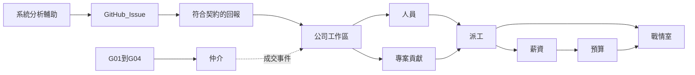

# 產品需求文件（PRD）

**下一驗收是公司工作區＋公開回報契約（P2）。** 系統分析輔助（P3）在其後。仲介（P4）是**門檻產品**，僅當 P3 開門條件通過後才開工。模組細節以各規格篇為準；**衝突時以 [總規格](spec.md) 的四套產品為準**。本文件給工程、設計、採購對齊範圍與驗收，**不是**銷售投影片。

## 1. 文件資訊

| 欄 | 值 |
|----|----|
| 狀態 | **規劃／尚未出貨**（工作區、系統分析、仲介）。控制台為現況 |
| 適用版本 | 公司工作區可營運化＋公開回報契約；控制台配合多名目的地／握手／上傳 |
| 前提 | 控制台約 0.6.x 已出貨；Company.* 能力已有程式，缺租戶與公開契約文件化 |
| 讀者 | 工程、設計、產品、採購（會後走讀） |
| 權威來源 | [願景](vision.md)、[總規格](spec.md)、[公開回報契約](reporting.md)、[系統分析輔助](analysis.md)、[技術架構](architecture.md)、[路線圖](roadmap.md)、[系統執行計劃書](execution-plan.md) |
| 本 PRD 不保證 | 交貨日、營收、客戶實測數字 |

銷售與簡報必須沿用「現況／規劃」標籤。把本 PRD 講成安裝包已有，等於對買家說謊。

| 波次 | 驗收什麼 | 何時做 |
|------|----------|--------|
| **A 公司工作區** | 租戶開帳、六大模組、公開回報契約、專案貢獻、控制台第一筆上傳 | **下一實作** |
| **B 系統分析輔助** | 概念 → 需求文件 → 規格 → 可追蹤 Issue → 控制台收得到指派 | A 之後 |
| **C 仲介（門檻後）** | 會員、認證、發案、應徵／邀請、合同、拆帳、成交事件寫入工作區 | **僅 G-01～G-04 通過後** |

### 四套獨立產品

| 產品 | 本 PRD 波次 | 給誰 | 營運 |
|------|-------------|------|------|
| 控制台 | 現況＋A 的上傳閉環 | 任何軟體工程師 | 本機安裝包（GitHub Release 自動更新） |
| 公司工作區 | A | 要管人／專案／毛利的公司 | 獨立安裝產物；我們主機與自架同一通道 |
| 系統分析輔助 | B | PM／分析／有概念的窗口 | 獨立 Web 安裝產物；我們主機與自架同一通道 |
| 仲介平台 | C（門檻後） | 非軟體業廠商、工程師會員 | 我們營運的公開 SaaS（產物形態同 P2／P3） |

加入仲介會員不收費（C）。仲介營收來自成交後的**仲介費**。合同當事人是需求公司 ↔ 工程師；平台是仲介與抽成方，不是派遣雇主（D-10）。工作區與控制台不靠仲介費活。

## 2. 問題與機會

目標是同一品牌下的**四套獨立產品**。見 [願景](vision.md)、[總規格](spec.md#四套產品)。

四個斷層不要合成一個產品：

- 工程師承接後又回到試算表與口頭保密（**控制台**；現況已補執行層）
- 公司收不到標準化回報、管不了人與毛利（**工作區**；下一實作）
- 不會把概念變成可追蹤 Issue（**系統分析輔助**）
- 非軟體業找不到人、沒有合同與拆帳（**仲介**；門檻後）

要完成的工作（寫進驗收）：

1. 工程師用控制台對選定公司申報時數與 Issue（可對多家）；第三方工具只要符合契約也可送。
2. 公司用工作區收公開回報、按專案看貢獻，並跑完人員／派工／薪資／毛利／戰情。
3. 窗口用系統分析輔助產出需求文件、規格、可指派 Issue；工程師在控制台收得到。
4. 門檻通過後：非軟體業經仲介發案、媒合、合同與拆帳。

## 3. 目標與非目標

### 波次 A 要交付

一家公司開帳工作區；工程師（控制台或其他符合契約的用戶端）握手並上傳第一筆回報；依專案看得到貢獻；人員／派工／工時確認／薪資 CSV／毛利／戰情室可營運（沿用 Company.* 租戶化）。控制台「建置以為當機」（CON-08／NFR-13）走軌道 O，**不是** A 的關門條件。

技術形態（見 [架構](architecture.md)）：四套共用 .NET 10。工作區是 **Blazor Web App**（Interactive Server 預設），可我們主機或自架（同一產物）。控制台是 Avalonia 承載同一套 Blazor UI（現況 Photino 過渡，見 AD-10），**不改成網站**。公開契約見 [reporting.md](reporting.md)。跨產品連線預設關閉，測試通過才啟用。

### 波次 B 要交付

非工程師窗口走完「概念 → 需求文件 → 規格 → Issue」；工程師在控制台／GitHub 收得到指派。見 [analysis.md](analysis.md)。

### 波次 C（門檻後）要交付

一組通過認證的需求組織與工程師走完：發布 → 應徵或邀請 → 雙方同意 → 合同 → 仲介應收 → 成交事件寫入工作區。見 [marketplace.md](marketplace.md)。

### 非目標（各波驗收都不含）

| 不做 | 原因 |
|------|------|
| 把控制台改成網站 | 工程師必須碰到本機行程與檔案 |
| 把仲介當下一實作 | 必須先有 P2／P3；見開門條件 |
| 把系統分析塞進仲介精靈 | P3 是獨立產品 |
| 取代 Jira／Azure Boards | 任務面以 GitHub 為準 |
| 取代 Cursor／Copilot | Agent 是操作者 |
| 汎用 ERP、總帳、報稅、勞健保 | 工作區匯出給既有財務 |
| 勞基法加班費率引擎、假勤／特休 | 先做不可派區間與待核准加班 |
| 勞務派遣、自動媒合、履歷社群 | 專案承攬仲介，不是人力銀行 |
| 押金凍結、金流託管、電子發票 | C 第一刀只記仲介應收 |
| 把控制台做成某家公司的前後台 | 見 [四套產品](spec.md#四套產品) |
| 在仲介層重做薪資／毛利／戰情室 | 那是工作區 |
| 把工作區做成仲介的成交後模組 | 工作區可獨立開帳 |
| 用換宿主（Avalonia）當建置卡死的修法 | 佔用可見與輸出節流是軌道 O；K1 不擋、也不取代 O |
| 完整 ReqIF／OSLC RDF 伺服器 | P3 第一刀對映語意即可 |
| 把模啟寫進本線產品層 | 另一條產品 |

## 4. 成功指標

以下是**產品意圖、可驗收**，不是合約保證。

### 波次 A（公司工作區；下一上線）

| ID | 指標 | 怎麼驗 |
|----|------|--------|
| KPI-01 | 一條真實專案跑完一個薪資週期 | 上傳 → PM 確認 → 人資鎖定 → CSV |
| KPI-02 | 經營層 30 秒內看到例外 | `exec` 登入落地戰情室 |
| KPI-03 | 外包資料隔離 | `vendor_admin` 抽測隔離 |
| KPI-04 | 工時閉環 | 「送到〔這家公司〕」後 Web「待 PM 確認」 |
| KPI-05 | 毛利可解釋 | 能指出收入來源與人事分攤 |
| KPI-06 | 權限在伺服器 | 隱藏選單不是唯一防線 |
| KPI-07 | 公開契約 | 非控制台用戶端（curl／腳本）符合 [reporting.md](reporting.md) 可上傳成功 |
| KPI-08 | 專案貢獻 | 同一專案下看得到多位工程師工時與 Issue 參照彙總 |

### 波次 B（系統分析輔助）

| ID | 指標 | 怎麼驗 |
|----|------|--------|
| KPI-SA01 | 概念到需求文件 | 非工程師窗口產出可讀需求文件（含範圍／非範圍） |
| KPI-SA02 | 規格 | 產出規格摘要與可追溯需求 ID |
| KPI-SA03 | Issue | 建立 GitHub Issue（含測試／驗收類） |
| KPI-SA04 | 指派閉環 | 工程師在控制台／GitHub 看得到指派並能開工 |

### 開門條件（進波次 C 前）

見 [analysis.md](analysis.md) G-01～G-04。見證與簽核填 [analysis-gate-checklist.md](analysis-gate-checklist.md)。未通過則 **不** 開工仲介。

### 波次 C（仲介；門檻後）

| ID | 指標 | 怎麼驗 |
|----|------|--------|
| KPI-M01 | 免費加入＋認證門檻 | 未認證不能發布／應徵 |
| KPI-M02 | 發案 | 非軟體業窗口能刊登（可呼叫 P3 產物，不重做分析引擎） |
| KPI-M03 | 成交閉環 | 應徵或邀請 → 雙方接受 → 合同 → 仲介應收 |
| KPI-M04 | 成交事件寫入工作區 | 租戶有則掛、無則建；工程師入名冊 |
| KPI-M05 | 工時可接 | 控制台對該工作區上傳成功（沿用 A 契約） |
| KPI-M06 | 權限在伺服器 | 無權直打被拒 |

## 5. 使用者與進場

細節見 [角色](personas.md)。工作區權限見 [總規格](spec.md#角色與權限)。

| 角色 | 預設落地 | 主要工作 |
|------|----------|----------|
| `lead` | 控制台 | 堆疊與 MCP；工作區只看派工 |
| `engineer` | 控制台 | 做工、狀態圖、申報；Web 只讀工時 |
| 工作區 `owner` | 設定 | 租戶時區、貨幣、毛利門檻、GitHub 寫回、API 金鑰 |
| 工作區 `exec` | 戰情室 | 只讀例外與毛利 |
| 工作區 `delivery` | 戰情室／派工 | 改派工、看人力衝突 |
| 工作區 `pm` | 專案 | 甘特、派工、確認工時、看專案貢獻 |
| 工作區 `hr` | 人員 | 主檔、計薪、鎖定 |
| 工作區 `finance` | 預算 | 認列、月報匯出 |
| `vendor_admin` | 己方人員 | 代送工時；不能看他司與毛利 |
| 分析窗口（B） | 系統分析輔助 | 概念到 Issue |
| `demand_admin`／`talent`（C） | 仲介 | 發案／應徵／合同（門檻後） |

## 6. 範圍與依賴

**建議實作順序：** 工作區租戶化＋公開契約＋控制台上傳 → 六大模組缺口 → 系統分析輔助 →（開門後）仲介。

## 7. 功能需求

### 7.1 公司工作區與公開回報（P0 進下一上線）

規格：各 [modules](modules/people.md)、[reporting.md](reporting.md)。以下原波次 B 條目升為波次 A；**PRD-CON-01～07** 與公開契約進 A。**PRD-CON-08**（佔用條）走軌道 O，不擋 A 關門。

#### 7.1.1 平台基盤

| ID | P | 角色 | 故事 | 驗收 |
|----|---|------|------|------|
| PRD-PLT-01 | A | 全員 | 管理者用公司帳戶登入工作區；工程師用控制台 GitHub 或 API 金鑰 | 未邀請上傳進待歸戶 |
| PRD-PLT-02 | A | 各角色 | 登入後進我的預設首頁 | 對齊工作區落地表 |
| PRD-PLT-03 | A | `owner` | 我能設公司名、時區、貨幣、毛利門檻、是否寫回 GitHub | 存檔後該租戶生效 |
| PRD-PLT-04 | A | `owner` | 工作區是可獨立安裝的產品；我們主機租戶與自架用同一產物 | 控制台可對多家租戶申報；連線測試通過才啟用 |
| PRD-PLT-05 | A | `hr`／`finance`／`delivery` | 改費率、鎖定、強制超載必填原因並審計 | 能查出誰、何時、為什麼 |
| PRD-PLT-06 | A | `engineer` | 我看不到同事月薪與對客戶費率 | 畫面遮罩；API 同樣拒絕 |
| PRD-PLT-07 | A | `owner` | 我能核發／撤銷 API 金鑰給第三方回報用戶端 | 金鑰對應人員或外包窗口 |

#### 7.1.2～7.1.8 模組與上傳

人員（PRD-PPL-01～06）、專案（PRD-PRJ-01～08）、派工（PRD-DSP-01～06）、薪資（PRD-PAY-01～07）、預算（PRD-BDG-01～05）、戰情（PRD-WAR-01～06）意圖與原規格相同，**波次皆為 A**。細節欄位仍見各模組篇。仲介成交自動建專案改為 C 可選，不擋 A。

#### 控制台上傳與公開契約

| ID | P | 角色 | 故事 | 驗收 |
|----|---|------|------|------|
| PRD-CON-01 | A | `engineer` | 我在控制台畫執行狀態圖 | 不要做成公司甘特縮小版 |
| PRD-CON-02 | A | `engineer` | 選一個申報目的地再「送到〔這家公司〕」 | 非背景偷傳；一次一個目的地 |
| PRD-CON-03 | A | 系統 | 上傳以本機時段 ID 冪等 | 已核准不可覆蓋 |
| PRD-CON-04 | A | `engineer` | 上傳不含原始碼 | 僅時段、專案識別、狀態圖、Issue 參照 |
| PRD-CON-05 | A | `engineer` | `GET /api/v1/me/assignments` 顯示該目的地派工 | 不混別家 |
| PRD-CON-06 | A | `engineer` | 我能設定多家接收 API | 零個目的地時其餘功能照常 |
| PRD-CON-07 | A | `engineer` | 上傳前握手，確認名冊有我 | `GET /api/v1/me`；未通過說人話 |
| PRD-CON-08 | O | `engineer` | 長工作進行中我看得到系統在做什麼，被擋的按鈕事先停用並說明原因 | 頂欄佔用條；建置中不誤認當機；MCP 編譯同一倉時桌面也顯示。見 [架構 AD-32](architecture.md) |
| PRD-RPT-01 | A | 系統 | 公開契約支援專案碼／repo 解析，不限內部 Guid | 見 [reporting.md](reporting.md) |
| PRD-RPT-02 | A | 第三方 | 用 API 金鑰上傳成功 | 與控制台同一契約 |
| PRD-RPT-03 | A | `pm` | 專案頁看得到貢獻彙總（工時、Issue、貢獻類型） | KPI-08 |

### 7.2 系統分析輔助（波次 B）

規格：[analysis.md](analysis.md)

| ID | P | 角色 | 故事 | 驗收 |
|----|---|------|------|------|
| PRD-SA-01 | B | 窗口 | 我能用口語／素材開始一則分析案 | 產出帶假設標註 |
| PRD-SA-02 | B | 窗口／PM | 我能產出需求文件（範圍／非範圍／驗收） | Markdown＋JSON |
| PRD-SA-03 | B | PM | 我能產出規格摘要並追溯需求 ID | 對齊 29148 概念 |
| PRD-SA-04 | B | PM | 我能產生 GitHub Issue（含測試／debug 類） | Issue 存在且可指派 |
| PRD-SA-05 | B | `engineer` | 我在控制台／GitHub 收得到指派 | KPI-SA04 |
| PRD-SA-06 | B | 系統 | AI 假設與待決問題必須可見 | 不可 silently 當成已確認需求 |

### 7.3 仲介（波次 C；門檻後）

規格：[marketplace.md](marketplace.md)。原 PRD-MKT-01～15 整組保留意圖，**僅在 G-01～G-04 通過後**進入下一上線。發案應能引用 P3 產物，不在仲介內重做完整系統分析引擎。KPI-M01～M06 為 C 的驗收。

## 8. 非功能需求

| ID | 主題 | 要求 |
|----|------|------|
| PRD-NFR-01 | 部署 | 工作區／分析可我們營運或自架，同一產物、TLS。仲介（C）預設我們營運公開 SaaS |
| PRD-NFR-02 | 授權 | 角色在伺服器強制 |
| PRD-NFR-03 | 敏感資料 | 費率／月薪遮罩；租戶隔離 |
| PRD-NFR-04 | 上傳內容 | 不含原始碼；MCP 不暴露薪資或仲介應收工具 |
| PRD-NFR-05 | 時效 | 工作區戰情室逾期五分鐘內反映 |
| PRD-NFR-06 | 裝置 | 編輯甘特／矩陣 ≥1200px |
| PRD-NFR-07 | 無障礙 | 狀態不只靠顏色；WCAG 2.2 AA 目標 |
| PRD-NFR-08 | 相容 | 公開回報契約相容至少一個控制台大版本 |
| PRD-NFR-09 | 刪除 | 軟刪；已有工時不可硬刪 |
| PRD-NFR-10 | 文案 | 繁中、錯誤說人話 |
| PRD-NFR-11 | 租戶 | 公司 A 看不到公司 B 的名冊、費率、合同與應收 |
| PRD-NFR-12 | 法律文案 | 仲介介面寫「專案承攬仲介」，不寫派遣、不代發薪（C） |
| PRD-NFR-13 | P1 體感 | 建置／測試等長工作期間 UI 仍可捲動與取消；重繪不得跟編譯器行數線性成長（軌道 O，不擋 A） |

## 9. 假設、風險、開放問題

### 假設

- 任務面是 GitHub Issue／PR
- 工時本機檔仍是工程師側真相（控制台側）
- 公開回報契約語意對映 HR-XML／CHAOSS／OSLC，第一刀用 JSON
- 一需求公司一個工作區、多專案（D-13）
- 仲介是專案承攬，不是派遣（D-10；C 開工前關閉）

### 風險

| 風險 | 緩解 |
|------|------|
| 又把仲介提前當下一刀 | 本 PRD 波次表與路線圖寫死；演示只跑控制台＋工作區 |
| 把規劃賣成現況 | 強制標「規劃」 |
| 契約變成控制台私有協定 | PRD-RPT-02；文件化 reporting.md |
| 本機與伺服器時段衝突 | 已核准不可覆蓋 |

### 開放問題

1. D-13 租戶切分確認（建議一公司一工作區）— **A 前**
2. 公開契約正式 OpenAPI 檔位置與版本策略 — **A 前**
3. P3 品牌名稱 — **B 前**
4. D-10／D-11／D-12（仲介法律與 KYC）— **C 前**
5. G-03 的 N 預設為 3，是否調整 — **B 驗收時**

## 10. 發布準則

**波次 A 通過**當且僅當 KPI-01～08、PRD-PLT／PPL／PRJ／DSP／PAY／BDG／WAR／CON-01～07／RPT 為真（沿用程式處以租戶可營運為準）。**CON-08／NFR-13 不擋 A**（軌道 O）。

**波次 B 通過**當且僅當 KPI-SA01～SA04、PRD-SA-01～06 為真。

**波次 C 可開工**當且僅當 G-01～G-04 關閉。**波次 C 通過**當且僅當 KPI-M01～M06 與 PRD-MKT-\* 為真。

**不進任何一波驗收：** 自動媒合、派遣、金流託管、電子發票、勞基法引擎、控制台改網站、原始碼上雲、完整 ReqIF 伺服器。
