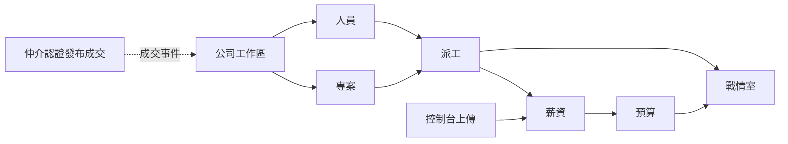

# 路線圖

把「能賣什麼」與「下一季做什麼」分開。日期是意圖，不是合約承諾。

## 已交付（控制台 0.6.13，現況）

- Windows x64 安裝包：掃描、需重編、啟停、Log、前端 URL
- GitHub：clone、提交、同步、PR、Actions、Release、檢查更新
- 需求工作台：開 GitHub Issue、暫停／收回、驗收
- 工時儀表、CSV／Markdown 匯出
- Agent 求救、MCP、審計、專案問答（多來源 OpenAI 相容端點）
- 被管專案的 DocFX／GitHub Pages 輔助

演示與採購**只保證這一段**。見 [90 分鐘導入](../team/trial-90min.md)。

## 下一實作：仲介 SaaS 第一刀（規劃）

我們營運的公開多租戶。施工見 [系統執行計劃書](execution-plan.md) 波次 A。規格見 [仲介平台](marketplace.md)。驗收見 [PRD](prd.md) KPI-M01～M06。

必須能讓一組通過認證的需求組織與工程師走完：

1. 免費加入；工程師身分＋GitHub、組織統編＋負責人
2. 網頁精靈發布專案（範圍、角色、資格、預算）
3. 應徵或邀請；雙方接受即成交
4. 合同套件紀錄（保密＋範圍）；仲介應收
5. 成交事件寫入工作區；成交工程師入名冊
6. 掛或建 GitHub 倉；Issue 溝通
7. 控制台握手並申報第一筆工時（不含原始碼）

**本刀不做：** 押金／金流託管、自動媒合、派遣、電子發票、戰情室／毛利（那是工作區自己的機制）。

## 公司工作區（規劃；程式多已存在）

獨立機制：需求公司管理工程師與專案。不與仲介第一刀同一發版硬綁。**不必先有仲介成交**才能開帳。沿用 Company.*：

1. 人員主檔、外包隔離、待歸戶
2. 客戶、合約、專案、甘特
3. 派工全貌、GitHub 寫回
4. 工時確認 → 人資鎖定 → CSV
5. 收入／人事成本、毛利
6. 戰情室

自架工作區改後期。預設我們主機租戶。

## 上線後

- 第三方 eKYC、押金
- 金流／請款自動化、電子發票
- 其他費用分類、採購單
- 甘特關鍵路徑
- 離線主管平板（WASM／Auto，非預設）

## 後續（寫進邊界，避免假裝第一刀就有）

| 項目 | 為什麼晚做 |
|------|------------|
| 金流託管、押金凍結 | 牌照與法規；第一刀只記應收 |
| 假勤、班表、特休、勞基法加班費率 | 是 HRIS |
| Jira／Azure Boards 雙向同步 | 任務面先穩 GitHub |
| 工作區客戶自架 | 仲介必須先是我們營運的 SaaS |
| 行動 App | Web 發案＋控制台做工足夠 |
| 自動媒合、履歷社群 | 第一刀只做應徵／邀請 |
| 勞務派遣 | 法律定位是承攬仲介 |

## 依賴關係

實作順序：仲介閉環先於工作區租戶化；工作區內戰情室仍放最後。虛線是交換，工作區可先獨立存在。
