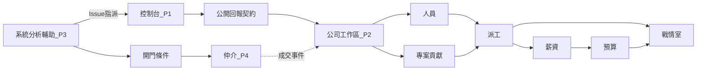

# 路線圖

把「能賣什麼」與「下一季做什麼」分開。日期是意圖，不是合約承諾。

## 已交付（控制台 0.6.15，現況）— P1

- Windows x64 安裝包：掃描、需重編、啟停、Log、前端 URL
- 各專案一句用途；開啟時寫入 `.ai_project/product-purposes.md`
- 建置／啟動佔用列（可取消）；工作區佔用鎖避免雙視窗互搶
- GitHub：clone、提交、同步、PR、Actions、Release、檢查更新
- 需求工作台與進件關卡
- 工時儀表、CSV／Markdown 匯出、需求台對帳；可加入多家申報公司
- Agent 求救、MCP、審計、專案問答（多來源 OpenAI 相容端點）
- 被管專案的 DocFX／GitHub Pages 輔助

演示與採購**只保證這一段**。見 [90 分鐘導入](../team/trial-90min.md)。

## 下一實作：公司工作區＋公開回報契約（規劃）— P2

沿用 `AiProject.Company.*`，租戶化並可營運。施工見 [系統執行計劃書](execution-plan.md) 波次 A。契約見 [公開回報契約](reporting.md)。驗收見 [PRD](prd.md) KPI-01～08。

必須能讓一家公司與工程師走完：

1. 開帳租戶；人員／客戶／專案主檔
2. 公開回報契約上線（握手、上傳、專案碼／repo 解析）；控制台多名目的地
3. 工程師或第三方用戶端上傳第一筆回報（不含原始碼）
4. 依**專案**看貢獻彙總
5. 派工、工時確認 → 人資鎖定 → CSV
6. 預算／毛利、戰情室

**不必先有仲介成交。** 工作區是獨立安裝產物：我們主機多租戶與客戶自架用同一映像／安裝器（見 [架構 AD-12](architecture.md)）。

## 再下一波：系統分析輔助（規劃）— P3

新建 Web 產品。規格見 [系統分析輔助](analysis.md)。驗收見 KPI-SA01～SA04。

1. 概念與素材 → 需求文件
2. → 規格文件（語意對映 29148／ReqIF／OSLC RM，不做完整伺服器）
3. → 可追蹤 GitHub Issue（含測試／debug）
4. 工程師在控制台收得到指派

## 門檻後：仲介平台（規劃）— P4

**僅當** [analysis.md](analysis.md) G-01～G-04 通過後才開工。規格見 [仲介平台](marketplace.md)。驗收見 KPI-M01～M06。

1. 免費加入；工程師身分＋GitHub、組織統編＋負責人
2. 發案（可引用 P3 產物，不重做分析引擎）
3. 應徵或邀請；雙方接受即成交
4. 合同套件；仲介應收
5. 成交事件寫入工作區；掛或建 GitHub 倉
6. 沿用既有公開回報契約申報工時

**本刀不做：** 押金／金流託管、自動媒合、派遣、電子發票。

## 上線後（各產品穩定後）

- 第三方 eKYC、押金（仲介）
- 金流／請款自動化、電子發票
- 其他費用分類、採購單
- 甘特關鍵路徑
- ReqIF／OSLC 完整匯出（系統分析）
- 離線主管平板（WASM／Auto，非預設）

## 後續（寫進邊界，避免假裝下一刀就有）

| 項目 | 為什麼晚做 |
|------|------------|
| 仲介本身 | 必須先有公司端回報閉環與系統分析驗證 |
| 金流託管、押金凍結 | 牌照與法規；第一刀只記應收 |
| 假勤、班表、特休、勞基法加班費率 | 是 HRIS |
| Jira／Azure Boards 雙向同步 | 任務面先穩 GitHub |
| 仲介客戶自架 | 第一刀我們營運；KYC／法律 |
| 行動 App | Web＋控制台足夠 |
| 自動媒合、履歷社群 | 第一刀只做應徵／邀請 |
| 勞務派遣 | 法律定位是承攬仲介 |
| 完整 ReqIF／OSLC RDF 伺服器 | 先語意對映 |

## 依賴關係

實作順序：公司端閉環先於系統分析；系統分析驗證先於仲介。虛線是交換，工作區可先獨立存在。
