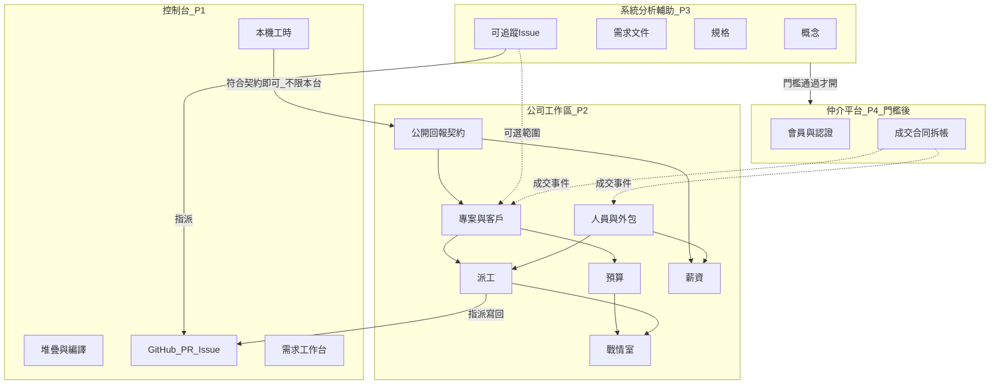

# 總規格

權威稿。模組細節以各篇為準；衝突時以本篇的邊界與權限為準。

**現況**指桌面控制台已出貨行為。**規劃**指公司工作區、系統分析輔助、仲介平台，除非該列已標現況。

## 產品邊界

四套**獨立產品**，因果是建構順序，不是「成交後才打開下一個模組」的流水線。彼此不共用資料庫；只靠契約交換資料。

虛線是產品間的資料交換。實線是同一產品內部。控制台**不**改成網站。工程師繼續用本機視窗。工作區、系統分析輔助、仲介是瀏覽器。發案與需求轉 Issue 走系統分析輔助（規劃），不用把控制台當發案站。

## 四套產品

控制台、公司工作區、系統分析輔助、仲介平台是**四套獨立產品**，各解一個問題。**衝突時以本節為準。** 舊稱「三層產品／三套機制」併入本節。禁止把工作區寫成仲介的成交後模組；禁止把系統分析輔助寫成仲介精靈；禁止把控制台做成任何一邊的前後台。

**模啟不進本節四套。** 模啟是姊妹產品（產業應用 OS）；與本線關係是 **L0 敘事＋L1 薄契約**，禁止 L2 產品聯集。本線「P3 系統分析輔助」≠ 模啟系統分析者台，亦≠ 模啟路線圖「P3」產業包。見 [詞彙・模啟關係](glossary.md#模啟關係姊妹產品不進四套)、[analysis.md](analysis.md#與模啟系統分析者控制台)。

| | 控制台 P1 | 公司工作區 P2 | 系統分析輔助 P3 | 仲介平台 P4 |
|---|-----------|---------------|------------------|--------------|
| 機制 | 工程師跨公司做工與申報 | 公司管人／專案／毛利；收公開回報 | 概念 → 需求 → 規格 → Issue | 媒合、成交、拆帳 |
| 給誰 | 任何軟體工程師 | 要管工程團隊的公司 | PM／分析／有概念的窗口 | 非軟體業廠商與工程師會員 |
| 何時能用 | 不必先有其他產品（現況） | 不必先有仲介；**下一實作** | P2 之後 | **僅本線 P3 門檻通過後** |
| 面對幾家 | **一對多**申報目的地 | **一公司一租戶**（建議） | 多專案／多組織 | 我們營運的公開多租戶 |
| 部署 | 本機安裝包（現況；目標 Avalonia 承載 Blazor） | 獨立部署物；我們主機與自架用同一產物 | 獨立 Web 部署物；我們主機與自架同一產物 | 我們營運的公開 SaaS（產物形態同 P2／P3；自架仲介非第一刀） |

### 資料交換（不是互相內嵌）

| 從 | 到 | 交換什麼 | 不交換什麼 |
|----|----|----------|------------|
| 任何符合契約的用戶端（含控制台） → 工作區 | 時段、狀態圖、Issue 參照、貢獻類型（[公開回報契約](reporting.md)） | 原始碼、本機路徑、仲介合同 |
| 工作區 → 控制台 | 握手（名冊有此人）、派工只讀條、可選薪資條 | 費率表、未鎖定發薪規則、毛利、仲介應收 |
| 系統分析輔助 → GitHub／控制台 | 可追蹤 Issue、指派、驗收條件 | 工作區薪資、仲介應收 |
| 系統分析輔助 → 工作區（可選） | 專案範圍、需求／規格摘要 | 原始碼 |
| 仲介 → 工作區 | 成交事件：組織、`dealId`、範圍、工程師 `github:{login}`、合同識別 | 仲介應收細節、未成交刊登 |
| 仲介 → 控制台 | 可選：該工作區接收 Base URL、GitHub 倉 | 仲介會員資料庫 |

工作區與回報用戶端之間的申報閉環：

1. 工程師（或第三方工具）指向該工作區的**公開回報契約** HTTPS 端點。控制台上稱為**申報目的地**（可多筆）。
2. 握手：GitHub 登入或公司核發的 API 金鑰。工作區確認名冊有此人（或金鑰對應人員）才允許上傳。
3. 明確送出時段、狀態圖、Issue 參照（不含原始碼）。
4. 工作區依**專案**彙整貢獻 → PM 確認 → 人資鎖定。本機 `work-hours.json` 仍是控制台側真相。

禁止：四套共用 DbContext 或直連對方資料庫；工作區把控制台當內嵌元件發行；仲介層重做薪資／戰情室；控制台改成發案網站；把原始碼收到我們的雲；未通過契約相容測試就啟用跨產品連線。仲介成交**可以**觸發寫入工作區，但工作區產品生命週期不依附仲介。

## 詞彙

| 詞 | 意思 |
|----|------|
| **人員** | 工作區上的人。必有顯示名；通常綁一個 GitHub 帳號 |
| **GitHub 主鍵** | `github:{login}`。與現況工時 `personKey` 相同 |
| **雇用類型** | 正職、專案外包（個人）、承攬公司派駐 |
| **外包商** | 承攬公司主檔。其下有多位派駐人員 |
| **需求方／需求組織** | 有軟體／資訊需求的組織；在仲介上為會員，不限軟體業 |
| **成交** | 需求方與工程師雙方接受協議；產出合同套件與仲介應收。若該組織已有或要使用工作區，另發成交事件寫入名冊與專案 |
| **仲介費** | 成交時平台應收；第一刀記帳，金流託管下一刀 |
| **租戶工作區** | 需求公司管理工程師與專案的實例。沿用 Company.*。可獨立開帳；仲介成交時掛上或建立，不是仲介的子模組 |
| **公開回報契約** | 工作區對外的 HTTPS 契約（握手、上傳、我的派工）。任何符合格式的用戶端都可送，不限控制台。見 [reporting.md](reporting.md) |
| **客戶** | 工作區裡付款或需求的外部（或內部）甲方 |
| **合約** | 工作區裡客戶底下的商務文件：額度、期間、計價方式。仲介成交合同是另一份，存在仲介層 |
| **專案** | 可派工、可記工時、可算毛利的交付單位。可對一個或多個 Git 倉 |
| **專案貢獻** | 依專案彙整的工時、Issue、貢獻類型（CHAOSS 詞彙） |
| **階段** | 需求、設計、實作、驗證、驗收、維運（可自訂，預設這六個） |
| **派工** | 把人員在某時段配到專案／里程碑／Issue |
| **執行狀態圖** | 工程師在控制台畫的專案投入（哪幾天、哪個專案、完成度） |
| **申報目的地** | 控制台上一筆接收設定：顯示名＋Base URL。同一工程師可有多筆。屬連線登錄；測試通過才啟用 |
| **連線登錄** | 跨產品端點（URL、契約版本、認證、測試結果、啟用）。預設關閉。見 [架構 AD-16](architecture.md) |
| **系統分析輔助** | P3：把概念轉成需求文件、規格、可追蹤 Issue 的 Web 產品（工作名稱） |
| **薪資週期** | 通常月結。內含時計與專案獎金列 |
| **戰情室** | 經營層首頁：紅黃綠與例外，不是第二個看板 |

## 角色與權限

仲介層另有 `demand_admin`（需求組織窗口）、`talent`（工程師會員）。細節見 [仲介平台](marketplace.md)。系統分析輔助角色見 [analysis.md](analysis.md)。下表是**公司工作區**角色，與是否經仲介成交無關。

| 角色代號 | 誰 | 能看 | 能改 |
|----------|-----|------|------|
| `owner` | 公司管理員 | 全部 | 全部設定與人員 |
| `exec` | 經營層 | 戰情室、匯總、毛利 | 不改派工細節 |
| `delivery` | 交付主管 | 全專案、派工、人力 | 派工、專案階段 |
| `pm` | PM／分析師 | 被授權的專案與客戶 | 該專案的派工、階段、進件 |
| `lead` | Tech Lead | 被授權專案的技術面 | 不改費率與薪資 |
| `engineer` | 正職工程師 | 自己的任務、工時、薪資條 | 上傳自己的時段與狀態圖 |
| `vendor_admin` | 外包窗口 | 己方人員與己方專案工時 | 己方人員主檔（有限）、代送工時 |
| `vendor_engineer` | 外包工程師 | 自己的任務與工時 | 上傳自己的時段 |
| `hr` | 人資 | 人員、薪資週期 | 人員主檔、計薪規則、核准 |
| `finance` | 財務 | 預算、毛利、匯出 | 收入認列、核准成本；不改程式倉 |

同一自然人可兼 `pm` 與 `lead`。外包角色**永遠**看不到他人費率、他司人員、全公司損益。

未設定任何申報目的地、或握手未通過的控制台使用者，行為維持**現況**：本機工時、本機進件。控制台不因此變成半套公司系統。

## 資料主鍵

| 實體 | 主鍵策略 |
|------|----------|
| 仲介會員 | `memberId`；工程師可綁 `github:{login}`；組織可綁統編 |
| 仲介專案刊登 | `listingId` |
| 成交 | `dealId`：刊登 × 工程師（可多人分次成交） |
| 人員 | 工作區內部 `personId`（UUID）＋可選 `github:{login}` |
| 外包商 | `vendorId` |
| 客戶 | `clientId` |
| 合約 | `contractId`，隸屬客戶 |
| 專案 | `projectId`。對外回報可用公司專案碼或 GitHub `owner/repo` 解析。可關聯 `ai-project.json` 產品線 |
| 倉 | GitHub `owner/repo`（現況已用） |
| 工時時段 | 用戶端時段 ID；上傳後不可默默覆蓋，只能更正並留審計 |
| 派工 | `assignmentId`：人員 × 專案 × 期間 × 來源（手動／Issue） |
| 系統分析產物 | `analysisId`／需求文件與規格版本；Issue 以 GitHub 為準 |

GitHub 帳號變更時，人資合併到同一 `personId`，舊時段不丟。尚未綁 GitHub 的人員可以存在（人資預建），但不能自動對帳 PR。

## 跨模組規則

1. **少填表。** 工時預設來自控制台開啟專案；派工預設寫回 GitHub assignee。人為修改必留誰、何時、為什麼。
2. **錢與費率是敏感欄。** `engineer`／`vendor_*` 預設不可見。`pm` 可見專案預算，不可見同事月薪。
3. **刪除是軟刪。** 已有工時或派工的人員、專案不可硬刪。
4. **時區。** 公司一組時區（預設 `Asia/Taipei`）。工時以上傳時的公司時區入帳。
5. **貨幣。** 公司一組（預設 TWD）。合約可標外幣，報表同時顯示原幣與公司幣（匯率人工維護，MVP 不接銀行）。
6. **回報不限控制台。** 只要符合 [公開回報契約](reporting.md)，第三方工具與腳本都可送。

## 現況已交付（控制台，勿在規劃模組裡重做）

- 掃描服務、需重編、一鍵啟停、Log、文件／GitHub Pages
- 每個掃描到的專案一句用途（專案檔／清單／README）；開啟工作區寫入 `.ai_project/product-purposes.md`
- GitHub：clone、提交、PR、Actions、Release
- 需求工作台：開 GitHub Issue、指派、暫停／收回、驗收結案
- 工時：開啟專案起算、GitHub 歸戶、週月季年、CSV／Markdown 匯出、需求台對帳
- Agent／MCP 與審計、專案問答（多來源）

工作區**讀這些真相**，不複製一套本機堆疊 UI。系統分析輔助產出的 Issue 與控制台進件並存；有倉之後落到 Git。

## 與模啟（姊妹產品）

| 級 | 內容 | 現在 |
|----|------|------|
| **L0** | 模啟＝核心 OS；本線控制台＝可選本機加速器 | 要維持 |
| **L1** | 選目錄掃描模啟倉（已可）；詞彙對齊；可選 SA Issue ↔ 進件對照（文件 only） | 要；不寫深整合程式 |
| **L2** | 共用登入／DB／monorepo；把系統分析輔助嵌進分析者台 | **禁止** |
| **L3** | OEM 報價、仲介預設模啟 SDK 專案 | 等本線 P2 與模啟 P0／P1 皆可演示後再評 |

模啟不成為第五套產品層。權威細節見模啟倉 `與AI_Project_Console整合評估.md`。

## 範圍邊界（寫進規格、不進下一實作）

見 [路線圖](roadmap.md) 的「後續」與「門檻後」：押金與金流託管、電子發票、假勤與班表、勞基法加班與特休引擎、Jira 雙向同步、自動媒合、勞務派遣、行動 App、完整 ReqIF／OSLC RDF 伺服器。工作區與分析站的自架與我們營運並列（同一安裝產物，見 [架構 AD-12](architecture.md)）。仲介是門檻產品，不是下一實作。禁止現在為本線 P3 或模啟做 L2 合併。
