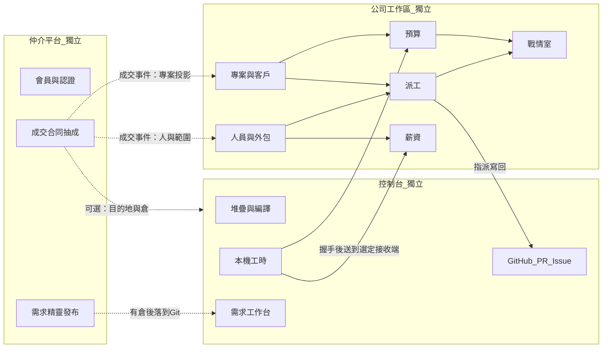

# 總規格

權威稿。模組細節以各篇為準；衝突時以本篇的邊界與權限為準。

**現況**指桌面控制台已出貨行為。**規劃**指仲介平台與公司工作區，除非該列已標現況。

## 產品邊界

三套**獨立機制**，不是一條「成交後才打開下一個模組」的流水線。彼此不共用資料庫；只靠契約交換資料。

虛線是產品間的資料交換。實線是同一產品內部。控制台**不**改成網站。工程師繼續用本機視窗。仲介與工作區是瀏覽器。需求公司發案用仲介網頁精靈，不用控制台。

## 三層產品

控制台、公司工作區、仲介平台是**三套獨立機制**，各解一個問題，不是一條成交流水線。**衝突時以本節為準。** 舊稱「雙產品切割」併入本節。禁止把工作區寫成仲介的成交後模組，也禁止把控制台做成任何一邊的前後台。

| | 仲介平台 | 公司工作區 | 控制台 |
|---|----------|------------|--------|
| 機制 | 媒合與成交 | 需求公司管理工程師與專案 | 工程師承接專案後做工 |
| 給誰 | 需求組織與工程師會員 | 任何要管人／專案／工時確認／毛利的需求公司（含 SI；不限是否經仲介） | 任何工程師（分析、設計、開發、測試） |
| 何時能用 | 不必先有工作區或控制台；加入、認證、發布、應徵、合同、抽成自成閉環 | 不必先有仲介成交；可獨立開帳管既有正職與外包。仲介成交時**寫入**，不是「成交才誕生」 | 不必先有仲介或工作區；本機堆疊、GitHub、工時、進件自成閉環 |
| 面對幾家 | 我們營運的公開多租戶 | **一需求公司一租戶**（建議），名冊只認自己的人 | **一對多**：可設定多家工作區的接收 API |
| 部署 | 我們營運 | 預設我們主機上的租戶；自架後期 | 工程師本機安裝包（現況） |

### 資料交換（不是互相內嵌）

| 從 | 到 | 交換什麼 | 不交換什麼 |
|----|----|----------|------------|
| 仲介 → 工作區 | 成交事件：組織識別、`dealId`、刊登範圍、工程師 `github:{login}`、合同識別 | 仲介應收、認證細節、未成交刊登 |
| 仲介 → 控制台 | 可選：該工作區接收 Base URL、GitHub 倉 | 仲介會員資料庫、應收 |
| 控制台 → 工作區 | 時段、狀態圖、Issue 編號（接收 API） | 原始碼、本機路徑、仲介合同 |
| 工作區 → 控制台 | 握手（名冊有此人）、派工只讀條 | 費率、月薪、毛利、仲介應收 |

工作區與控制台之間的申報閉環（雙方都已獨立存在時才發生）：

1. 工程師在控制台新增**申報目的地**（該工作區接收 API 的 HTTPS 位址；可多筆）。來源可以是仲介成交後寫入，也可以是公司窗口口頭／設定交給工程師。
2. 用既有 GitHub 登入向該接收端握手。工作區確認名冊有此人（已綁 `github:{login}`）才允許上傳。
3. 工程師明確按「送到〔這家公司〕」，上傳時段與狀態圖（不含原始碼）。
4. 工作區依**專案**彙整 → PM 確認 → 人資鎖定。本機 `work-hours.json` 仍是工程師側真相。

禁止：三套共用 DbContext 或直連對方資料庫；工作區把控制台當內嵌元件發行；仲介層重做薪資／戰情室；控制台改成發案網站；把原始碼收到我們的雲。仲介成交**可以**觸發佈建／寫入工作區，但工作區產品生命週期不依附仲介。

## 詞彙

| 詞 | 意思 |
|----|------|
| **人員** | 工作區上的人。必有顯示名；通常綁一個 GitHub 帳號 |
| **GitHub 主鍵** | `github:{login}`。與現況工時 `personKey` 相同 |
| **雇用類型** | 正職、專案外包（個人）、承攬公司派駐 |
| **外包商** | 承攬公司主檔。其下有多位派駐人員 |
| **需求方／需求組織** | 仲介上有軟體需求的會員組織，不限軟體業 |
| **成交** | 需求方與工程師雙方接受協議；產出合同套件與仲介應收。若該組織已有或要使用工作區，另發成交事件寫入名冊與專案 |
| **仲介費** | 成交時平台應收；第一刀記帳，金流託管下一刀 |
| **租戶工作區** | 需求公司管理工程師與專案的實例。沿用 Company.*。可獨立開帳；仲介成交時掛上或建立，不是仲介的子模組 |
| **客戶** | 工作區裡付款或需求的外部（或內部）甲方。仲介成交寫入時，需求組織在工作區裡通常就是這個租戶自己 |
| **合約** | 工作區裡客戶底下的商務文件：額度、期間、計價方式。仲介成交合同是另一份，存在仲介層 |
| **專案** | 可派工、可記工時、可算毛利的交付單位。可對一個或多個 Git 倉 |
| **階段** | 需求、設計、實作、驗證、驗收、維運（可自訂，預設這六個） |
| **派工** | 把人員在某時段配到專案／里程碑／Issue |
| **執行狀態圖** | 工程師在控制台畫的專案投入（哪幾天、哪個專案、完成度） |
| **接收 API** | 某租戶工作區對外的 HTTPS 契約（握手、上傳、我的派工）。控制台只認這個，不認工作區資料庫 |
| **申報目的地** | 控制台上一筆接收設定：顯示名＋Base URL。同一工程師可有多筆，分屬不同需求公司的工作區 |
| **薪資週期** | 通常月結。內含時計與專案獎金列 |
| **戰情室** | 經營層首頁：紅黃綠與例外，不是第二個看板 |

## 角色與權限

仲介層另有 `demand_admin`（需求組織窗口）、`talent`（工程師會員）。細節見 [仲介平台](marketplace.md)。下表是**公司工作區**角色（沿用），與是否經仲介成交無關。

| 角色代號 | 誰 | 能看 | 能改 |
|----------|-----|------|------|
| `owner` | 公司管理員 | 全部 | 全部設定與人員 |
| `exec` | 經營層 | 戰情室、匯總、毛利 | 不改派工細節 |
| `delivery` | 交付主管 | 全專案、派工、人力 | 派工、專案階段 |
| `pm` | PM／分析師 | 被授權的專案與客戶 | 該專案的派工、階段、進件 |
| `lead` | Tech Lead | 被授權專案的技術面 | 不改費率與薪資 |
| `engineer` | 正職工程師 | 自己的任務、工時、薪資條 | 上傳自己的時段與狀態圖 |
| `vendor_admin` | 外包窗口 | 己方人員與己方專案工時 | 己方人員主檔（有限）、代送工時 |
| `vendor_engineer` | 外包工程師 | 自己的任務與工時 | 上傳自己的時段 |
| `hr` | 人資 | 人員、薪資週期 | 人員主檔、計薪規則、核准 |
| `finance` | 財務 | 預算、毛利、匯出 | 收入認列、核准成本；不改程式倉 |

同一自然人可兼 `pm` 與 `lead`。外包角色**永遠**看不到他人費率、他司人員、全公司損益。

未設定任何申報目的地、或握手未通過的控制台使用者，行為維持**現況**：本機工時、本機進件。控制台不因此變成半套公司系統。

## 資料主鍵

| 實體 | 主鍵策略 |
|------|----------|
| 仲介會員 | `memberId`；工程師可綁 `github:{login}`；組織可綁統編 |
| 仲介專案刊登 | `listingId` |
| 成交 | `dealId`：刊登 × 工程師（可多人分次成交） |
| 人員 | 工作區內部 `personId`（UUID）＋可選 `github:{login}` |
| 外包商 | `vendorId` |
| 客戶 | `clientId` |
| 合約 | `contractId`，隸屬客戶 |
| 專案 | `projectId`。可關聯工作區／`ai-project.json` 產品線與 GitHub repo |
| 倉 | GitHub `owner/repo`（現況已用） |
| 工時時段 | 控制台既有時段 ID；上傳後不可默默覆蓋，只能更正並留審計 |
| 派工 | `assignmentId`：人員 × 專案 × 期間 × 來源（手動／Issue） |

GitHub 帳號變更時，人資合併到同一 `personId`，舊時段不丟。尚未綁 GitHub 的人員可以存在（人資預建），但不能自動對帳 PR。

## 跨模組規則

1. **少填表。** 工時預設來自控制台開啟專案；派工預設寫回 GitHub assignee。人為修改必留誰、何時、為什麼。
2. **錢與費率是敏感欄。** `engineer`／`vendor_*` 預設不可見。`pm` 可見專案預算，不可見同事月薪。
3. **刪除是軟刪。** 已有工時或派工的人員、專案不可硬刪。
4. **時區。** 公司一組時區（預設 `Asia/Taipei`）。工時以上傳時的公司時區入帳。
5. **貨幣。** 公司一組（預設 TWD）。合約可標外幣，報表同時顯示原幣與公司幣（匯率人工維護，MVP 不接銀行）。

## 現況已交付（控制台，勿在規劃模組裡重做）

- 掃描服務、需重編、一鍵啟停、Log、文件／GitHub Pages
- GitHub：clone、提交、PR、Actions、Release
- 需求工作台：進件、驗收條件、Issue、設計變更關卡
- 工時：開啟專案起算、GitHub 歸戶、週月季年、CSV／Markdown 匯出、需求台對帳
- Agent／MCP 與審計

工作區**讀這些真相**，不複製一套本機堆疊 UI。仲介需求精靈不取代控制台進件；有倉之後才落到 Git（通常發生在成交並交換資料之後）。

## 範圍邊界（寫進規格、不進仲介第一刀）

見 [路線圖](roadmap.md) 的「後續」：押金與金流託管、電子發票、假勤與班表、勞基法加班與特休引擎、Jira 雙向同步、自動媒合、勞務派遣、行動 App。自架工作區改後期。公開 SaaS 多租戶是仲介**預設**，不是後續才做。
