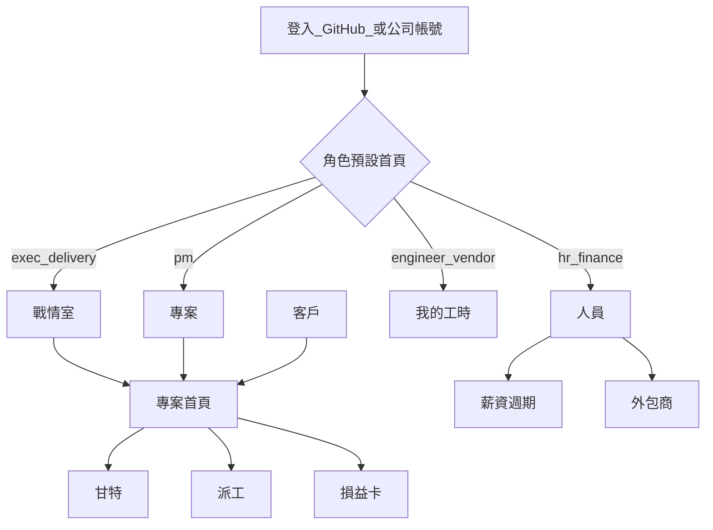

# UI／UX

以使用者進場為準，不以模組清單為準。控制台視覺延續現況；仲介與工作區是 Blazor Web App，品牌色與控制台對齊，但**不是**把桌面頁簽搬到瀏覽器。

## 產品分工

| 工作 | 在哪裡 | 原因 |
|------|--------|------|
| 加入、認證、精靈發案、應徵／邀請、合同 | 仲介網站（規劃；下一實作） | 需求公司不一定會裝控制台 |
| 掃描、編譯、啟停、Log、求救、MCP | 桌面控制台（現況） | 必須碰到本機行程與檔案 |
| 畫執行狀態、看自己的工時、對工作區接收 API 申報 | 桌面控制台為主；Web 只讀確認 | 計時已在本機發生；目的地可多家 |
| 進件落到 Git、驗收關卡 | 桌面需求工作台（現況）；成交後 Web 只讀彙總 | 真相在 Git 倉 |
| 人員、外包、派工全貌、甘特、預算、薪資、戰情室 | 公司工作區（規劃；可獨立） | 多人、權限、錢 |

工程師一天開控制台八小時。需求窗口發案開仲介網站；管人與專案開工作區。兩套網站不要做成同一登入後的兩個分頁。

## 公司工作區資訊架構

全域導覽（權限內才出現）：戰情室、專案、客戶、派工、人員、預算、薪資、設定。工程師只見「我的工時／薪資條」與說明「繪圖請用控制台」。

## 進場與空狀態

- 第一次 `owner` 進設定：公司名、時區、貨幣、毛利門檻、是否寫回 GitHub assignee。
- 沒有專案時，戰情室顯示「建立第一個客戶與專案」，不要空白圖表。
- 工程師未綁人員檔：上傳進待歸戶，畫面說明找人資，不要報一串 UUID。

## 互動原則

1. **下一步永遠看得到。** 待確認工時、超載、逾期，用頁首徽章而不是只靠郵件。
2. **人為修正要審計。** 改費率、改時段歸屬、強制超載派工，對話框必填原因。
3. **少填表。** 新建專案能從已開過的 GitHub repo 選，不要再打倉網址。
4. **狀態色一致：** 綠可行、黃注意、紅要處理。與控制台工時徽章（8h 黃、10h 紅）同一套語義。
5. **敏感欄遮罩。** 費率、月薪預設遮罩，點一下（仍要權限）才顯示。
6. **桌面瀏覽器為準**（≥1200px）編輯甘特、週矩陣、薪資表。平板／手機只保證戰情室、核准按鈕、我的工時。

## 關鍵畫面清單

### 戰情室首頁（exec 落地）

上：四個 KPI（進行中、紅燈、待案人力、本月預估毛利）。中：專案卡網格，可切「只看紅黃」。下：例外清單（未派 Issue、工時未傳、毛利破門檻）。每張卡可鍵盤進入。

### 派工週矩陣（delivery／pm）

列：人員，外包商可摺疊。欄：週一到五或週彙總。拖放派工（MVP 若時程緊可先用對話框建立，拖放列 V1.1）。超載格子紅底。側欄：未派 Issue。

### 客戶進場（pm）

列表用分頁籤（潛在／議約／合約／休眠），逾期跟進用黃／紅底，不是另開 CRM。客戶首頁上：狀態機；中：活動時間線；下：主按鈕「成立專案」一次填合約＋專案。潛在階段不能派工。

### 專案首頁＋甘特（pm）

左：階段、目標日、健康。右：損益迷你卡。上：需求分析目錄（Pages、規格骨架、進件只讀）與專案紀錄。下：甘特。再下：派工表。未掛倉顯示說明句，不要 500。

### 人員名冊（hr）

表：名、類型、外包商、GitHub、本週已派／上限、狀態。開卡片編主檔。新建可「只建檔、稍後綁 GitHub」。

### 薪資週期（hr／finance）

上：週期狀態（收集中／PM 確認中／已鎖定）。表：每人月薪列、時計列、專案獎金列、例外。列可展開到時段。

### 我的工時（engineer Web）

本月時數、各專案、核准狀態、退回原因。大按鈕文案：「到控制台畫狀態並上傳」。不在瀏覽器重做繪圖編輯器。

### 控制台執行狀態圖（現況延伸，規劃）

在工時儀表板加一頁「狀態圖」：專案列 × 日期，塗色表示投入；存本機。設定裡可新增多個**申報目的地**（公司名＋接收 API）。送出時選一家，按鈕「送到〔這家公司〕」。不要做成公司平台甘特的縮小版。

## 文案語氣

繁中、短句、按鈕用動詞（「送到〔這家公司〕」「鎖定本月」「強制派工」）。錯誤說人話：「這家公司還沒有你的人員檔，請找對方人資」，不要說 `403 Forbidden`。

## 無障礙

對比符合 WCAG 2.2 AA 目標。戰情室不只靠顏色：紅燈同時有文字「逾期」。矩陣與表可用鍵盤。公司平台與控制台一樣，動效可關。
