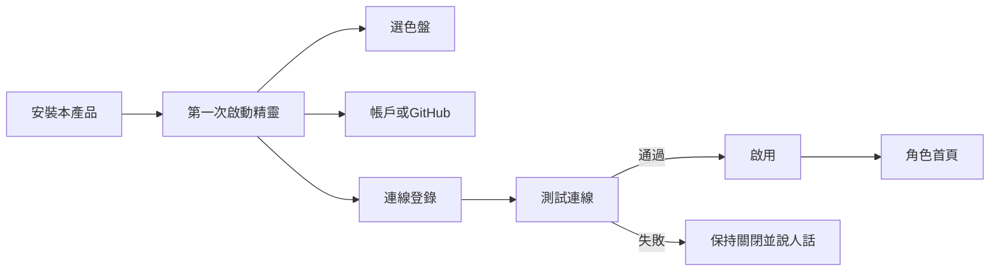
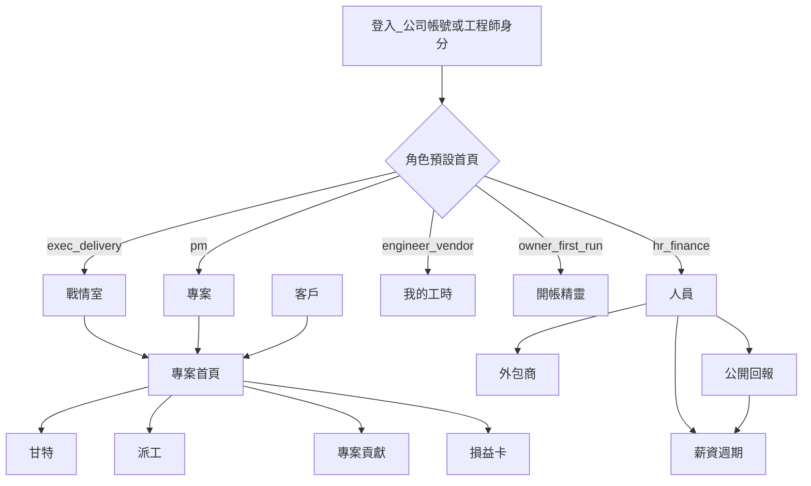

# UI／UX

以使用者進場為準，不以模組清單為準。控制台視覺延續現況工具感；工作區、系統分析輔助、仲介是 Web。四套**同一套語意 token**，**不是**把桌面頁簽搬到瀏覽器。技術不變量見 [架構 AD-21～AD-24](architecture.md)。

## 產品分工

| 工作 | 在哪裡 | 原因 |
|------|--------|------|
| 掃描、編譯、啟停、Log、求救、MCP | 桌面控制台（現況） | 必須碰到本機行程與檔案 |
| 畫執行狀態、看自己的工時、對公開回報契約申報 | 桌面控制台為主；Web 只讀確認 | 計時已在本機發生；目的地可多家 |
| 進件落到 Git、驗收關卡 | 桌面需求工作台（現況）；工作區只讀彙總 | 真相在 Git 倉 |
| 人員、外包、派工全貌、甘特、預算、薪資、戰情室、專案貢獻 | 公司工作區（規劃；**下一實作**） | 多人、權限、錢、公開契約入帳 |
| 概念 → 需求文件 → 規格 → Issue | 系統分析輔助（規劃；P2 之後） | 系統分析是獨立產品 |
| 加入、認證、發案、應徵／邀請、合同、拆帳 | 仲介網站（規劃；**門檻後**） | 非軟體業媒合；須先過 P3 開門條件 |
| 選企業色盤、微調主色、測跨產品連線 | 各產品自己的引導／設定 | 整合不是出廠預設；見下文精靈 |

工程師一天開控制台八小時。公司管人與專案開工作區。上游分析開系統分析輔助。仲介是另一個網站，不要與工作區做成同一登入後的兩個分頁。

## 企業視覺與色盤

目標：企業能選形象或微調，四套產品仍認得出是同一家族，且**紅黃綠狀態不會被品牌色吃掉**（[AD-22](architecture.md)）。

### 權杖契約

三層。畫面與 CSS 只許引用 semantic／component，不許寫死 `#0b6e56`（現況控制台與 Company.Web 的 accent 要抽進 token）。

| 層 | 例 | 誰改 |
|----|----|------|
| primitive | `--palette-accent-600`、`--font-size-md`、`--space-3` | 設計系統套件 |
| semantic | `--color-accent`、`--color-accent-hi`、`--color-danger`、`--color-warning`、`--color-success`、`--color-surface`、`--color-text`、`--color-muted`、`--color-border` | 主題包／租戶覆寫 |
| component | `--btn-primary-bg`、`--badge-overdue-fg`、`--war-card-border` | 元件規格；可指向 semantic |

主題包是一份 JSON（安裝預設 + 可選租戶覆寫），建置或執行期寫入 CSS 變數。深色模式是同一 JSON 的 `dark` 區，不是另一套元件。

**語意色鎖定：** `--color-success`／`--color-warning`／`--color-danger` 不出現在「品牌主色」微調槽。戰情室紅燈同時有文字「逾期」。工時徽章沿用 8h 黃、10h 紅。

對比目標 WCAG 2.2 AA。精靈在存檔前跑對比檢查：accent 對 surface、text 對 surface、語意色對 surface。不合格不得存，說明要加深或改背景。

### 預設色盤（開箱可選）

名稱是產品用語，實作用穩定 `id`。數值是種子，K0 抽出時以現況 `#0b6e56` 為「松綠」基準再校一次對比。

| id | 名稱 | 適用印象 | accent 種子 |
|----|------|----------|-------------|
| `pine` | 松綠 | 預設家族色；延續現況控制台 | `#0b6e56` |
| `navy` | 藏青 | 偏治理／金融 | `#1e3a5f` |
| `slate` | 岩灰 | 偏工程工具 | `#3d4f5f` |
| `clay` | 陶土 | 偏服務業／溫和公開站 | `#9a5b3c` |
| `iris` | 鳶尾 | 偏分析／文件 | `#5b4b8a` |

每盤必須帶：accent、accent-hi、surface、text、muted、border，以及**不可改的** success／warning／danger 預設（可在無障礙範圍內微調明度，不可改色相用途）。

四套產品**同一 token 名**，**不同預設包**：

| 產品 | 預設盤 | 密度／語氣 |
|------|--------|------------|
| P1 控制台 | `pine`，可切深色 | 密、工具列、短句 |
| P2 工作區 | `pine` 或企業覆寫 | 營運表單與戰情卡 |
| P3 分析 | `iris` 可改 | 長文預覽、假設標註明顯 |
| P4 仲介 | `navy` 可改 | 公開品牌、認證狀態清楚 |

SaaS：租戶 `owner` 可覆寫該租戶包。自架：安裝精靈寫入主機層預設，之後仍可在設定改。P1 是本機使用者層（現況「外觀」），不讀任何公司租戶主題——控制台不是某家公司的前後台。

### 主題精靈（四套設定裡同一流程）

1. 選一預設色盤（大色票，鍵盤可選）。
2. 可選微調：主色、中性背景、字級（三檔：密／標準／疏）。**沒有**「把警示改成品牌紅」這種槽。
3. 對比檢查；失敗顯示哪一對不夠。
4. 預覽：**控制台**工具列＋主按鈕；**工作區**戰情室一張紅卡＋主按鈕；**分析**需求文件預覽條；**仲介**刊登卡。只預覽本產品殼，但 token 相同所以色是家族的。
5. 存檔。可「還原家族預設」。

動效可關，四套都要（現況控制台已有此方向）。

## 引導式開帳與連線

整合全部是設定＋測試，不是安裝時勾選「全套」。下一步永遠看得到。

### P1 控制台（本機）

現況使用者已會選專案目錄。規劃精靈**不打斷**零目的地的現況路徑。

1. 外觀：色盤／深色（可跳過，用 `pine`）。
2. 更新通道：預設官方 GitHub Release；可改檢查預發行（現況已有）。
3. **申報目的地（可零筆、可多家）：** 設定 → **申報公司**。每一張卡片功能相同（測試連線、啟用、停用）。「再加一家公司」再多一張同樣的卡片。同一工程師可對不同公司的不同專案申報；同一工作區網址只要一張。按「測試連線」→ `GET /api/v1/me`。通過才允許「送到〔這家公司〕」。失敗：「這家公司還沒有你的人員檔，請找對方人資」或「這個網址沒有公開回報契約」，不要 `403 Forbidden`。
4. 零目的地：掃描／編譯／進件／工時照常；目的地區塊顯示「尚未連公司工作區，需要時再加」。

長工作（編譯、測試、掃描、Git、啟停）走頂欄**佔用條**，不是第一次啟動精靈。見 [控制台佔用條](#控制台佔用條)。

設定頁說明：第三方只要符合公開契約即可送，不限本台。

### P2 公司工作區（Web）

第一次 `owner`（SaaS 開帳或自架安裝後）：

1. 公司名、時區、貨幣、毛利門檻。
2. 公開回報 Base URL 展示（複製給工程師）；核發／撤銷 API 金鑰。
3. 是否寫回 GitHub assignee。
4. 色盤與微調（本租戶）。
5. **可選連線：** 系統分析輔助 Base URL、仲介成交 webhook／API。每筆「測試連線」通過才啟用。沒有分析站／仲介**不擋**開帳。
6. 結束後進角色首頁。沒有專案時戰情室顯示「建立第一個客戶與專案」，不要空白圖表。

工程師未綁人員檔：上傳進待歸戶，畫面說明找人資，不要報 UUID。

自架與 SaaS 同一精靈；差別只在 `Hosting:Mode` 造成的文案（「這是本公司主機」vs「這是我們代管的租戶」）。

### P3 系統分析輔助

訪談式引導本身就是產品（概念 → 需求 → 規格 → Issue）。安裝／開帳精靈另外只做：帳戶、預設 GitHub 組織、可選把範圍摘要送到某工作區（測試後啟用）、色盤。假設與待決問題在主流程必須可見，不可藏在設定裡。

### P4 仲介（門檻後）

加入／認證 → 發案（可附 P3 產物）→ 應徵／邀請 → 合同 → 應收。開帳精靈：會員類型、認證材料、可選「成交後寫入的工作區」連線（測試後啟用）。不要與工作區戰情室混成同一首頁。

### 連線列的統一 UI

所有產品的連線列同一元件（Shared.UI）：

| 欄 | 顯示 |
|----|------|
| 名稱 | 人話顯示名 |
| 角色 | 申報目的地／分析範圍／成交事件／更新來源 |
| 狀態 | 未測／通過已啟用／失敗已關閉／已停用 |
| 動作 | 測試連線、啟用、停用、刪除 |

未通過測試不能啟用。上次測試時間與失敗原因可展開。

## 公司工作區資訊架構

全域導覽（權限內才出現）：戰情室、專案、客戶、派工、人員、外包商、預算、**公開回報**、薪資、帳戶、設定。設定內含：公司、公開回報（捷徑）、主題、匯率。人員帳戶在「帳戶」。工程師只見「我的工時／薪資條」與說明「繪圖請用控制台」。公開回報用分頁籤拆開：待確認、待歸戶、連線、金鑰；預設待確認。頁首徽章顯示待處理筆數。

## 進場與空狀態

- 第一次 `owner` 走開帳精靈（上一節），不要丟進空白戰情。
- 沒有專案時，戰情室顯示「建立第一個客戶與專案」，不要空白圖表。
- 工程師未綁人員檔：上傳進待歸戶，畫面說明找人資，不要報一串 UUID。
- 控制台零目的地：不出現錯誤橫幅，只在申報區給下一步。

## 互動原則

1. **下一步永遠看得到。** 待確認工時、超載、逾期，用頁首徽章而不是只靠郵件。
2. **人為修正要審計。** 改費率、改時段歸屬、強制超載派工、重設密碼，對話框必填原因。
3. **少填表。** 新建專案能從已開過的 GitHub repo 選，不要再打倉網址。
4. **狀態色一致：** 綠可行、黃注意、紅要處理。與控制台工時徽章（8h 黃、10h 紅）同一套語義；品牌主色改了也不許改這三色的用途。
5. **敏感欄遮罩。** 費率、月薪預設遮罩，點一下（仍要權限）才顯示。
6. **桌面瀏覽器為準**（≥1200px）編輯甘特、週矩陣、薪資表。平板／手機只保證戰情室、核准按鈕、我的工時。
7. **回報不限控制台。** 設定頁說明第三方只要符合公開契約即可送。
8. **連線先測再開。** 填 URL 不是整合完成。
9. **引導可跳過的才跳過。** 色盤可跳過；公開回報要給工程師用時，Base URL 與測試不可默默略過。
10. **首屏是掃描面。** 清單、卡、KPI 先出現；建立／重設／加費用用對話框或側欄。多工作用分頁籤，禁止把四段表單疊成一條靜態捲軸。桌面用左右工作台（主內容＋側欄）。

## 關鍵畫面清單

### 帳戶管理（owner／人資）

上：KPI（可登入、停用、待接受邀請）與「開公司帳戶／邀請 GitHub」。中：分頁籤「公司帳戶｜GitHub 邀請」＋表。重設密碼、開帳戶、邀請都進對話框，原因仍必填。不要把建立表單鋪在表的上面變成一條靜態捲軸。

### 戰情室首頁（exec 落地）

上：四個 KPI（進行中、紅燈、待案人力、本月預估毛利）。中：專案卡網格，可切「只看紅黃」。下：例外清單（未派 Issue、工時未傳、毛利破門檻）。每張卡可鍵盤進入。紅黃燈用語意色＋文字。

### 派工週矩陣（delivery／pm）

列：人員（外包商可摺疊）。欄：週一到五**含日期**，最後一欄本週已派／上限（固定寬，不可被側欄裁成「小」）。格子：專案色塊＋小時。超載紅底並標「超載」。點格子選人。表在主欄吃滿可用寬度；更窄時橫向捲動，不要裁掉小時欄。側欄：建立派工、未派 Issue、本週派工單。

### 客戶進場（pm）

列表用分頁籤（潛在／議約／合約／休眠），逾期跟進用黃／紅底，不是另開 CRM。客戶首頁上：狀態機；中：活動時間線；下：主按鈕「成立專案」一次填合約＋專案。潛在階段不能派工。

### 專案首頁＋甘特＋貢獻（pm）

左：階段、目標日、健康。右：損益迷你卡。上：需求分析目錄與專案紀錄。中：**專案貢獻**（各工程師工時、Issue 參照、貢獻類型）。下：甘特與派工表。未掛倉顯示說明句，不要 500。

### 人員名冊（hr）

表：名、類型、外包商、GitHub、本週已派／上限、狀態。開卡片編主檔。新建可「只建檔、稍後綁 GitHub」。

### 人員卡片（hr）

分頁「主檔｜派工與工時」。派工與工時用左右工作台：**左窄欄目前派工**，**右主欄近期工時表**（不要把四欄表塞進 22rem 側欄）。狀態用語意色＋文字（待 PM 確認／已核准／已退回），不要顯示 enum。工時滿 8h 黃、10h 紅。

### 薪資週期（hr／finance）

上：分頁「薪資週期｜待 PM 確認」。週期用頁籤一次只展開一張表。加班金額、鎖定原因在對話框，必填原因。不要把所有歷史週期的表疊成一條捲軸。控制台送來的時段先在導覽「公開回報 → 待確認」出現；薪資頁的待確認是同一批資料。

### 公開回報接收匣（pm／delivery／hr／owner）

上：分頁籤，一次只開一塊。預設 **待確認**（上傳紀錄、確認歸屬／退回）。**待歸戶**只看對不到人的上傳。**連線**只給 Base URL 與契約端點（可複製給工程師）。**金鑰**只核發／撤銷（需管理員）。空狀態說明「工程師在控制台按送到〔這家公司〕後會出現」。不要把連線、金鑰、入帳疊成同一條捲軸。不要把接收口藏在薪資週期裡當唯一入口。設定 → 公開回報只放捷徑。

### 我的工時（engineer Web）

本月時數、各專案、核准狀態、退回原因。大按鈕文案：「到控制台畫狀態並上傳」。不在瀏覽器重做繪圖編輯器。

### 控制台佔用條（現況缺口，規劃；軌道 O）

與「執行狀態圖」（哪天投入哪個專案）不是同一件事。佔用條回答：**現在這一刻電腦在做哪件長工作、為什麼按鈕按不了。**

1. 頂欄常駐一條（對齊 GitPulse 密度）：人話標題、「3/12」、經過時間、取消。建置中即使停在「服務」頁也看得到。
2. 「建置」選單、列上「編譯」、啟動／停止：忙碌時**事前**停用，`title`＝「忙碌中：建置 3/12 · Foo」。不要等點了才彈原生「請等待」。
3. 視窗標題帶佔用（例如 `建置中 3/12 — 專案名`）。
4. Agent／MCP 正在編譯同一工作區：條上寫「Agent 正在編譯」，桌面編譯同樣停用。
5. 第二個建置請求：排隊並在條上顯示「下一個：…」，或明確拒絕並說明；禁止沒反應。
6. 發行 Release 繼續用現況進度對話框（更長、分步）；日常建置用佔用條，不另開 modal。

技術不變量見 [架構 AD-32～AD-34](architecture.md)。

### 控制台執行狀態圖（現況延伸，規劃）

在工時儀表板加一頁「狀態圖」：專案列 × 日期，塗色表示投入；存本機。另加只讀「公司」分頁：顯示選定申報目的地的握手身分（`GET /api/v1/me`）、這家認為你在哪些專案（`GET /api/v1/me/assignments`，並標本機專案能否對上）、最近一次「送到〔這家公司〕」結果、可選最新薪資條（`GET /api/v1/me/payslip`）。設定裡可在 **申報公司** 分頁新增多個申報目的地（公司名＋接收 API）。送出時選一家，按鈕「送到〔這家公司〕」。不要做成公司平台甘特／戰情室的縮小版。目的地必須已測試通過。派工與薪資條不受週／月切換篩選。

### 主題與連線設定（四套皆有）

設定 → 外觀：色盤、微調、對比、預覽。設定 → 連線：登錄表＋測試。設定 → 更新：通道、是否含預發行、目前版號、檢查更新。

### 系統分析輔助（規劃 P3；摘要）

訪談式引導 → 需求文件預覽 → 規格預覽 → 一鍵建立／更新 GitHub Issue → 指派。假設與待決問題必須可見。細節見 [analysis.md](analysis.md)。

### 仲介（規劃 P4；門檻後；摘要）

加入／認證 → 發案（附 P3 產物）→ 應徵／邀請 → 合同確認 → 應收。不要與工作區戰情室混成同一首頁。

## 文案語氣

繁中、短句、按鈕用動詞（「送到〔這家公司〕」「鎖定本月」「強制派工」「測試連線」「啟用這家公司」）。錯誤說人話：「這家公司還沒有你的人員檔，請找對方人資」，不要說 `403 Forbidden`。「連線測試失敗，工作區沒有改動」而不是堆疊追蹤。

## 無障礙

對比符合 WCAG 2.2 AA 目標。戰情室不只靠顏色：紅燈同時有文字「逾期」。矩陣與表可用鍵盤。色盤精靈可用鍵盤走完。公司平台與控制台一樣，動效可關。主題預覽必須能在不靠色覺的情況下分辨「警示」與「主色」（圖示或文字）。
